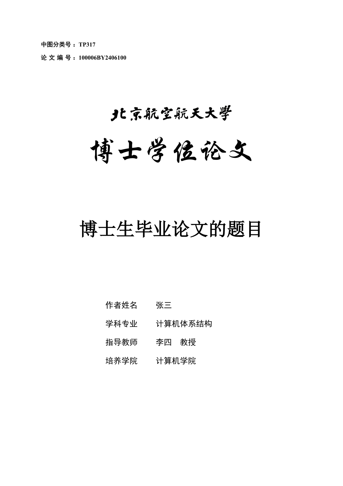

<p align="center">
  <a href="https://www.buaa.edu.cn" rel="noopener noreferrer">
    
  </a>
</p>

<br />

# Modern BUAA Graduate Thesis Template

A modern **[Typst](https://typst.app)** template for Beihang University graduate theses. It provides a complete BUAA-style thesis structure so you can focus on writing while the template handles covers, front matter, body formatting, references, and appendices.

- 📦 One main `thesis` API for the complete document layout
- 🎓 Follows the BUAA graduate thesis format requirements, including covers, declarations, headings, captions, page headers, and page numbers
- 🧩 Includes practical thesis-writing utilities such as algorithm blocks, subfigures, GB/T 7714 references, blind review mode, and print mode

> **Warning**: This is a community-maintained template, not an official BUAA template. Please always check the generated PDF against the latest school and college requirements before submission.

## 🚀 Quick Start

Install the package from Typst Universe and wrap your thesis body with `thesis.with(...)`:

```typ
#import "@preview/modern-buaa-thesis:0.4.0": abstract, abstract-en, thesis

#let abstract-zh = [
  #show: abstract.with(keyword: ("Typst", "BUAA", "Thesis"))
  This is the Chinese abstract.
]

#let abstract-en-text = [
  #show: abstract-en.with(keyword: ("Typst", "BUAA", "Thesis"))
  This is the English abstract.
]

#show: thesis.with(
  type: "doctor",
  title: (zh: [Chinese Thesis Title], en: [A PhD Thesis Title]),
  author: (zh: [Author Name], en: [San Zhang]),
  teacher: (zh: [Supervisor Name], en: [Si Li]),
  teacher-degree: (zh: [Professor], en: [Prof.]),
  college: (zh: [College Name], en: [School of Computer Science and Engineering]),
  major: (
    discipline: [Computer Science and Technology],
    direction: [Distributed Systems],
    discipline-first: [Computer Science and Technology],
    discipline-direction: [Computer Systems],
  ),
  date: (
    start: [2021-09-01],
    end: [2026-06-30],
    summit: [2026-06-10],
    defense: [2026-06-10],
  ),
  degree: (zh: [Doctor of Engineering], en: [Doctor of Philosophy]),
  lib-number: [TP317],
  stu-id: [BY2406100],
  abstract: abstract-zh,
  abstract-en: abstract-en-text,
  bibliography: read("ref.bib"),
)

= Introduction

= Method

= Experiments
```

See [template/thesis.typ](https://github.com/wangjq4214/buaa-thesis/blob/0.4.0/template/thesis.typ) for a complete source example and [example/thesis.pdf](https://github.com/wangjq4214/buaa-thesis/blob/0.4.0/example/thesis.pdf) for the rendered PDF.

<p align="center">
  <a href="https://github.com/wangjq4214/buaa-thesis/blob/0.4.0/example/thesis.pdf" rel="noopener noreferrer">
    
  </a>
</p>

## ✨ Features

### 📚 Complete Thesis Structure

`thesis.with(...)` renders the full document shell:

- Chinese cover, English cover, title page, and declaration pages
- Chinese and English abstracts
- Table of contents, list of figures, and list of tables
- BUAA-style body headings, page headers, footers, captions, equations, and references
- Bibliography, achievements, acknowledgements, and CV sections

The supported thesis types are:

| Type         | Usage                        |
| ------------ | ---------------------------- |
| `master`     | Academic master's thesis     |
| `pro-master` | Professional master's thesis |
| `doctor`     | Doctoral thesis              |

### 🧮 Algorithm Blocks

The template exports `pseudocode-list`, a list-friendly pseudocode builder inspired by [lovelace](https://typst.app/universe/package/lovelace). It works inside a Typst `figure` with `kind: "algorithm"`, so algorithms are numbered and referenced consistently with the thesis format.

```typ
#import "@preview/modern-buaa-thesis:0.4.0": font-type, pseudocode-list

#figure(
  kind: "algorithm",
  placement: top,
  pseudocode-list(booktabs: true, numbered-title: [Greedy Grouping], full: true)[
    - *Input:* device set $D$, threshold $epsilon$
    - *Output:* grouped device set $G$

    + Initialize every device as an independent group
    + *while* merge candidates exist *do*
      + Select the pair with the minimum cost
      + *if* cost is below $epsilon$ *then*
        + Merge the pair
      + *end*
    + *end*
    + #text(font: font-type.kai, [Return the final groups])
  ],
  caption: [Greedy grouping algorithm],
) <algo:greedy>

As shown in @algo:greedy, ...
```

Useful options include:

| Option           | Description                                                               |
| ---------------- | ------------------------------------------------------------------------- |
| `numbered-title` | Shows the current algorithm number and an optional title inside the block |
| `line-numbering` | Controls line numbers; set to `none` to hide them                         |
| `booktabs`       | Adds top, middle, and bottom rules for a thesis-style algorithm block     |
| `full`           | Lets the algorithm block use the available line width                     |

### 🕶️ Blind Review Mode

Set `blind-review: true` when generating a review copy:

```typ
#show: thesis.with(
  // ...
  blind-review: true,
)
```

Blind review mode masks sensitive identity fields in the generated PDF:

- Student ID, author name, supervisor name, and signature fields on cover/declaration pages
- Author/member names in structured achievement lists
- Acknowledgements and CV sections are omitted from the appendix

### 🖨️ Print Mode

Set `is-print: true` when preparing a duplex-printing PDF:

```typ
#show: thesis.with(
  // ...
  is-print: true,
)
```

Print mode inserts additional page breaks between the generated cover pages, making the front matter align better for double-sided printing.

### 🔖 References and Citations

The template integrates [gb7714-bilingual](https://typst.app/universe/package/gb7714-bilingual) and exports `multicite` for grouped citations:

```typ
#import "@preview/modern-buaa-thesis:0.4.0": multicite, thesis

#show: thesis.with(
  bibliography: read("ref.bib"),
)

Prior work includes #multicite[@heDeepResidualLearning2016 @vaswaniAttentionAllYou2023].
```

When `bibliography` is provided, the template initializes the GB/T 7714 numeric bibliography style and renders the reference section in the appendix.

### 🏅 Achievements and Back Matter

Besides free-form `achievement`, `acknowledgements`, and `cv` content, the package provides helpers for structured achievement lists:

```typ
#import "@preview/modern-buaa-thesis:0.4.0": achievement-papers, achievement-patents, thesis

#let papers = achievement-papers((
  (
    authors: ([San Zhang], [Si Li]),
    title: [A Typst Thesis Template],
    venue: [Example Conference],
    year: [2026],
    note: [Accepted],
  ),
))

#let patents = achievement-patents((
  (
    authors: ([San Zhang], [Si Li]),
    title: [A Typesetting Method],
    patent-no: [CN000000000],
    year: [2026],
  ),
))

#show: thesis.with(
  // ...
  achievement: [
    #papers
    #patents
  ],
)
```

The structured helpers automatically participate in blind review mode by masking personal names.

### 🖼️ Figures, Tables, Equations, and Subfigures

The main body format customizes common academic elements:

- Figures and tables use the Chinese supplements required by the thesis format
- Table captions are placed above tables
- Equations are numbered by chapter
- Headings reset figure, table, algorithm, and equation counters
- `sub-fig` is exported for subfigure layouts through [subpar](https://typst.app/universe/package/subpar)

Use `sub-fig` when a figure contains multiple panels:

```typ
#import "@preview/modern-buaa-thesis:0.4.0": sub-fig

#sub-fig(
  figure(
    image("before.png", width: 100%),
    caption: [Before optimization],
  ), <fig:before>,
  figure(
    image("after.png", width: 100%),
    caption: [After optimization],
  ), <fig:after>,
  columns: (1fr, 1fr),
  caption: [Optimization result comparison],
  label: <fig:comparison>,
)

@fig:comparison compares the overall result, while @fig:before and @fig:after
refer to individual panels.
```

### 🔤 Font Fallbacks

The exported `font-type` dictionary contains Songti, Heiti, and Kaiti fallback stacks for Windows, macOS, and common open-source CJK fonts. This keeps documents more portable across local Typst installations and CI builds.

## ⚙️ Configuration

The main entry point is `thesis.with(...)`.

| Parameter          | Default            | Description                                                                      |
| ------------------ | ------------------ | -------------------------------------------------------------------------------- |
| `type`             | `"master"`         | Thesis type: `"master"`, `"pro-master"`, or `"doctor"`                           |
| `title`            | `(zh: [], en: [])` | Chinese and English thesis titles                                                |
| `author`           | `(zh: [], en: [])` | Chinese and English author names                                                 |
| `teacher`          | `(zh: [], en: [])` | Chinese and English supervisor names                                             |
| `teacher-degree`   | `(zh: [], en: [])` | Supervisor title, such as professor or associate professor                       |
| `college`          | `(zh: [], en: [])` | College or school name                                                           |
| `major`            | dictionary         | Discipline, research direction, first-level discipline, and discipline direction |
| `date`             | dictionary         | Study period, submission date, and defense date                                  |
| `degree`           | `(zh: [], en: [])` | Degree name shown on cover pages                                                 |
| `lib-number`       | `[]`               | Chinese Library Classification number                                            |
| `stu-id`           | `[]`               | Student ID                                                                       |
| `abstract`         | `[]`               | Chinese abstract content                                                         |
| `abstract-en`      | `[]`               | English abstract content                                                         |
| `conclusion`       | `[]`               | Optional conclusion section content                                              |
| `bibliography`     | `none`             | BibTeX content, usually `read("ref.bib")`                                        |
| `achievement`      | `[]`               | Academic achievements section                                                    |
| `acknowledgements` | `[]`               | Acknowledgements section, hidden in blind review mode                            |
| `cv`               | `[]`               | Author CV section, hidden in blind review mode                                   |
| `is-print`         | `false`            | Enables duplex-print page breaks                                                 |
| `blind-review`     | `false`            | Enables anonymized review output                                                 |

## 🗺️ Roadmap

- [x] Implement support for master's thesis (experimental support, there may still be some minor issues, welcome to feedback via issues, Thanks [Aerithy](https://github.com/Aerithy))
- [ ] Implement support for non-engineering thesis
- [ ] Implement support for proposal reports and interim reports (maybe a new package?)

## 📝 Changelog

### [0.4.0](https://github.com/wangjq4214/buaa-thesis/tree/0.4.0) (2026-06-14)

#### ✨ Features

- add blind review mode through `blind-review: true`
- add structured achievement helpers for papers, patents, and research projects
- add a `chap:conclusion` label for referencing the conclusion section

#### 🐛 Bug Fixes

- fix header font size and page number display
- fix the thesis number prefix on the cover
- fix professional master's thesis title wording
- fix heading references and outline entries

#### 📝 Documentation

- refresh README examples and feature descriptions

### [0.3.0 (BreakChange)](https://github.com/wangjq4214/buaa-thesis/tree/0.3.0) (2026-04-11)

#### 🐛 Bug Fixes

- fix math font rendering issue, using Cambria Math by default
- fix bibliography formatting issue, thanks to [gb7714-bilingual](https://github.com/pku-typst/gb7714-bilingual)
- fix bibliography character spacing issue with more compact English typesetting

### [0.2.0 (BreakChange)](https://github.com/wangjq4214/buaa-thesis/tree/0.2.0) (2025-12-29)

#### ✨ Features

- add support for engineering master's thesis, including academic and professional master's degrees
- add custom algorithm blocks, inspired by [lovelace](https://typst.app/universe/package/lovelace)
- add support for Kaiti font

#### 🐛 Bug Fixes

- fix equation numbering font to New Times Roman
- fix algorithm block numbering issue
- fix the behavior where the conclusion section heading was incorrectly numbered

### [0.1.2](https://github.com/wangjq4214/buaa-thesis/tree/0.1.2) (2025-12-05)

#### ✨ Features

- support the latest format requirements of BUAA graduate thesis (2025.09 edition)

#### 🐛 Bug Fixes

- fix the error order of font types

#### Improvements

- add a script to automatically update the version number of the package

### [0.1.1](https://github.com/wangjq4214/buaa-thesis/tree/0.1.1) (2025-09-28)

#### ✨ Features

- add support for sub figure

#### 🐛 Bug Fixes

- fix the heading reference error format
- fix the error bib font type

### [0.1.0](https://github.com/wangjq4214/buaa-thesis/tree/0.1.0) (2025-07-08)

#### 🎉 First Version

- release the first version of modern buaa thesis template

#### ✨ Features

- add support for cover pages
- add support for table of contents
- add support for tables of figures and tables
- add support for section headings
- add support for figures and tables
- add support for equation numbering
- add support for body formatting
- add support for reference documents
- add support for appendices such as personal information pages

## 📄 License

[MIT](./LICENSE).

## 🤝 Contributing

- External contributions are welcome, contributors can fork this repository, make modifications and merge
- Code review and package release will be handled by [wangjq4214](https://github.com/wangjq4214)
- If you have questions, you can discuss them in [issues](https://github.com/wangjq4214/buaa-thesis/issues) !!
