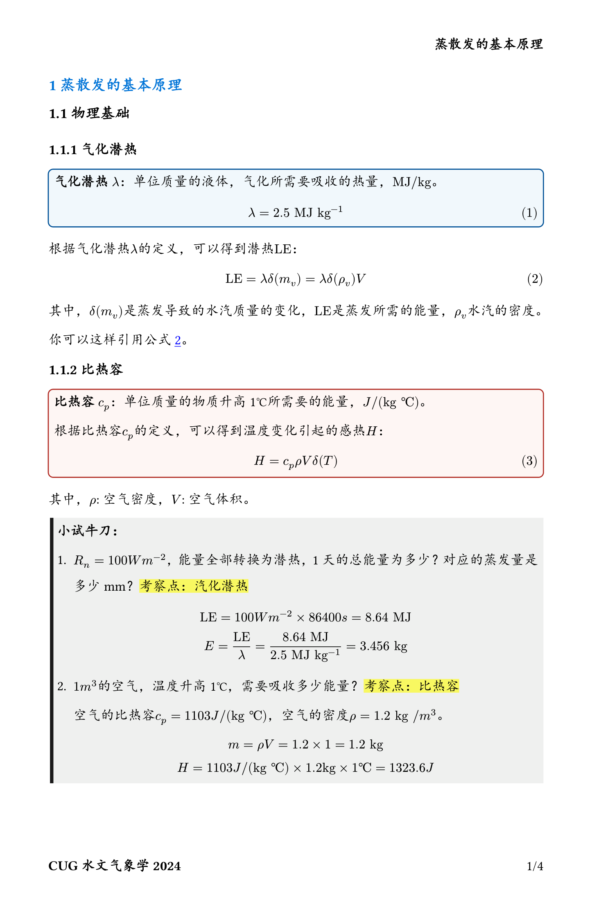
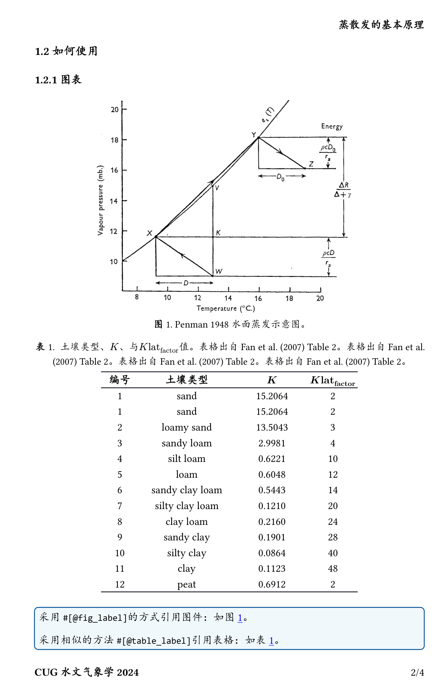
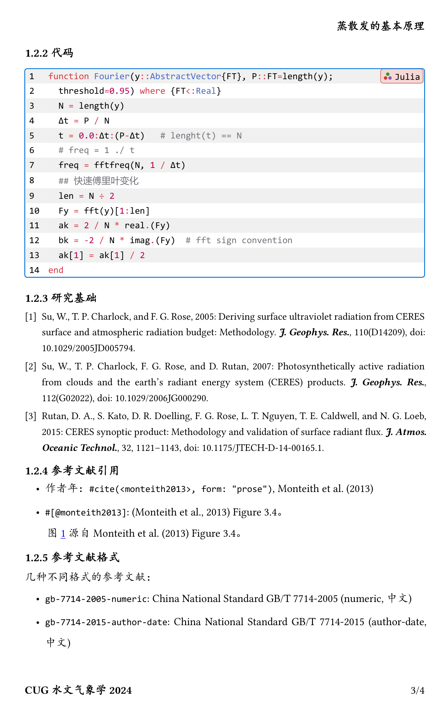
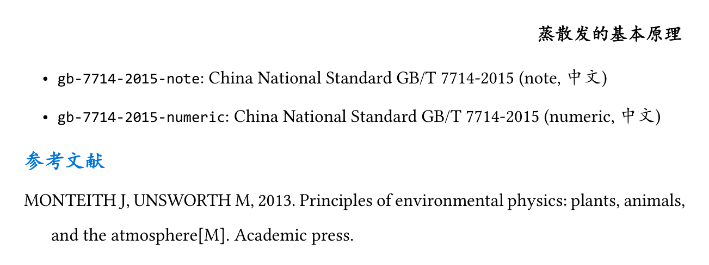

# typst自然科学报告写作规范

> Typst Template for Natural Science Reports


<!--  -->

## Installation

- Local mode
```powershell
# powershell
mkdir -path $env:APPDATA/typst/packages/local
cd $env:APPDATA/typst/packages/local
git clone https://github.com/CUG-hydro/modern-cug-report.typ modern-cug-report
```

- Official released

```typst
#import "@local/modern-cug-report:0.1.3": *
#show: (doc) => template(doc, 
  footer: "CUG水文气象学2025",
  header: "蒸散发的基本原理"
)
#let delta(x) = $Delta #x$
```

## Example

A complete example can be found at: [example/ch03_Evapotranspiration.typ](example/ch03_Evapotranspiration.typ)

The following is the output of the above example: 








