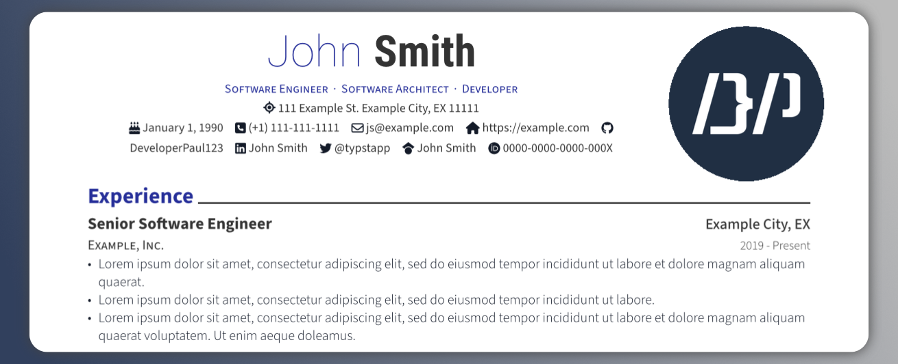
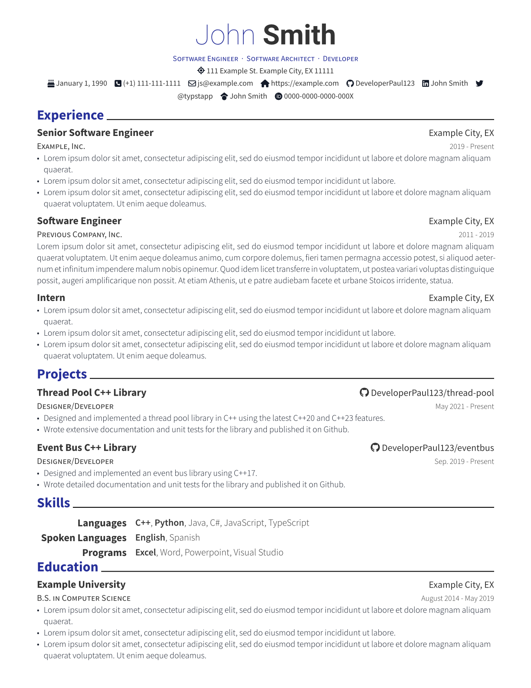
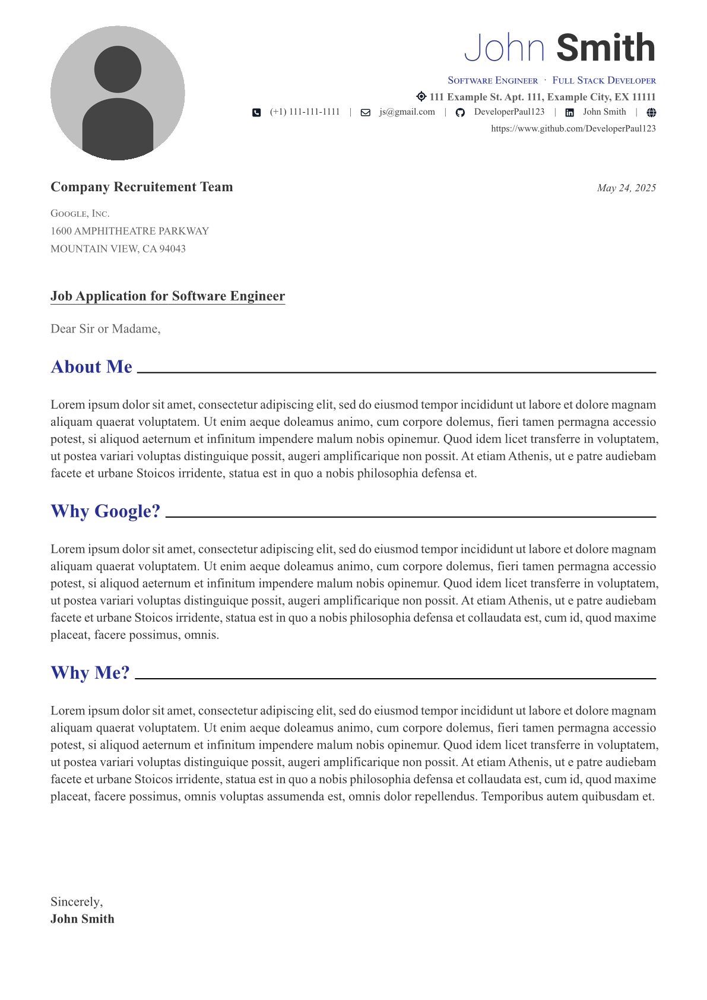
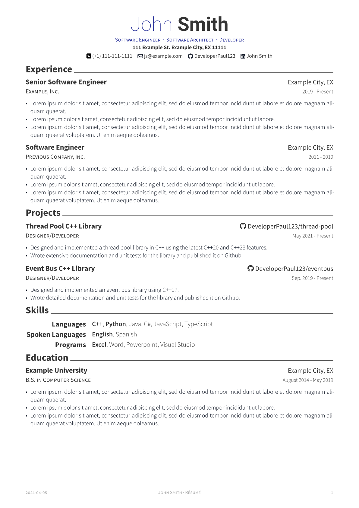
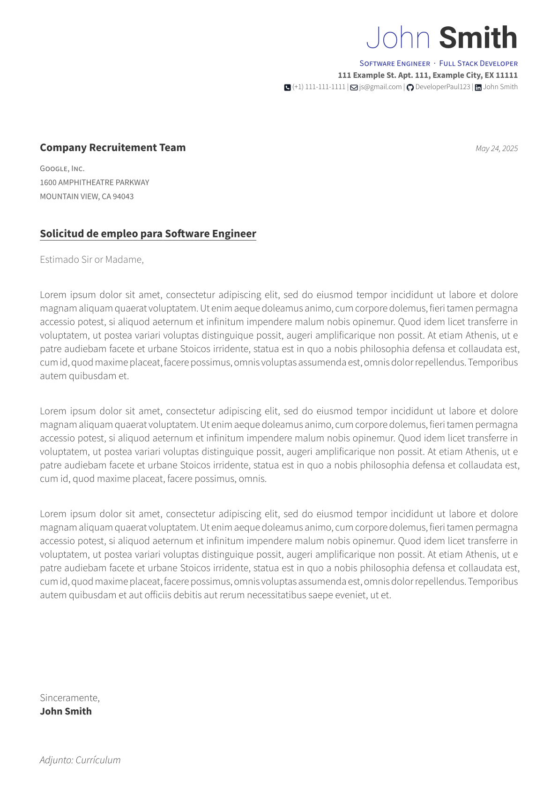
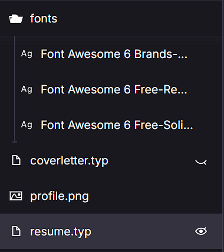

<h1 align="center">
  
  <br><br>
  Modern CV
</h1>

[](https://github.com/DeveloperPaul123/modern-cv/stargazers)
[](https://discord.gg/CX2ybByRnt)

[](https://github.com/DeveloperPaul123/modern-cv/actions/workflows/tests.yml)  

A port of the [Awesome-CV](https://github.com/posquit0/Awesome-CV) Latex resume template in [typst](https://github.com/typst/typst).

## Features

- Modern and clean design
- Easy to use and customize (colors, profile picture, fonts, etc.)
- Support for multiple sections (education, experience, skills, etc.)
- Support for multiple languages

## Preview

| Resumes | Cover letters |
| --- | --- |
|  |  |
|  | |

## Requirements

### Tools

The following tools are used for the development of this template:

- [typst](https://github.com/typst/typst)
- [typst-test](https://github.com/tingerrr/typst-test) for running tests
- [just](https://github.com/casey/just) for simplifying command running
- [oxipng](https://github.com/shssoichiro/oxipng) for compressing thumbnails used in the README

### Fonts

You will need the `Roboto` and `Source Sans Pro` fonts installed on your system or available somewhere. If you are using the `typst` web app, no further action is necessary. You can download them from the following links:

- [Roboto](https://fonts.google.com/specimen/Roboto)
- [Source Sans Pro](https://github.com/adobe-fonts/source-sans-pro)

This template also uses FontAwesome icons via the [fontawesome](https://typst.app/universe/package/fontawesome) package. You will need to install the fontawesome fonts on your system or configure the `typst` web app to use them. You can download fontawesome [here](https://fontawesome.com/download).

To use the fontawesome icons in the web app, add a `fonts` folder to your project and upload the `otf` files from the fontawesome download to this folder like so:



See `typst fonts --help` for more information on configuring fonts for `typst` that are not installed on your system.

### Usage

Below is a basic example for a simple resume:

```typst
#import "@preview/modern-cv:0.9.0": *

#show: resume.with(
  author: (
      firstname: "John", 
      lastname: "Smith",
      email: "js@example.com", 
      phone: "(+1) 111-111-1111",
      github: "DeveloperPaul123",
      linkedin: "Example",
      address: "111 Example St. Example City, EX 11111",
      positions: (
        "Software Engineer",
        "Software Architect"
      )
  ),
  profile-picture: none,
  date: datetime.today().display(),
  paper-size: "us-letter"
)

= Education

#resume-entry(
  title: "Example University",
  location: "B.S. in Computer Science",
  date: "August 2014 - May 2019",
  description: "Example"
)

#resume-item[
  - #lorem(20)
  - #lorem(15)
  - #lorem(25)  
]
```

After saving to a `*.typ` file, compile your resume using the following command:

```bash
typst compile resume.typ
```

For more information on how to use and compile `typst` files, see the [official documentation](https://typst.app/docs).

Documentation for this template is published with each commit. See the attached PDF on each Github Action run [here](https://github.com/DeveloperPaul123/modern-cv/actions).

## Building and Testing Locally

To build and test the project locally, you will need to install the `typst` CLI. You can find instructions on how to do this [here](https://github.com/typst/typst#installation).

With typst installed you can make changes to `lib.typ` and then `just install` or `just install-preview` to install the package locally. Change the import statements in the template files to point to the local package (if needed):

```typst
#import "@local/modern-cv:0.9.0": *
````

If you use `just install-preview` you will only need to update the version number to match `typst.toml`.

Note that the script parses the `typst.toml` to determine the version number and the folder the local files are installed to.

### Formatting

This project uses [typstyle](https://github.com/Enter-tainer/typstyle) to format the code. Run `just format` to format all the `*.typ` files in the project. Be sure to install `typstyle` before running the script.

## License

The project is licensed under the MIT license. See [LICENSE](LICENSE) for more details.

## Author

| [<br><sub>@DeveloperPaul123</sub>](https://github.com/DeveloperPaul123) |
|:----:|
