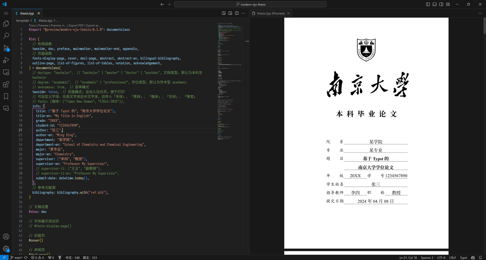
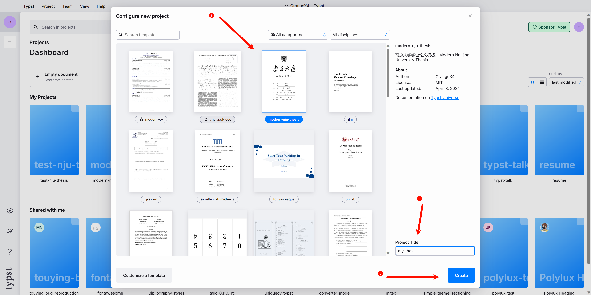
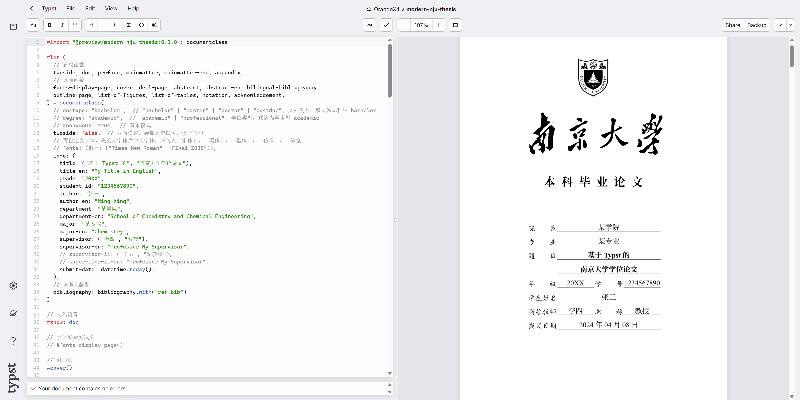
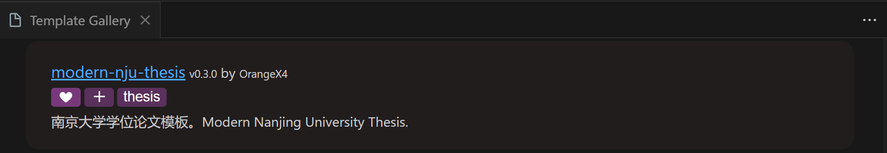
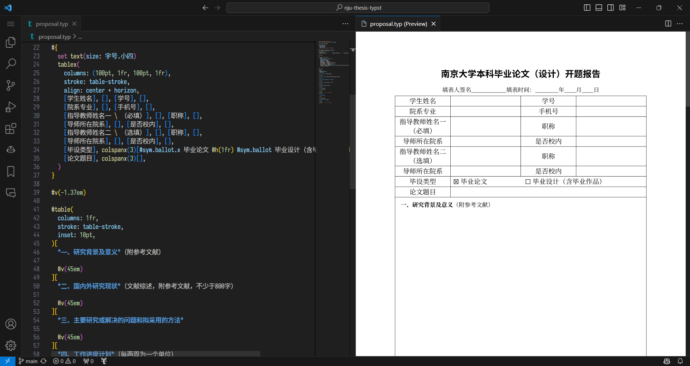

# 南京大学学位论文 modern-nju-thesis

南京大学毕业论文（设计）的 Typst 模板，能够简洁、快速、持续生成 PDF 格式的毕业论文。[Typst Universe](https://typst.app/universe/package/modern-nju-thesis)

Typst 非官方中文交流群：793548390

南京大学 Typst 交流群：943622984



## 劣势

- Typst 是一门新生的排版标记语言，还做不到像 Word 或 LaTeX 一样成熟稳定。
- 该模板并非官方模板，而是民间模板，**存在不被认可的风险**。


## 优势

Typst 是可用于出版的可编程标记语言，拥有变量、函数与包管理等现代编程语言的特性，注重于科学写作 (science writing)，定位与 LaTeX 相似。可以阅读我的 [一篇知乎文章](https://zhuanlan.zhihu.com/p/669097092) 进一步了解 Typst 的优势。

- **语法简洁**：上手难度跟 Markdown 相当，文本源码阅读性高，不会像 LaTeX 一样充斥着反斜杠与花括号。
- **编译速度快**：Typst 使用 Rust 语言编写，目标运行平台是WASM，即浏览器本地离线运行；也可以编译成命令行工具，采用一种 **增量编译** 算法和一种有约束的版面缓存方案，**文档长度基本不会影响编译速度，且编译速度与常见 Markdown 渲染引擎渲染速度相当**。
- **环境搭建简单**：不需要像 LaTeX 一样折腾几个 G 的开发环境，原生支持中日韩等非拉丁语言，无论是官方 Web App 在线编辑，还是使用 VS Code 安装插件本地开发，都是 **即开即用**。
- **现代编程语言**：Typst 是可用于出版的可编程标记语言，拥有 **变量、函数、包管理与错误检查** 等现代编程语言的特性，同时也提供了 **闭包** 等特性，便于进行 **函数式编程**。以及包括了 `[标记模式]`、`{脚本模式}` 与 `$数学模式$` 等多种模式的作用域，并且它们可以不限深度地、交互地嵌套。并且通过 **包管理**，你不再需要像 TexLive 一样在本地安装一大堆并不必要的宏包，而是 **按需自动从云端下载**。

可以参考我参与搭建和翻译的 [Typst 中文文档网站](https://typst-doc-cn.github.io/docs/) 迅速入门。


## 使用

快速浏览效果: 查看 [thesis.pdf](https://github.com/nju-lug/modern-nju-thesis/releases/latest/download/thesis.pdf)，样例论文源码：查看 [thesis.typ](https://github.com/nju-lug/modern-nju-thesis/blob/main/template/thesis.typ)

**你只需要修改 `thesis.typ` 文件即可，基本可以满足你的所有需求。**

如果你认为不能满足你的需求，可以先查阅后面的 [Q&A](#Q%26A) 部分。

模板已经上传到了 Typst Universe，使用起来十分简单，理论上只需要通过

```typst
#import "@preview/modern-nju-thesis:0.4.0": documentclass
```

导入即可。

### 在线编辑

Typst 提供了官方的 Web App，支持像 Overleaf 一样在线编辑，这是一个 [例子](https://typst.app/project/rgiwHIjdPOnXr9HJb8H0oa)。

实际上，我们只需要在 [Web App](https://typst.app/?template=modern-nju-thesis&version=0.4.0) 中的 `Start from template` 里选择 `modern-nju-thesis`，即可在线创建模板并使用。





**但是 Web App 并没有安装本地 Windows 或 MacOS 所拥有的字体，所以字体上可能存在差异，所以推荐本地编辑！**

**你需要手动上传 fonts 目录下的字体文件到项目中，否则会导致字体显示错误！**

PS: 虽然与 Overleaf 看起来相似，但是它们底层原理并不相同。Overleaf 是在后台服务器运行了一个 LaTeX 编译器，本质上是计算密集型的服务；而 Typst 只需要在浏览器端使用 WASM 技术执行，本质上是 IO 密集型的服务，所以对服务器压力很小（只需要负责文件的云存储与协作同步功能）。


### VS Code 本地编辑（推荐）

1. 在 VS Code 中安装 [Tinymist Typst](https://marketplace.visualstudio.com/items?itemName=myriad-dreamin.tinymist)。
2. 按下 `Ctrl + Shift + P` 打开命令界面，输入 `Typst: Show available Typst templates (gallery) for picking up a template` 打开 Tinymist 提供的 Template Gallery，然后从里面找到 `modern-nju-thesis`，点击 `❤` 按钮进行收藏，以及点击 `+` 号，就可以创建对应的论文模板了。
3. 最后用 VS Code 打开生成的目录，打开 `thesis.typ` 文件，并按下 `Ctrl + K V` 进行实时编辑和预览。



### 特性 / 路线图

- **说明文档**
    - [ ] 编写更详细的说明文档，后续考虑使用 [tidy](https://github.com/typst/packages/tree/main/packages/preview/tidy/0.1.0) 编写，你现在可以先参考 [NJUThesis](https://mirror-hk.koddos.net/CTAN/macros/unicodetex/latex/njuthesis/njuthesis.pdf) 的文档，参数大体保持一致，或者直接查阅对应源码函数的参数
- **类型检查**
    - [ ] 应该对所有函数入参进行类型检查，及时报错
- **全局配置**
    - [x] 类似 LaTeX 中的 `documentclass` 的全局信息配置
    - [x] **盲审模式**，将个人信息替换成小黑条，并且隐藏致谢页面，论文提交阶段使用 
    - [x] **双面模式**，会加入空白页，便于打印
    - [x] **自定义字体配置**，可以配置「宋体」、「黑体」与「楷体」等字体对应的具体字体
    - [x] **数学字体配置**：模板不提供配置，用户可以自己使用 `#show math.equation: set text(font: "Fira Math")` 更改
- **模板**
  - [x] 本科生模板
    - [x] 字体测试页
    - [x] 封面
    - [x] 声明页
    - [x] 中文摘要
    - [x] 英文摘要
    - [x] 目录页
    - [x] 插图目录
    - [x] 表格目录
    - [x] 符号表
    - [x] 致谢
  - [x] 研究生模板
    - [x] 封面 
    - [x] 声明页 
    - [x] 摘要
    - [x] 页眉 
    - [ ] 国家图书馆封面
    - [ ] 出版授权书
  - [ ] 博士后模板
- **编号**
    - [x] 前言使用罗马数字编号
    - [x] 附录使用罗马数字编号
    - [x] 表格使用 `1.1` 格式进行编号
    - [x] 数学公式使用 `(1.1)` 格式进行编号
- **环境**
    - [ ] 定理环境（这个也可以自己使用第三方包配置）
- **其他文件**
    - [x] 本科生开题报告
    - [x] 研究生开题报告


## 其他文件

还实现了本科生和研究生的开题报告，只需要预览和编辑 `others` 目录下的文件即可。




## Q&A

### 我不会 LaTeX，可以用这个模板写论文吗？

可以。

如果你不关注模板的具体实现原理，你可以用 Markdown Like 的语法进行编写，只需要按照模板的结构编写即可。


### 我不会编程，可以用这个模板写论文吗？

同样可以。

如果仅仅是当成是入门一款类似于 Markdown 的语言，相信使用该模板的体验会比使用 Word 编写更好。


### 为什么我的字体没有显示出来，而是一个个「豆腐块」？

这是因为本地没有对应的字体，**这种情况经常发生在 MacOS 的「楷体」显示上**。

你应该安装本目录下的 `fonts` 里的所有字体，里面包含了可以免费商用的「方正楷体」和「方正仿宋」，然后再重新渲染测试即可。

你可以使用 `#fonts-display-page()` 显示一个字体渲染测试页面，查看对应的字体是否显示成功。

如果还是不能成功，你可以按照模板里的说明自行配置字体，例如

```typst
#let (...) = documentclass(
  fonts: (楷体: ((name: "Times New Roman", covers: "latin-in-cjk"), "FZKai-Z03S")),
)
```

先是填写英文字体，然后再填写你需要的「楷体」中文字体。

**字体名称可以通过 `typst fonts` 命令查询。**

如果找不到你所需要的字体，可能是因为 **该字体变体（Variants）数量过少**，导致 Typst 无法识别到该中文字体。


### 为什么 Typst 有很多关于字体的警告？

你会发现 Typst 有许多关于字体的警告，这是因为 modern-nju-thesis 加入了很多不必要的 fallback 字体，你可以自定义字体消除警告，先英文字体后中文字体，应传入「宋体」、「黑体」、「楷体」、「仿宋」、「等宽」。

```typst
#let (...) = documentclass(
  fonts: (楷体: ((name: "Times New Roman", covers: "latin-in-cjk"), "FZKai-Z03S")),
)
```


### 学习 Typst 需要多久？

一般而言，仅仅进行简单的编写，不关注布局的话，你可以打开模板就开始写了。

如果你想进一步学习 Typst 的语法，例如如何排篇布局，如何设置页脚页眉等，一般只需要几个小时就能学会。

如果你还想学习 Typst 的「[参考](https://typst-doc-cn.github.io/docs/reference/foundations/)」部分，进而能够编写自己的模板，一般而言需要几天的时间阅读文档，以及他人编写的模板代码。

如果你有 Python 或 JavaScript 等脚本语言的编写经验，了解过函数式编程、宏、样式、组件化开发等概念，入门速度会快很多。


### 我有编写 LaTeX 的经验，如何快速入门？

可以参考 [小蓝书](https://typst-doc-cn.github.io/tutorial/) 和 [FAQ](https://typst-doc-cn.github.io/guide/)。

一些常见问题：

- [如何在段落内加入行间数学公式以避免首行缩进？](https://typst-doc-cn.github.io/guide/FAQ/block-equation-in-paragraph.html)


### 目前 Typst 有哪些第三方包和模板？

可以查看 [Typst Universe](https://typst.app/universe)。

我个人推荐的包：

- 基础绘图：[cetz](https://typst.app/universe/package/cetz)
- 绘制带有节点和箭头的图表，如流程图等：[fletcher](https://typst.app/universe/package/fletcher)
- 定理环境：[theorion](https://typst.app/universe/package/theorion)
- 伪代码：[lovelace](https://typst.app/universe/package/lovelace)
- 带行号的代码显示包：[zebraw](https://typst.app/universe/package/zebraw)
- 简洁的 Numbering 包：[numbly](https://typst.app/universe/package/numbly)
- 幻灯片和演示文档：[touying](https://typst.app/universe/package/touying)
- 相对定位布局包：[pinit](https://typst.app/universe/package/pinit)
- 数学单位包：[unify](https://typst.app/universe/package/unify)
- 数字格式化包：[zero](https://typst.app/universe/package/zero)
- 写 LaTeX 数学公式：[mitex](https://typst.app/universe/package/mitex)
- 写原生 Markdown：[cmarker](https://typst.app/universe/package/cmarker)
- 写 Markdown-like checklist：[cheq](https://typst.app/universe/package/cheq)
- 写 Markdown-like 表格：[tablem](https://typst.app/universe/package/tablem)


### 为什么只有一个 thesis.typ 文件，没有按章节分多个文件？

因为 Typst **语法足够简洁**、**编译速度足够快**、并且 **拥有光标点击处双向跳转功能**。

语法简洁的好处是，即使把所有内容都写在同一个文件，你也可以很简单地分辨出各个部分的内容。

编译速度足够快的好处是，你不再需要像 LaTeX 一样，将内容分散在几个文件，并通过注释的方式提高编译速度。

光标点击处双向跳转功能，使得你可以直接拖动预览窗口到你想要的位置，然后用鼠标点击即可到达对应源码所在位置。

还有一个好处是，单个源文件便于同步和分享。

即使你还是想要分成几个章节，也是可以的，Typst 支持你使用 `#import` 和 `#include` 语法将其他文件的内容导入或置入。你可以新建文件夹 `chapters`，然后将各个章节的源文件放进去，然后通过 `#include` 置入 `thesis.typ` 里。


### 我如何更改页面上的样式？具体的语法是怎么样的？

理论上你并不需要更改 `nju-thesis` 目录下的任何文件，无论是样式还是其他的配置，你都可以在 `thesis.typ` 文件内修改函数参数实现更改。具体的更改方式可以阅读 `nju-thesis` 目录下的文件的函数参数。

例如，想要更改页面边距为 `50pt`，只需要将

```typst
#show: doc
```

改为

```typst
#show: doc.with(margin: (x: 50pt))
```

即可。

后续我也会编写一个更详细的文档，可能会考虑使用 [tidy](https://github.com/typst/packages/tree/main/packages/preview/tidy/0.1.0) 来编写。

如果你阅读了那些函数的参数，仍然不知道如何修改得到你需要的样式，欢迎提出 Issue，只要描述清楚问题即可。

或者也欢迎加群讨论：943622984


### 该模板和其他现存 Typst 中文论文模板的区别？

其他现存的 Typst 中文论文模板大多都是在 2023 年 7 月份之前（Typst Verison 0.6 之前）开发的，当时 Typst 还不不够成熟，甚至连 **包管理** 功能都还没有，因此当时的 Typst 中文论文模板的开发者基本都是自己从头写了一遍需要的功能/函数，因此造成了 **代码耦合度高**、**意大利面条式代码**、**重复造轮子** 与 **难以自定义样式** 等问题。

该模板是在 2023 年 10 ～ 11 月份（Typst Verison 0.9 时）开发的，此时 Typst 语法基本稳定，并且提供了 **包管理** 功能，因此能够减少很多不必要的代码。

PS：2025 年 2 月进行了 Typst 0.13 的迁移更新。

并且我对模板的文件架构进行了解耦，主要分为了 `utils`、`pages` 和 `layouts` 三个目录，这三个目录可以看后文的开发者指南，并且使用 **闭包** 特性实现了类似不可变全局变量的全局配置能力，即模板中的 `documentclass` 函数类。


### 我不是南京大学本科生，如何迁移该模板？

我在开发的过程中已经对模板的各个模板进行了解耦，理论上你只需要在 `pages` 目录中加入你需要的页面，然后更改少许、或者不需要更改其他目录的代码。

具体目录职责划分可以看下面的开发者指南。


## 开发者指南

### template 目录

- `thesis.typ` 文件: 你的论文源文件，可以随意更改这个文件的名字，甚至你可以将这个文件在同级目录下复制多份，维持多个版本。
- `ref.bib` 文件: 用于放置参考文献。
- `images` 目录: 用于放置图片。


### 内部目录

- `utils` 目录: 包含了模板使用到的各种自定义辅助函数，存放没有外部依赖，且 **不会渲染出页面的函数**。
- `pages` 目录: 包含了模板用到的各个 **独立页面**，例如封面页、声明页、摘要等，即 **会渲染出不影响其他页面的独立页面的函数**。
- `layouts` 目录: 布局目录，存放着用于排篇布局的、应用于 `show` 指令的、**横跨多个页面的函数**，例如为了给页脚进行罗马数字编码的前言 `preface` 函数。
  - 主要分成了 `doc` 文稿、`preface` 前言、`mainmatter` 正文与 `appendix` 附录/后记。
- `lib.typ`:
  - **职责一**: 作为一个统一的对外接口，暴露出内部的 utils 函数。
  - **职责二**: 使用 **函数闭包** 特性，通过 `documentclass` 函数类进行全局信息配置，然后暴露出拥有了全局配置的、具体的 `layouts` 和 `pages` 内部函数。


## 参与贡献

- 在 Issues 中提出你的想法，如果是新特性，可以加入路线图！
- 实现路线图中仍未实现的部分，然后欢迎提出你的 PR。
- 同样欢迎 **将这个模板迁移至你的学校论文模板**，大家一起搭建更好的 Typst 社区和生态吧。


## 致谢

- 感谢 [@atxy-blip](https://github.com/atxy-blip) 开发的 [NJUThesis](https://github.com/nju-lug/NJUThesis) LaTeX 模板，文档十分详细，本模板大体结构都是参考 NJUThesis 的文档开发的。
- 感谢 [@csimide](https://github.com/csimide) 帮忙补充的 [bilingual-bibliography](https://github.com/nju-lug/modern-nju-thesis/issues/3)。
- 感谢 [HUST-typst-template](https://github.com/werifu/HUST-typst-template) 与 [sysu-thesis-typst](https://github.com/howardlau1999/sysu-thesis-typst) 等 Typst 中文论文模板。


## License

This project is licensed under the MIT License.
