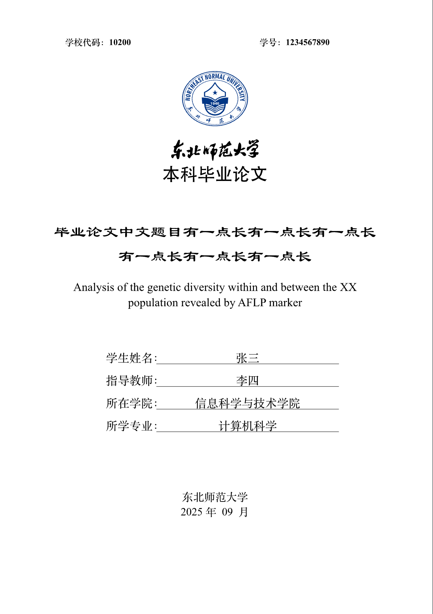
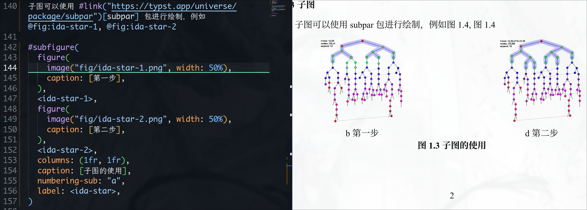

# NENU-Thesis-Typst-Template

[English](./READMD.md)| [简体中文](./README_zh.md)

A Typst template for theses at Northeast Normal University (NENU). Usage instructions and rendered examples are available in the [online documentation](https://virgiling.wiki/NENU-Thesis-Typst/).



> [!IMPORTANT]
> This template is an unofficial community template and may not be accepted by the university.
>
> Although this template attempts to replicate the Word template, there may still be many formatting issues. See [Known Issues](#known-issues) for details.

> [!NOTE]
> Other templates are provided in the `other/` folder, for example:
> 
> 1. Lab report template (lab-report.typ)
> 2. Master/PhD proposal template (master-proposal.typ)
> 
> These templates are not integrated into the `thesis` template yet. To use them, clone the repository (or copy the file locally).
> Note these files may reference resources in `other` and `asset`; please download those as well.

## Usage

First, learn how to write with Typst (you don't need to write functions). It's simple — see the [tutorial](https://typst-doc-cn.github.io/docs/tutorial/writing-in-typst/) for a quick start.

The template can be used locally or imported as a package:

```typ
#import "@preview/modern-nenu-thesis:0.1.1": thesis
```

> [!IMPORTANT]
> You need to download the Lisu font (隶书) from [here](https://github.com/dolbydu/font/blob/master/unicode/Lisu.TTF) (for macOS/Linux).

### Local usage

1. Install a text editor — VS Code is recommended — and add the Tinymist Typst and Typst Preview extensions.

- Clone/download this repository and open the project folder in VS Code.

- Open the `template/thesis.typ` file and start writing your thesis. In VS Code you can press <C-K> V (Ctrl+K V) to open the preview pane and see live rendering.

## TODO

- [x] Bachelor's thesis template
    - [x] Cover
    - [x] Title page
    - [x] Chinese abstract
    - [x] English abstract
    - [x] Table of contents
    - [x] Main text
    - [x] Acknowledgements
    - [x] Appendix

- [x] Master's (Doctoral) thesis template
    - [x] Double-Blind review mode
    - [ ] Minor adjustments, mainly regarding blank lines

- [ ] Postdoctoral research report

- [x] Added printing options for generating the bound version of the thesis

- [ ] More templates

- [ ] Improve documentation
    - [x] Basic Usage
    - [ ] Parameters document 

## Known Issues

1. When using `subpar`, subfigure numbering cannot be displayed correctly, as shown below:

Therefore subfigures are currently not supported.

> [!IMPORTANT]
> 
> There is a workaround discussed in [Issue #12](https://github.com/RubixDev/typst-i-figured/issues/12).

2. Author signature cannot be directly inserted as an image/PDF on the title page.

## Acknowledgements

- Thanks to the `modern-nju-thesis` Typst template (https://github.com/nju-lug/modern-nju-thesis) for its clear architecture and detailed comments — this project borrows heavily from its structure.
- Thanks to the `SEU-Typst-Template` (https://github.com/csimide/SEU-Typst-Template/) for its template contributions.