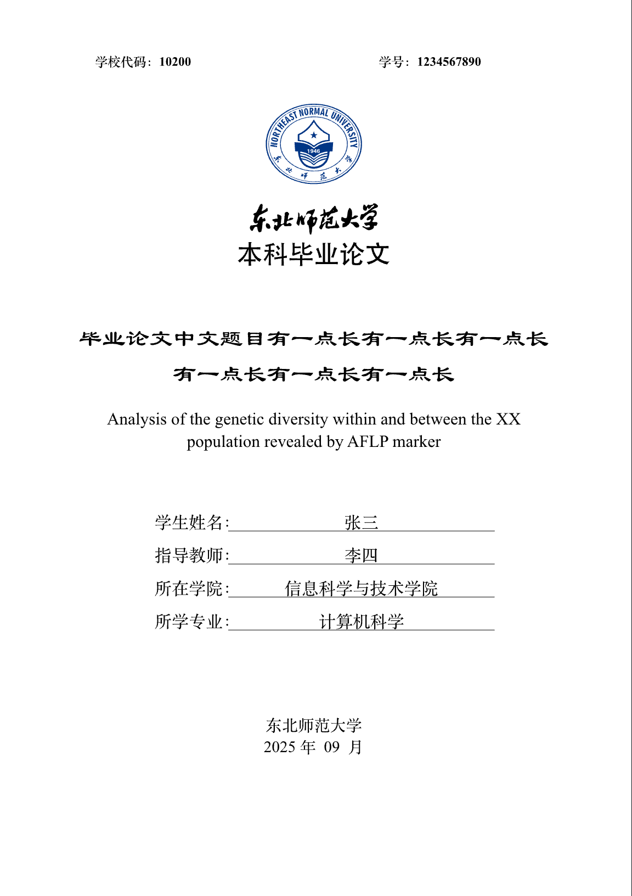

# NENU-Thesis-Typst-Template

东北师范大学毕业论文的 `Typst` 模板，可以在 [在线文档](https://virgiling.wiki/NENU-Thesis-Typst/) 中查看使用方法与生成的效果



> [!IMPORTANT]
> 此模板是民间模板，有不被学校认可的风险。
>
> 本模板虽已尽力尝试复原 Word 模板，但可能仍然存在诸多格式问题，详细请看[存在的问题](#存在的问题)

> [!NOTE]
> 我们在 `other` 文件夹中放了其他的模板，例如：
> 
> 1. 实验报告模板(lab-report.typ)
> 2. 研究生/博士生 开题报告模板(master-proposal.typ)
> 
> 这些模板暂时没有集成到 `thesis` 模板中，要使用的话只能将仓库克隆（或复制该文件到本地）
> 需要注意的是，这些文件会使用 `other` 和 `asset` 中的一些资源文件，请一并下载

## 使用方法

首先你需要学会如何用 `Typst` 来书写（不需要书写函数），这十分简单，可以参考 [教程](https://typst-doc-cn.github.io/docs/tutorial/writing-in-typst/) 来简单学习。

模板可以下载到本地使用，也可以通过导入包使用：

```typ
#import "@preview/modern-nenu-thesis:0.1.1": thesis
```

> [!IMPORTANT]
> 需要下载[隶书字体](https://github.com/dolbydu/font/blob/master/unicode/Lisu.TTF)（如果使用 MacOS/Linux）

### 本地使用

1. 安装一个文本编辑器，这里推荐使用 `VS Code`，并安装 [Tinymist Typst](https://github.com/Myriad-Dreamin/tinymist) 和 [Typst Preview](https://github.com/Enter-tainer/typst-preview) 插件

- 克隆/下载本仓库到本地，并使用 `VS Code` 打开项目文件夹

- 打开 `template/thesis.typ` 文件，开始编写你的论文内容，可以按下 `<C-K> V` (Ctrl+K V) 快捷键在 `VS Code` 中打开预览窗口，实时查看你的论文效果

## TODO

- [x] 学士学位论文模板
    - [x] 封面
    - [x] 扉页
    - [x] 中文摘要
    - [x] 英文摘要
    - [x] 目录页
    - [x] 正文
    - [x] 致谢
    - [x] 附录

- [x] 硕士（博士）学位论文模板
    - [x] 盲审模式
    - [ ] 一些微调，主要是空行上的

- [ ] 博士后研究报告

- [x] 加入打印选项，用于生成装订版本的论文

- [ ] 更多其它模板

- [ ] 完善使用文档
    - [x] 基本使用
    - [ ] 参数文档

## 存在的问题

1. 使用 `subpar` 时，无法正确显示子图的编号，如下图所示：

因此暂时不支持使用子图

> [!IMPORTANT]
> 
> [Issue#12](https://github.com/RubixDev/typst-i-figured/issues/12) 这里有一个迂回的方法用以解决子图问题


2. 扉页中作者签名无法直接插入图片/PDF

## 致谢

- 感谢 [modern-nju-thesis](https://github.com/nju-lug/modern-nju-thesis) 开发的 `Typst` 模板，架构清晰，文档注释详细，本项目在架构上参考良多。
- 感谢 [SEU-Typst-Template](https://github.com/csimide/SEU-Typst-Template/) 开发的 `Typst` 模板
