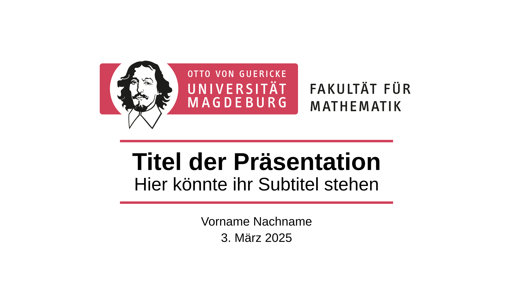
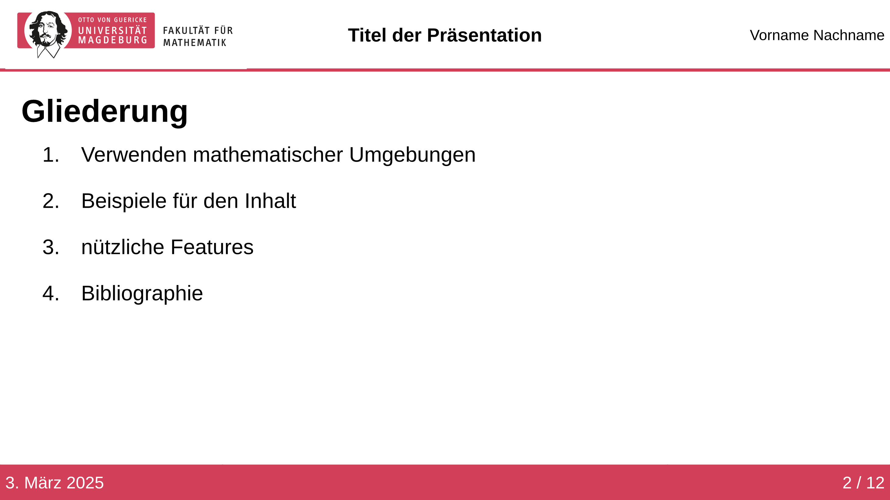
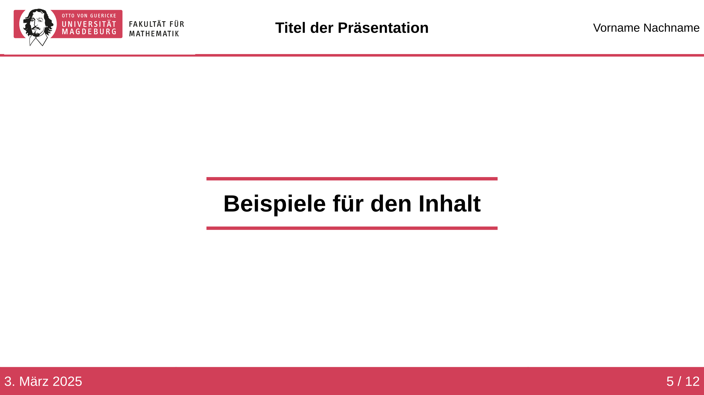
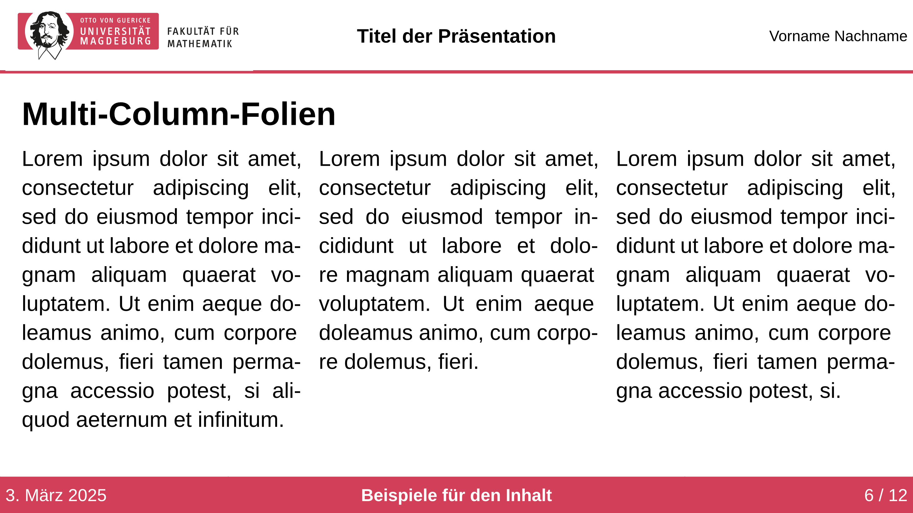
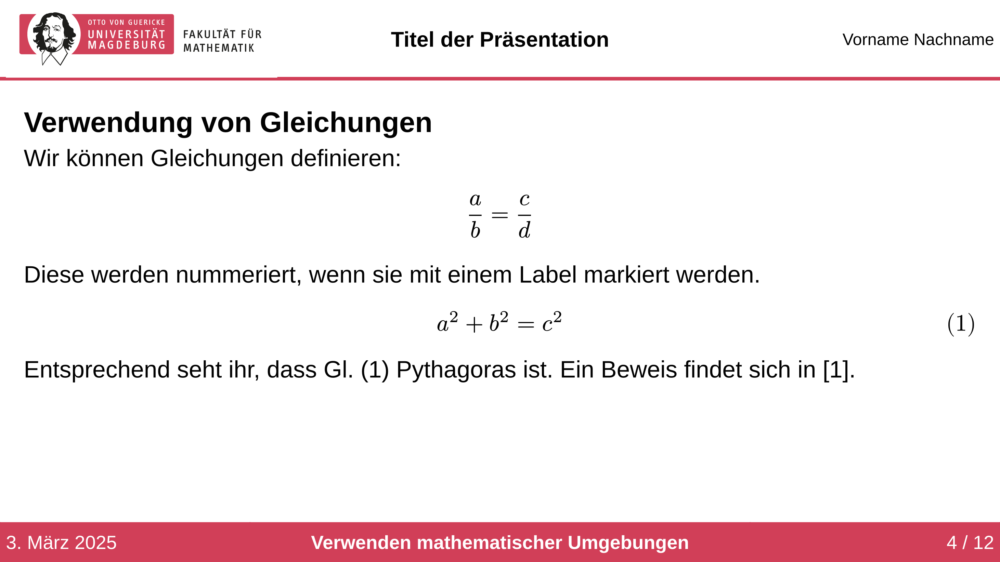

Unofficial template for creating presentations with [Polylux](https://typst.app/universe/package/polylux) in the style of the Faculty of Mathematics at Otto von Guericke University Magdeburg. Some documentation and an introduction to Polylux can be found [here](https://polylux.dev/book/).

The template can be used via:
```
typst init @preview/modern-ovgu-fma-polylux:0.1.0
```

You can also use the template via:
```typ
#import "@preview/modern-ovgu-fma-polylux:0.1.0" : *
```
and then initialize it with:
```typ
#show: ovgu-fma-theme.with(
  author: [First Name Last Name],
  title: [Presentation Title],
  affiliation: [affiliation],
  date: ez-today.today(),
)
```
Additional parameters allow further customization:
```typ
#show: ovgu-fma-theme.with(
  text-font: "Liberation Sans",
  text-lang: "en",
  text-size: 20pt,
  author:[],
  title:[],
  affiliation:[],
  date:[],
)
```
The author, title, and date will later be used for the header and footer of the slides.

# Slide Types
## Title Slide

```typ
#title-slide(
  author: none,
  date
  title: [Presentation Title],
  subtitle: [Your subtitle here],
)
```

## Outline Slide

```typ
#let outline-slide(
  heading:none,
)[]
```

## Header Slide

```typ
#header-slide()[Examples for content]
```
Headings created with this slide type will be displayed in the outline slide. To include additional headings in the outline slide, they must be registered manually using:
```typ
#toolbox.register-section(head)
```

## Base Slide
```typ
#slide-base(
  heading: none,
  show-section: true,
)[]
```
This is the foundation for all slide types.
- `heading: content`: serves as the slide title.
- `show-section: bool`: if true, the current section title is displayed in the footer.

## Slide
This slide type is based on the base slide. Below are some examples of slides.
### Multi-Column Layout

```typ
#folie(
  heading: [Multi-Column Slides]
)[
  #toolbox.side-by-side()[#lorem(39)][#lorem(30)][#lorem(35)]
]
```

### Using Mathematical Environments

```typ
#folie()[
  == Using Equations
  We can define equations:
    $ a/b = c/d $
  These are numbered when marked with a label.
    $ a^2 + b^2 = c^2 $ <pythagoras>
  As you can see, @pythagoras is Pythagoras. A proof can be found in @gerwig2021satz.
]
```

### Using an Image

```typ
#folie()[
  #figure(
    caption: [Example Graphic#footnote([Created by Malte])]
  )[#image("example-image.jpg", height: 80%)]
]
```

# Additional Features

## Numbering Equations

With the show-rule:

```typ
#show: document => conf-equations(document)
```

Only equations with labels will be numbered. To use this feature, add this command at the beginning of your presentation.

## Mathematical Symbols

If you don't know the command for a mathematical symbol, the website [detypify](https://detypify.quarticcat.com/) is very helpful. You can simply draw the symbol there, and the corresponding command will be suggested.

## Animations

Polylux offers a feature to gradually reveal content on a slide using the command:

```typ
#show: later
```

There are several additional commands for animations, all of which can be found in the [Polylux book](https://polylux.dev/book/dynamic/helper.html#higher-level-helper-functions).

## Creating a Handout from the Presentation

If the following command is placed at the beginning of the code:

```typ
#enable-handout-mode(true)
```

Animations will be ignored, and the presentation will be printed as a handout.

