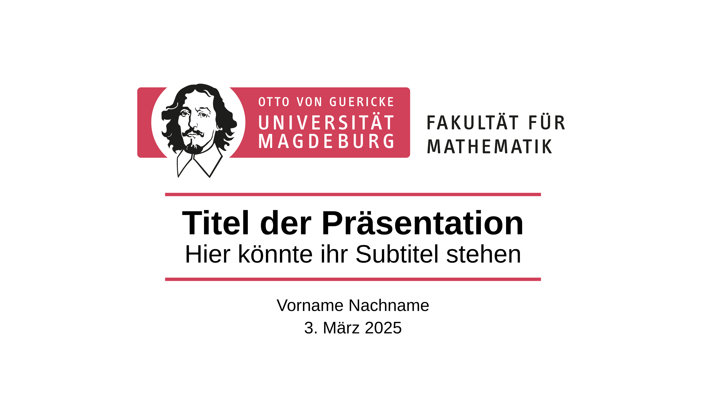
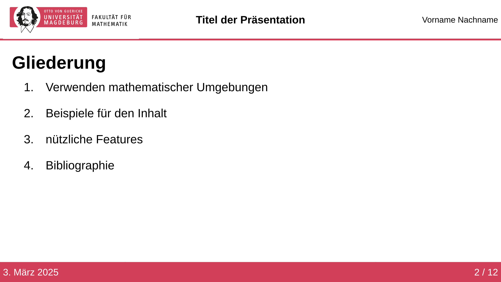
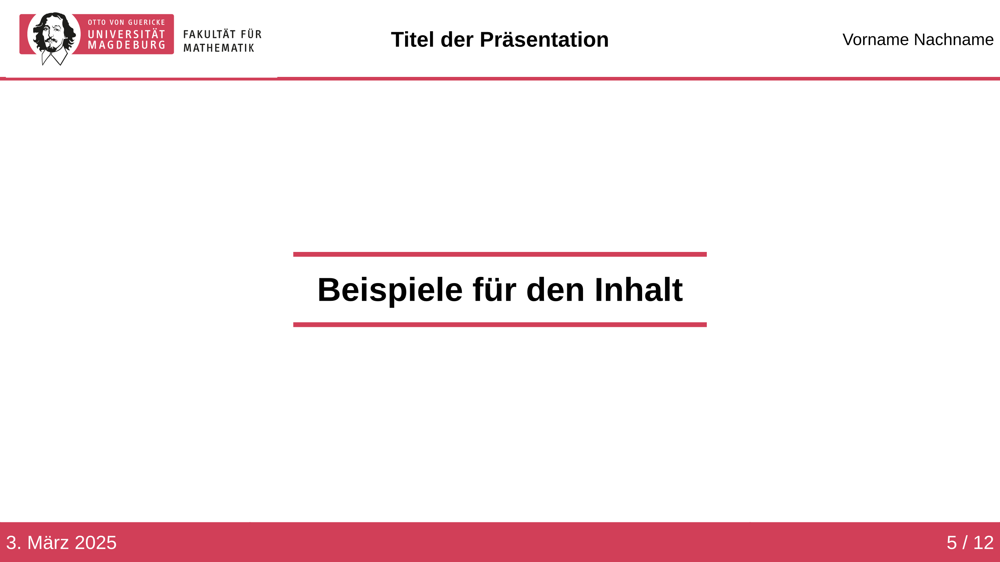
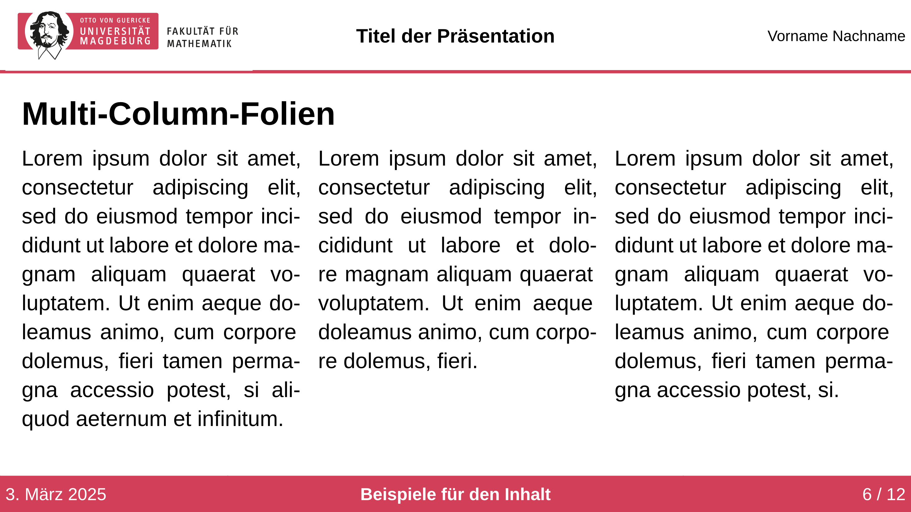
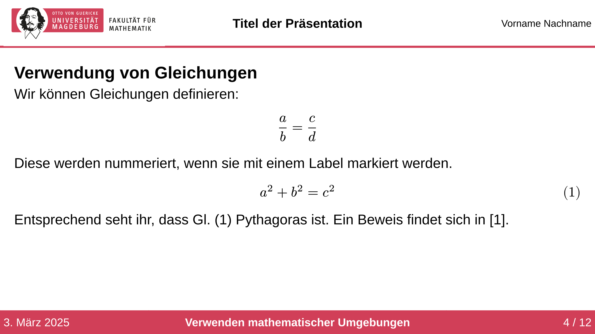
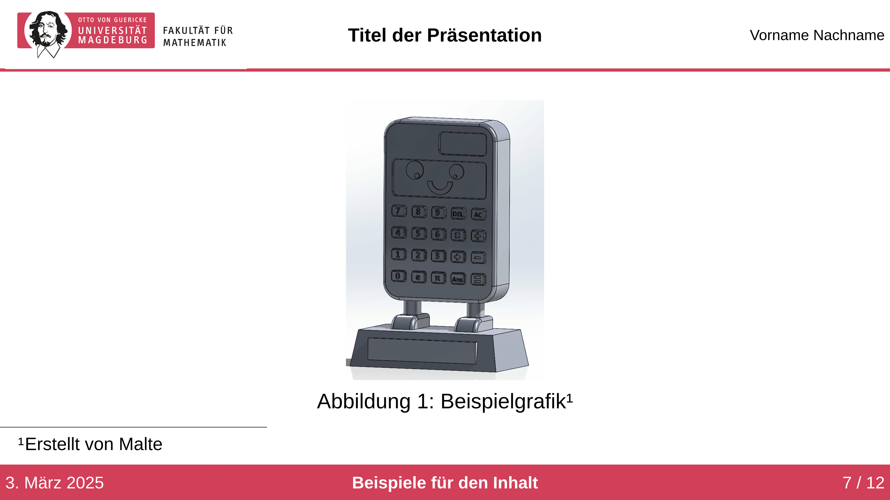

Inoffizielles Template, um Präsentationen mit [Polylux](https://typst.app/universe/package/polylux) im Stil der Fakultät für Mathematik der Otto-von-Guericke-Universität Magdeburg zu erstellen. Etwas Dokumentation und eine Einführung in Polylux findet ihr [hier](https://polylux.dev/book/).

Das Template kann via:
```
typst init @preview/modern-ovgu-fma-polylux:0.1.0 
```
genutzt werden.

Ihr könnt das Template auch via
```typ
#import "@preview/modern-ovgu-fma-polylux:0.1.0" : *
```
nutzen und es anschließend mit
```typ
#show: ovgu-fma-theme.with(
  author: [Vorname Nachname],
  title: [Titel der Präsentation],
  affiliation: [affiliation],
  date: ez-today.today(),
)
```
initialisieren. Es gibt auch noch weitere Parameter mit dem ihr das Aussehen weiter anpassen könnt.
```typ
#show: ovgu-fma-theme.with(
  text-font: "Liberation Sans",
  text-lang: "de",
  text-size: 20pt,
  author:[],
  title:[],
  affiliation:[],
  date:[],
)
```
Die Angaben zu Autor, Titel und Datum werden später für header und footer der Folien verwendet. 

# Slide-Types

## Title-Slide

```typ
#title-slide(
  author: none,
  date
  title: [Titel der Präsentation],
  subtitle: [Hier könnte ihr Subtitel stehen],
)
```

## Outline-Slide

```typ
#let outline-slide(
  heading:none,
)[]
```

## Header-Slide

```typ
#header-slide()[Beispiele für den Inhalt]
```
Die mit diesem Folientyp erzeugten Überschriften werden bei der Outline-Slide angezeigt. Sollen auch andere Überschriften in der Outline-Slide angezeigt werden, müssen diese selbst registriert werden. Dies geschieht mit dem Befehl:
```typ
#toolbox.register-section(head)
```

## Base-Slide
```typ
#slide-base(
  heading: none,
  show_section: true,
)[]
```
Das ist die Grundlage für alle Folientypen. 
- `heading: content`: dient als Folienüberschrift
- `show_section: bool`: falls true, dann wird in der Fußzeile der aktuelle Gliederungspunkt angezeigt.

## Folie

Dieser Slide-Typ basiert auf der Base-Slide. Nachfolgend ein paar Beispiele für Folien.

### Multi-Column-Layout

```typ
#folie(
  heading: [Multi-Column-Folien]
)[
  #toolbox.side-by-side()[#lorem(39)][#lorem(30)][#lorem(35)]
]
```

### Verwenden mathematischer Umgebungen

```typ
#folie()[
  == Verwendung von Gleichungen
  Wir können Gleichungen definieren:
    $ a/b = c/d $
  Diese werden nummeriert, wenn sie mit einem Label markiert werden.
    $ a^2 + b^2 = c^2 $ <pythagoras>
  Entsprechend seht ihr, dass @pythagoras Pythagoras ist. Ein Beweis findet sich in @gerwig2021satz.
]
```

### Verwenden einer Abbildung

```typ
#folie()[
  #figure(
    caption: [Beispielgrafik#footnote([Erstellt von Malte])]
  )[#image("example-image.jpg",height: 80%)]
]
```

# Weitere Funktionen
## Nummerieren von Gleichungen
Mit der show-rule
```typ
#show: document => conf_equations(document)
```
werden nur Gleichung nummeriert, die auch ein Label haben. Wenn ihr diesen Feature nutzen wollt, dann fügt den Befehl an den Anfang eurer Präsentation ein.

## Mathematische Symbole
Wenn du den Befehl für ein mathematisches Symbol nicht kennst ist die Webseite [detypify](https://detypify.quarticcat.com/) sehr hilfreich. Dort kannst du das Symbol einfach zeichnen und dir wird der entsprechende Befehl vorgeschlagen.

## Animationen
Polylux bietet das Feature mit dem Befehl
```typ
#show: later
```
Content nach und nach auf einer Folie erscheinen zu lassen. Es gibt noch einige weiterer solcher Befehle, die alle im [Polylux-Buch](https://polylux.dev/book/dynamic/helper.html#higher-level-helper-functions) nachgelesen werden können.

## Handout aus der Präsentation
Wenn am Anfang des Codes der Befehl
```typ
#enable-handout-mode(true)
```
steht, werden die Animationen ignoriert und die Präsentation als Handout gedruckt.