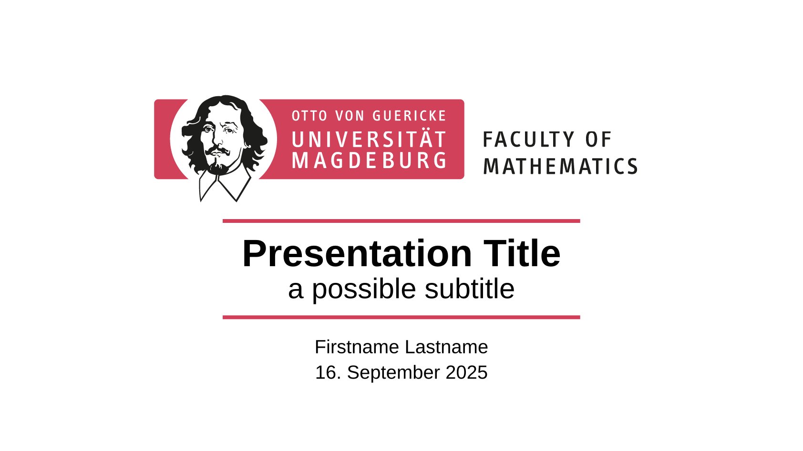
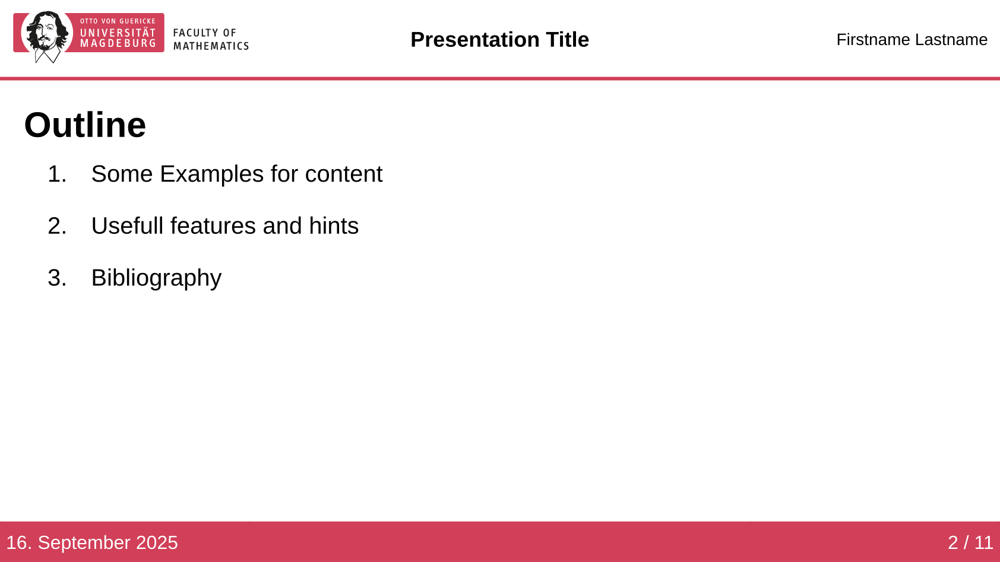
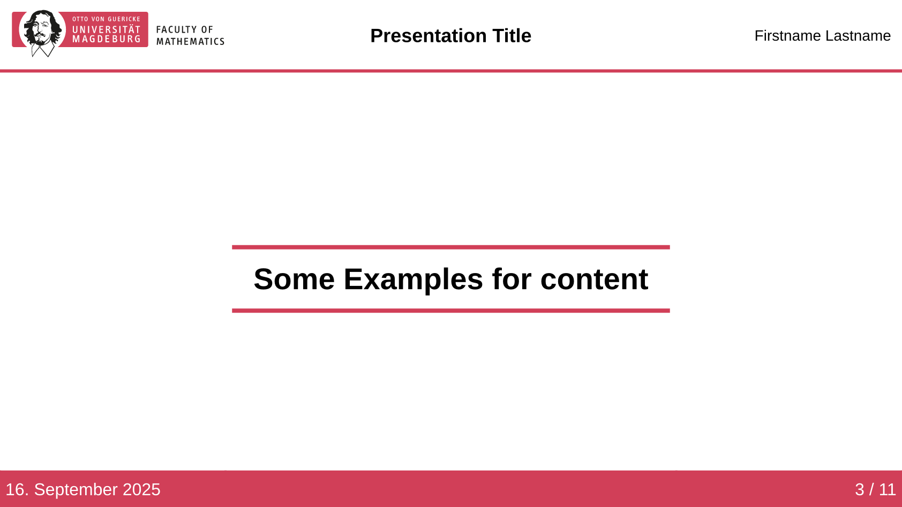
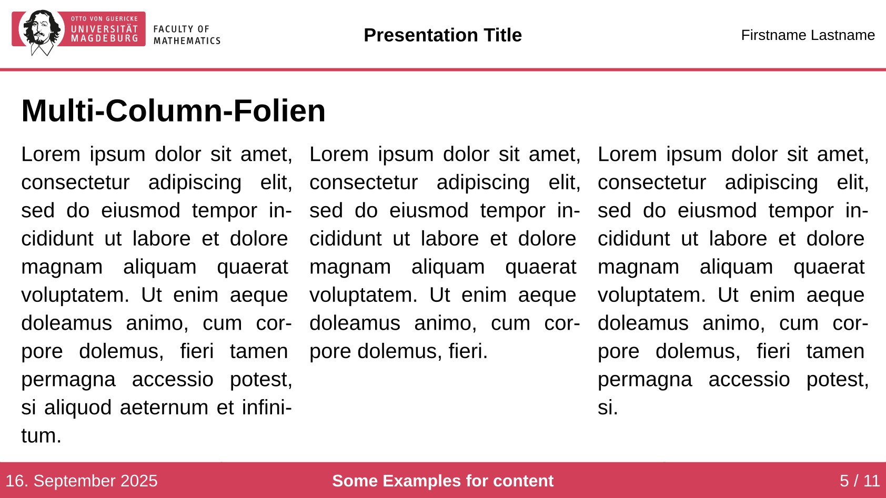
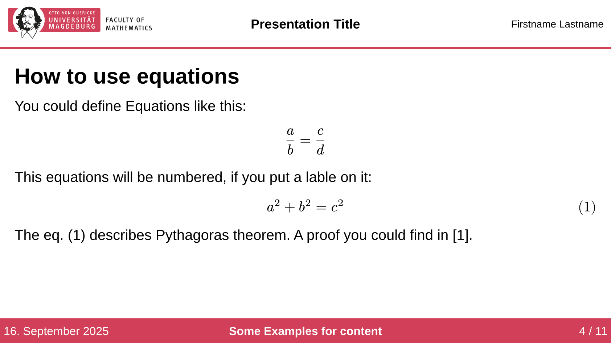
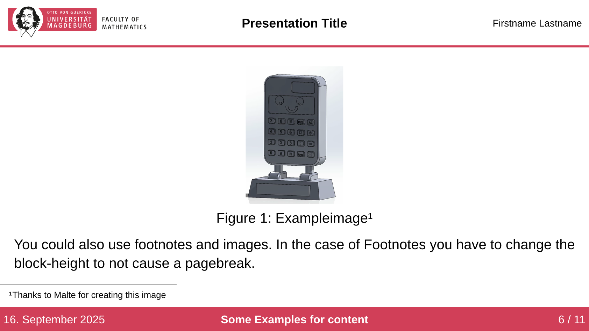

Unofficial template for creating presentations with [Polylux](https://typst.app/universe/package/polylux) in the style of the Faculty of Mathematics at Otto-von-Guericke-University Magdeburg. Some documentation and an introduction to Polylux can be found [here](https://polylux.dev/book/).

The template can be used via:
```pwsh
typst init @preview/modern-ovgu-fma-polylux:1.0.0
```

You can also use the template via:
```typ
#import "@preview/modern-ovgu-fma-polylux:1.0.0": *
```
and then initialize it with:
```typ
#show: ovgu-fma-theme.with(
  author: [Firstname Lastname],
  title: [Presentation Title],
  date: ez-today.today(),
  text-lang: "en",
)
```
Additional parameters allow further customization. The first three parameters will be passed to the ```#text()``` function.
```typ
#show: ovgu-fma-theme.with(
  text-font: "Liberation Sans",
  text-lang: "de",
  text-size: 20pt,
  author: [],
  title: [],
  date: [],
)
```
The author, title, and date will later be used for the header and footer of the slides. They will be also used for the title slide, if no other parameters are given there.

# Slide Types
## Title Slide

```typ
#title-slide(
  author: none,
  date: none,
  title: none,
  subtitle: none,
  max-width: 75%,
  body
)
```
The values for author, date or title aren't set here, they will be used from the show-rule from the beginning. If you want this values to be empty, then set them to ```[]```. The max-with argument sets the maximal width which the title takes from the page.

## Base Slide
```typ
#slide-base(
  heading: none,
  show-section: true,
  block-height: none,
)[]
```
This is the foundation for all slide types, except the title slide.
- `heading: content`: serves as the slide title.
- `show-section: bool`: if true, the current section title is displayed in the footer.
- `block-height: relative`: if set, it will be used as the height of the main content block. If footnotes are used, you have manually to adjust this to not cause some unwanted page breaks. A good starting value for adjusting is 85%.

Further you could find the different kinds of slides based on this slide-type.

## Outline Slide

```typ
#let outline-slide(
  heading:none,
)[]
```
The heading argument will be used for the title in the outline-slide. If set to none some language specific default will be used. (Currently the two supported languages are German and English)

## Header Slide

```typ
#header-slide()[Examples for content]
```
Headings created with this type of slide will be displayed in the outline slide. To include additional headings in the outline slide, they must be registered manually using:
```typ
#toolbox.register-section(head)
```


## Slide
This is probably the slide you will use most often. Below are some examples with this slide, which use different kinds of content.
### Multi-Column Layout

```typ
#slide(
  heading: [Multi-Column-Folien],
)[
  #toolbox.side-by-side()[#lorem(39)][#lorem(30)][#lorem(35)]
]
```

### Using Mathematical Environments

```typ
#folie(
  heading: [How to use equations],
)[
  You could define Equations like this:
  $ a/b = c/d $
  This equations will be numbered, if you put a lable on it:
  $ a^2 + b^2 = c^2 $ <pythagoras>
  The @pythagoras describes Pythagoras theorem. A proof you could find in @gerwig2021satz.
]
```

### Using an Image

```typ
#folie(
  block-height: 85%,
)[
  #figure(
    caption: [Exampleimage#footnote([Thanks to Malte for creating this image])],
  )[#image("example-image.jpg", height: 70%)]
  You could also use footnotes and images. In the case of Footnotes you have to change the block-height to not cause a pagebreak.
]
```

# Additional Features
## Numbering Equations

With the show-rule:

```typ
#show: document => conf-equations(document)
```

Only equations with labels will be numbered. To use this feature, add this command at the beginning of your presentation.

# Hints for usage
## Mathematical Symbols

If you don't know the command for a mathematical symbol, the website [detypify](https://detypify.quarticcat.com/) is very helpful. You can simply draw the symbol there, and the corresponding command will be suggested.

## Animations

Polylux offers a feature to gradually reveal content on a slide using the command:

```typ
#show: later
```

There are several additional commands for animations, all of which can be found in the [Polylux book](https://polylux.dev/book/dynamic/helper.html#higher-level-helper-functions).

## Creating a Handout from the Presentation

If the following command is placed at the beginning of the code:

```typ
#enable-handout-mode(true)
```

Animations will be ignored, and the presentation will be printed as a handout.

