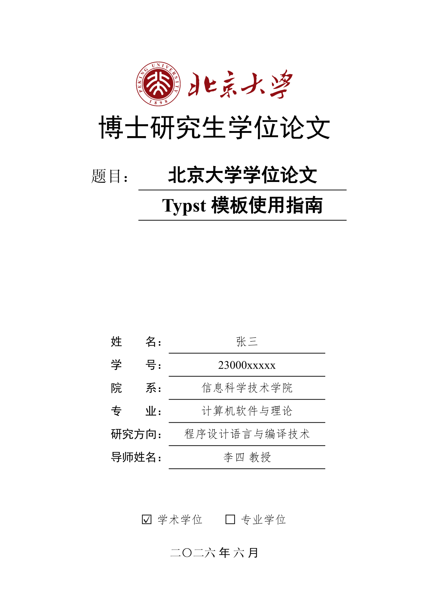

# modern-pku-thesis

北京大学学位论文 Typst 模板 / Typst template for dissertations in Peking University (PKU).



📄 **[在线预览 PDF](https://pku-typst.github.io/pkuthss-typst/thesis.pdf)** | **[盲审版本](https://pku-typst.github.io/pkuthss-typst/thesis-blind.pdf)**

## 安装方式

### 方式一：通过 Typst Universe（推荐）

```bash
typst init @preview/modern-pku-thesis:0.2.3 my-thesis
cd my-thesis
```

这会创建一个包含 `main.typ` 和 `ref.bib` 的新项目，直接编辑即可开始写作。

### 方式二：克隆仓库

```bash
git clone https://github.com/pku-typst/pkuthss-typst.git
cd pkuthss-typst
```

编辑 `thesis.typ`，参考其中的示例和文档。

**两种方式的区别：**

|          | Typst Universe     | 克隆仓库               |
| -------- | ------------------ | ---------------------- |
| 模板更新 | 修改版本号即可升级 | 需要手动拉取更新       |
| 项目结构 | 干净的初始模板     | 包含完整示例和文档     |
| 适合场景 | 直接开始写论文     | 学习模板用法、参与开发 |

## 字体配置

模板使用以下字体，需要在系统中安装或通过 `--font-path` 指定：

| 用途     | 字体名称                 | 备选方案                    |
| -------- | ------------------------ | --------------------------- |
| 中文正文 | 宋体 (SimSun)            | 思源宋体 (Source Han Serif) |
| 中文标题 | 黑体 (SimHei)            | 思源黑体 (Source Han Sans)  |
| 中文强调 | 楷体 (SimKai/KaiTi)      | -                           |
| 中文仿宋 | 仿宋 (FangSong)          | -                           |
| 英文正文 | Times New Roman          | TeX Gyre Termes             |
| 代码     | New Computer Modern Mono | -                           |

**获取字体：**

- **Windows/macOS**：系统通常已预装宋体、黑体等中文字体
- **Linux**：安装 `fonts-noto-cjk` 或下载 [思源字体](https://github.com/adobe-fonts/source-han-serif)
- **仓库用户**：`fonts/` 目录包含所需字体，使用 `--font-path fonts` 编译

## 编译

```bash
# 基本编译
typst compile main.typ

# 指定字体路径（如果字体未安装到系统）
typst compile main.typ --font-path /path/to/fonts

# 生成盲审版本
typst compile main.typ --input blind=true

# 生成打印版（链接不着色）
typst compile main.typ --input preview=false

# 章节不强制从奇数页开始
typst compile main.typ --input alwaysstartodd=false
```

## 文档

克隆仓库后，`thesis.typ` 本身即为完整的使用文档，包含：

- 模板配置选项说明
- Typst 基本语法教程
- 常见问题解答
- 进阶使用技巧

## 许可

MIT License
