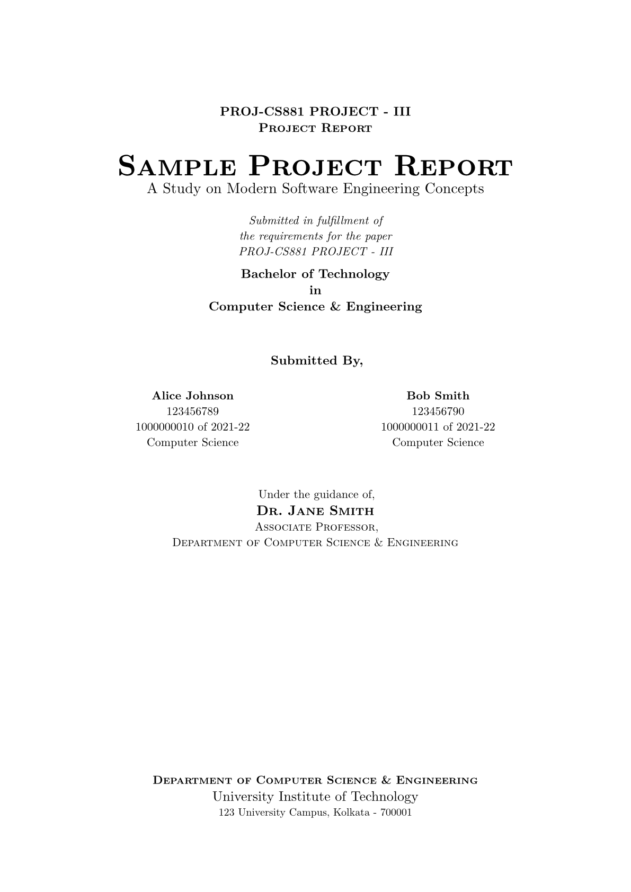

# modern-project-report

A clean, modern college and university project report template written in [Typst](https://typst.app/). Updated to comply with the latest Typst standards (v0.11+ / v0.12+ / v0.13+ / v0.15+).



## Features

- **Modern Typst Context API**: Dynamic running headers powered by Typst `context` blocks that track section titles across pages automatically.
- **Title & Cover Page**: Formal title block featuring subject code, degree/stream details, guide information, chunked author grid, institutional logo, and address.
- **Abstract & Table of Contents**: Dedicated abstract page layout and auto-indented table of contents (`outline(indent: auto)`).
- **Heading Styles**: Structured multi-level heading hierarchy with clean spacing and automated section numbering.
- **Binding Margin**: Pre-configured left binding margin offset suitable for physical report binding.

## Quick Start

### Using the Typst CLI

Initialize a new project directly with the CLI:

```bash
typst init @preview/modern-project-report:0.1.0
```

### Manual Import

To use this template in an existing Typst document:

```typst
#import "@preview/modern-project-report:0.1.0": project

#show: project.with(
  title: "Sample Project Report",
  subtitle: "A Study on Modern Software Engineering",
  abstract: [
    This project report outlines the design, architecture, and implementation of the target system.
  ],
  subject: "PROJ-CS881 PROJECT - III",
  degree: "Bachelor of Technology",
  stream: "Computer Science & Engineering",
  guide: (
    name: "Dr. Jane Smith",
    designation: "Associate Professor",
    department: "Department of Computer Science & Engineering",
  ),
  authors: (
    (
      name: "Alice Johnson",
      department: "Computer Science",
      rollno: "123456789",
      regno: "1000000010 of 2021-22",
    ),
    (
      name: "Bob Smith",
      department: "Computer Science",
      rollno: "123456790",
      regno: "1000000011 of 2021-22",
    ),
  ),
  department: "Department of Computer Science & Engineering",
  institute: "University Institute of Technology",
  address: "123 University Campus, City - 700001",
)

// Report content
= Introduction
#lorem(60)

== Background
#lorem(100)
```

## Template Parameters

| Parameter | Type | Default | Description |
|---|---|---|---|
| `title` | `str` | `""` | The title of the project report |
| `subtitle` | `str` | `""` | Optional subtitle or description |
| `subject` | `str` | `""` | Course code or paper subject (e.g. `"PROJ-CS881"`) |
| `degree` | `str` | `"Bachelor of Technology"` | Degree name |
| `stream` | `str` | `"Information Technology"` | Specialization or stream |
| `authors` | `array` | `()` | Array of author dictionaries `(name, rollno, regno, department, email)` or strings |
| `guide` | `dictionary` / `str` | `()` | Guide info `(name, designation, department)` or guide name string |
| `department` | `str` | `""` | Department name |
| `institute` | `str` | `""` | College / University name |
| `address` | `str` | `""` | Location or address of the institute |
| `logo` | `image` / `str` / `none` | `none` | Path to institution logo image |
| `abstract` | `content` / `none` | `none` | Abstract content for the report |

## Submitting to Typst Universe

To publish this package to [Typst Universe](https://typst.app/universe):

1. Fork the [typst/packages](https://github.com/typst/packages) repository on GitHub.
2. Create a new directory under `packages/preview/modern-project-report/0.1.0/`.
3. Copy `typst.toml`, `lib.typ`, `template.typ`, `README.md`, `LICENSE`, `thumbnail.png`, and the `template/` directory into `packages/preview/modern-project-report/0.1.0/`.
4. Create a Pull Request against `typst/packages`.

## License

Distributed under the MIT License. See `LICENSE` for details.