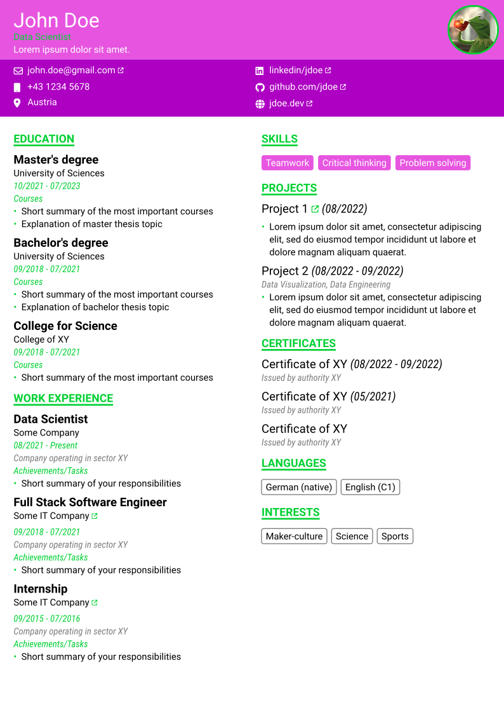
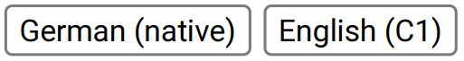
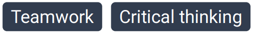
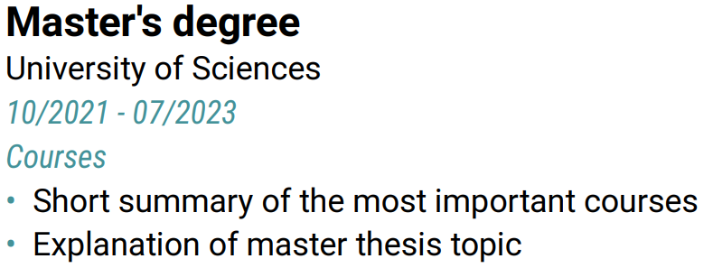
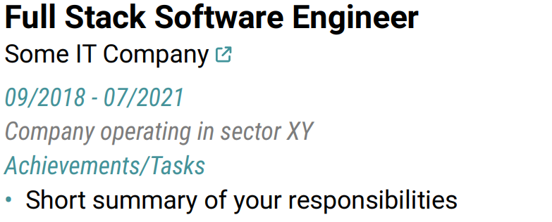
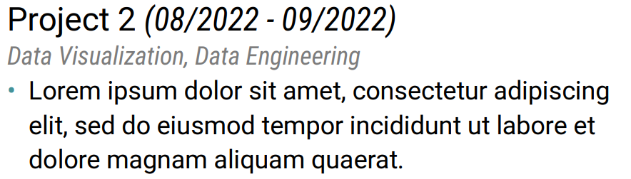

# A modern typst CV template

[](https://github.com/peterpf/modern-typst-resume/stargazers)

A customizable resume/CV template focusing on clean and concise presentation, with a touch of color.

## Requirements

To compile this project you need the following:

- Typst
- Roboto font family

## Compiling

Build the document once with

```bash
typst compile main.typ
```

Build the document whenever you save changes by running

```bash
typst watch main.typ
```

## Usage

The following code provides a minimum working example:

```typst
#import "@preview/modern-resume": *

#show: modern-resume.with(
  author: "John Doe",           // Optional parameter
  job-title: "Data Scientist",  // Optional parameter
  bio: lorem(5),                // Optional parameter
  avatar: image("avatar.png"),  // Optional parameter
  contact-options: (            // All entries are optional
    email: link("mailto:john.doe@gmail.com")[john.doe\@gmail.com],
    mobile: "+43 1234 5678",
    location: "Austria",
    linkedin: link("https://www.linkedin.com/in/jdoe")[linkedin/jdoe],
    github: link("https://github.com/jdoe")[github.com/jdoe],
    website: link("https://jdoe.dev")[jdoe.dev],
  ),
)

== Education

#experience-edu(
  title: "Master's degree",
  subtitle: "University of Sciences",
  task-description: [
    - Short summary of the most important courses
    - Explanation of master thesis topic
  ],
  date-from: "10/2021",
  date-to: "07/2023",
)

// More content goes here

```

See [main.typ](./main.typ) for a full example that showcases all available elements.

## Output examples

Example outputs for different color palettes:

| Default colors | Pink colors |
|:----------------:|:-------------:|
| | |


## Customization

Note: customization is currently only supported when cloning the template locally. Allowing customization via a "Typst universe"-installed template is a feature that is actively worked on.

The template allows you to make it yours by defining a custom color palette.
Customize the color theme by changing the values of the `color` dictionary in [lib.typ](lib.typ). For example:

- The default color palette:

  ```typst
  #let colors = (
    primary: rgb("#313C4E"),
    secondary: rgb("#222A33"),
    accent-color: rgb("#449399"),
    text-primary: black,
    text-secondary: rgb("#7C7C7C"),
    text-tertiary: white,
  )
  ```

- A pink color palette:

  ```typst
  #let colors = (
    primary: rgb("#e755e0"),
    secondary: rgb("#ad00c2"),
    accent-color: rgb("#00d032"),
    text-primary: black,
    text-secondary: rgb("#7C7C7C"),
    text-tertiary: white,
  )
  ```

## Elements

This section introduces the visual elements that are part of this template.

### Pills

Import this element from the template module with `pill`.



```typst
#pill("German (native)")
#pill("English (C1)")
```



```typst
#pill("Teamwork", fill: true)
#pill("Critical thinking", fill: true)
```

### Educational/work experience

Import the elements from the template module with `experience-edu` and `experience-work` respectively.



```typst
#experience-edu(
  title: "Master's degree",
  subtitle: "University of Sciences",
  task-description: [
    - Short summary of the most important courses
    - Explanation of master thesis topic
  ],
  date-from: "10/2021",
  date-to: "07/2023",
)
```



```typst
#experience-work(
  title: "Full Stack Software Engineer",
  subtitle: [#link("https://www.google.com")[Some IT Company]],
  facility-description: "Company operating in sector XY",
  task-description: [
    - Short summary of your responsibilities
  ],
  date-from: "09/2018",
  date-to: "07/2021",
)
```

### Project

Import this element from the template module with `project`.




```typst
#project(
  title: "Project 2",
  subtitle: "Data Visualization, Data Engineering",
  description: [
    - #lorem(20)
  ],
  date-from: "08/2022",
  date-to: "09/2022",
)
```

## Contributing

I'm grateful for any improvements and suggestions.

## Acknowledgements

This project would not be what it is without:

- [Font Awesome Free](https://github.com/FortAwesome/Font-Awesome/) | providing the icons
