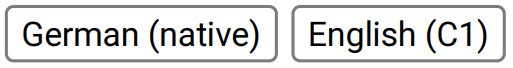
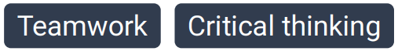
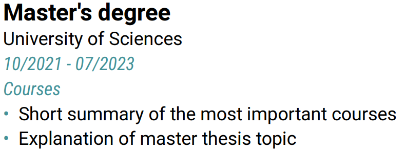
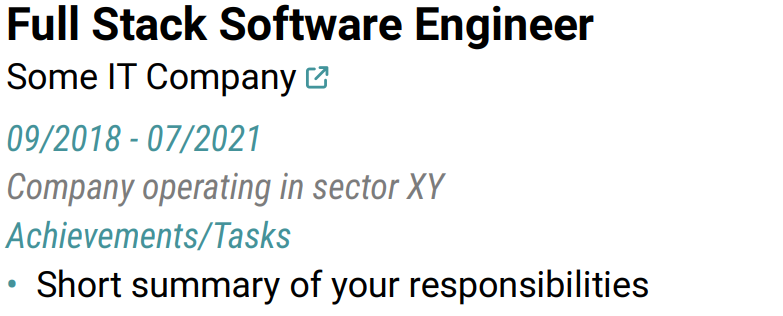
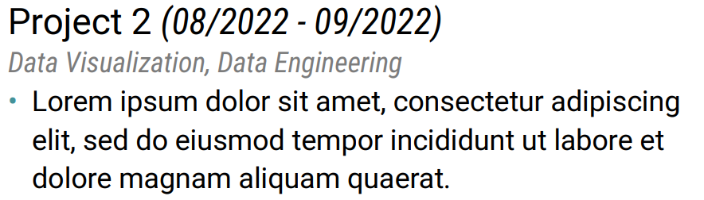

# A modern typst CV template

<div style="display: flex; gap: 10px; justify-content: center; align-items: center; text-align: center">
  <a href='https://ko-fi.com/O5O11OGPX2' target='_blank'>
    
  </a>

  <a href="https://github.com/peterpf/modern-typst-resume/stargazers" target="_blank">
    
  </a>
</div>

A customizable resume/CV template focusing on clean and concise presentation, with a touch of color.

**This template is available on [typst Universe](https://typst.app/universe/package/modern-resume)!**

## Requirements

To compile this project you need the following:

- [typst](https://github.com/typst/typst)
- [Roboto font family](https://fonts.google.com/specimen/Roboto)

## Compiling

Build the document once with

```bash
typst compile main.typ
```

Build the document whenever you save changes by running

```bash
typst watch main.typ
```

## Usage

The following code provides a minimum working example:

```typst
#import "@preview/modern-resume:1.0.0": *

#show: modern-resume.with(
  author: "John Doe",           // Optional parameter
  job-title: "Data Scientist",  // Optional parameter
  bio: lorem(5),                // Optional parameter
  avatar: image("avatar.png"),  // Optional parameter
  contact-options: (            // All entries are optional
    email: link("mailto:john.doe@gmail.com")[john.doe\@gmail.com],
    mobile: "+43 1234 5678",
    location: "Austria",
    linkedin: link("https://www.linkedin.com/in/jdoe")[linkedin/jdoe],
    github: link("https://github.com/jdoe")[github.com/jdoe],
    website: link("https://jdoe.dev")[jdoe.dev],
  ),
  // Optional custom theme
  theme: (
    primary: rgb("#313C4E"),
    secondary: rgb("#222A33"),
    accentColor: rgb("#449399"),
    textPrimary: rgb("#000000"),
    textSecondary: rgb("#7C7C7C"),
    textMuted: rgb("#ffffff"),
  ),
)

== Education

#experience(
  title: "Master's degree",
  subtitle: "University of Sciences",
  task-description: [
    - Short summary of the most important courses
    - Explanation of master thesis topic
  ],
  date-from: "10/2021",
  date-to: "07/2023",
  label: "Courses",
)

// More content goes here

```

See [main.typ](./main.typ) for a full example that showcases all available elements.

## Output examples

Example outputs for different color palettes:

|                   Default colors                    |                 Pink colors                 |
| :-------------------------------------------------: | :-----------------------------------------: |
|  |  |


## Customization

The template allows you to make it yours by defining a custom color palette.
You can create and pass your own theme dictionary to the `modern-resume` function:

```typst
// Define a custom theme once
#let custom-theme = (
  primary: rgb("#ffc0cb"),      // Pink background for header
  secondary: rgb("#222A33"),    // Dark background for contact info
  accentColor: rgb("#449399"),  // Accent color for headings and details
  textPrimary: rgb("#000000"),  // Primary text color
  textSecondary: rgb("#7C7C7C"),// Secondary text color
  textMuted: rgb("#ffffff"),    // Text color for elements on dark background
)

// Use it in the main resume function
#show: modern-resume.with(
  // ... other parameters
  theme: custom-theme,
)

// And reuse it in individual components for consistency
#experience(
  // ... parameters
  theme: custom-theme,
)

#project(
  // ... parameters
  theme: custom-theme,
)

#pill("Skill", theme: custom-theme)
```

If you don't specify a theme, the default theme will be used.
All components accept a `theme` parameter that allows you to customize their appearance.

## Elements

This section introduces the visual elements that are part of this template.

### Pills

Import this element from the template module with `pill`.



```typst
#pill("German (native)")
#pill("English (C1)")

// With custom theme
#pill("German (native)", theme: custom-theme)
```



```typst
#pill("Teamwork", fill: true)
#pill("Critical thinking", fill: true)

// With custom theme
#pill("Problem solving", fill: true, theme: custom-theme)
```

### Experience

Import the experience element from the template module with `experience`.



```typst
#experience(
  title: "Master's degree",
  subtitle: "University of Sciences",
  task-description: [
    - Short summary of the most important courses
    - Explanation of master thesis topic
  ],
  date-from: "10/2021",
  date-to: "07/2023",
  label: "Courses",
)

// With custom theme
#experience(
  title: "Master's degree",
  subtitle: "University of Sciences",
  task-description: [
    - Short summary of the most important courses
    - Explanation of master thesis topic
  ],
  date-from: "10/2021",
  date-to: "07/2023",
  label: "Courses",
  theme: custom-theme,
)
```



```typst
#experience(
  title: "Full Stack Software Engineer",
  subtitle: [#link("https://www.google.com")[Some IT Company]],
  facility-description: "Company operating in sector XY",
  task-description: [
    - Short summary of your responsibilities
  ],
  date-from: "09/2018",
  date-to: "07/2021",
  label: "Achievements/Tasks",
)

// With custom theme
#experience(
  title: "Full Stack Software Engineer",
  subtitle: [#link("https://www.google.com")[Some IT Company]],
  facility-description: "Company operating in sector XY",
  task-description: [
    - Short summary of your responsibilities
  ],
  date-from: "09/2018",
  date-to: "07/2021",
  label: "Achievements/Tasks",
  theme: custom-theme,
)
```

### Project

Import this element from the template module with `project`.




```typst
#project(
  title: "Project 2",
  subtitle: "Data Visualization, Data Engineering",
  description: [
    - #lorem(20)
  ],
  date-from: "08/2022",
  date-to: "09/2022",
)

// With custom theme
#project(
  title: "Project 2",
  subtitle: "Data Visualization, Data Engineering",
  description: [
    - #lorem(20)
  ],
  date-from: "08/2022",
  date-to: "09/2022",
  theme: custom-theme,
)
```

## Development

### Testing

Run the tests with

```bash
typst compile tests/test_lib.typ --root .
```

or with

```bash
nix flake check
```

## Acknowledgements

This project would not be what it is without:

- [Font Awesome Free](https://github.com/FortAwesome/Font-Awesome/) | providing the icons
