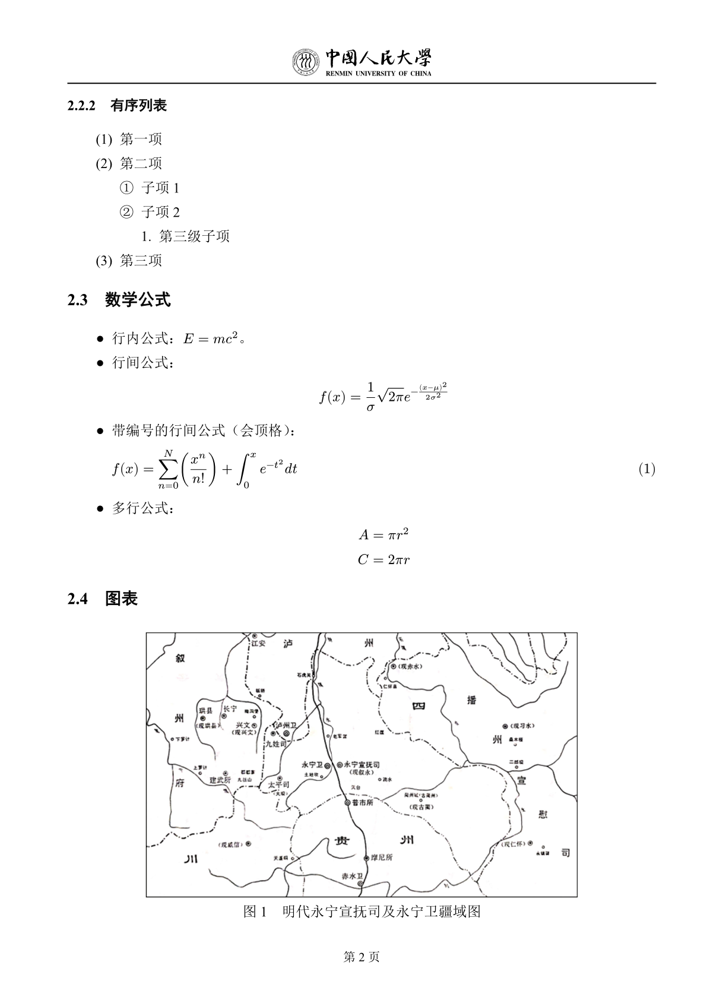

# 中国人民大学本科生毕业论文 Typst 模板


This is an unofficial undergraduate thesis Typst template for Renmin University of China (RUC). It aims to help students efficiently and elegantly complete their thesis typesetting using modern tools.

这是一个非官方的中国人民大学（RUC）本科生毕业论文 Typst 模板。旨在帮助同学们用现代化的工具，高效、优雅地完成论文排版。

## ✨ 特性

- **开箱即用**：预置了符合学校要求的页边距、字体、行距等格式。
- **自动化**：自动生成目录、图表索引，自动处理参考文献引用。
- **模块化**：章节分离，结构清晰，易于维护。

## 📦 安装与使用

### 1. 安装 Typst

1. 安装 [VS Code](https://code.visualstudio.com/)。
2. 在 VS Code 扩展商店中搜索并安装 **Tinymist** 插件。
   - 该插件提供了语法高亮、实时预览、自动补全等功能。
   - 安装后，打开 `.typ` 文件即可自动激活，点击右上角的 "Preview" 按钮即可查看实时预览。

### 2. 获取模板

你可以根据需求选择以下任意一种方式：

#### 方式一：使用 Typst CLI (推荐)

你需要先从官方 [Typst](https://github.com/typst/typst) 下载并安装 Typst CLI。如果你的 Typst 版本 >= 0.13.0，可以直接从官方包仓库初始化：
```bash
typst init @preview/modern-ruc-thesis:0.1.0
```

#### 方式二：直接克隆 (传统方式)

直接克隆本仓库或者下载 ZIP 压缩包解压到任意位置：
```bash
git clone https://github.com/ruc-thesis/modern-ruc-thesis.git
```
也可以使用国内镜像仓库：
```bash
git clone https://gitee.com/ruc-thesis/modern-ruc-thesis.git
```

### 3. 开始写作
本模板的主要文件结构如下，请在对应文件中填写内容：

- **`template/main.typ`**: **主控文件**。
  - 在这里填写论文的**基本信息**（标题、作者、学院、摘要等）。
  - 在这里**引用章节**（如 `#include "chapters/chapter1.typ"`）。
  - 在这里配置**参考文献**和**附录**。
- **`template/chapters/`**: **章节目录**。
  - 在这里创建并编写你的正文章节（如 `chapter1.typ`, `chapter2.typ`）。
- **`template/refs.bib`**: **参考文献数据**。
  - 使用 BibTeX 格式存储你的参考文献条目。
- **`template/acknowledgement.typ`**: **致谢**。
  - 书写致谢内容。
- **`template/appendix.typ`**: **附录**。
  - 书写附录内容。

### 4. 编译
- **VS Code**: 打开 `template/main.typ`，点击右上角的预览按钮，保存时会自动编译。
- **命令行**: 在项目根目录下运行：
  ```bash
  typst compile template/main.typ
  ```

## ✍️ Typst 基本语法简述

Typst 的语法简洁直观，以下是一些常用语法：

### 标题与层级
使用 `=` 表示标题，数量表示层级：
```typst
= 一级标题
== 二级标题
=== 三级标题
```

### 文本格式
- **加粗**：`*加粗内容*`
- _斜体_：`_斜体内容_`
- `代码`：`` `行内代码` ``

### 列表
- **无序列表**：使用 `-`
  ```typst
  - 项目 1
  - 项目 2
  ```
- **有序列表**：使用 `+`
  ```typst
  + 第一步
  + 第二步
  ```

### 数学公式
- **行内公式**：使用 `$` 包裹，如 `$E = mc^2$`。
- **独行公式**：使用 `$ ` 包裹（加空格）。
  - **默认**：不编号，居中显示。
    ```typst
    $ a^2 + b^2 = c^2 $
    ```
  - **编号**：在公式后添加标签 `<label>`，公式将自动编号并**左对齐**。
    ```typst
    $ a^2 + b^2 = c^2 $ <eq:pythagoras>
    ```

### 图片与表格
- **图片**：
  ```typst
  #figure(
    image("path/to/image.png", width: 80%),
    caption: [图片标题],
  )
  ```
- **表格**：
  ```typst
  #figure(
    table(
      columns: 2,
      [表头1], [表头2],
      [内容1], [内容2],
    ),
    caption: [表格标题],
  )
  ```

### 引用

- **引用文献**：使用 `@key`，如 `@wang2001`。
- **引用图表**：在图表后添加标签 `<label>`，然后使用 `@label` 引用。

更多语法请参考 [Typst 官方文档](https://typst.app/docs)。

## ⭐ 效果预览




## 🛠️ 开发者

如果你是开发者，或者想为本项目贡献代码，请阅读 [开发者指南](docs/DEV.md)。

## 📄 许可证

本项目基于 [MIT 许可证](LICENSE) 开源。

## ⚠️ 免责声明

该模板中使用的“RUC”和“中国人民大学”标志来源于 [官方大学网站](https://www.ruc.edu.cn/xuexiaobiaozhi1924747550510977025.html)。

这些标志为中国人民大学所有。此处的展示仅用于学术格式化，并不意味着获得该校的官方认可。

模板作者不拥有这些标志的版权，也不主张对其拥有任何权利。

如需官方使用或转发标志，请直接联系中国人民大学。
