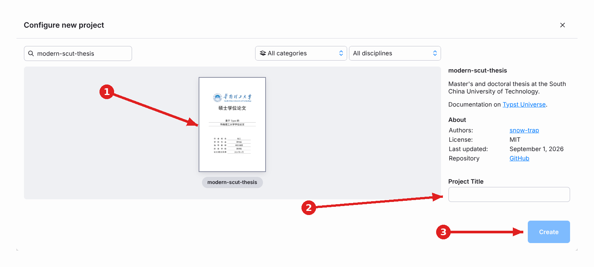

# 华南理工大学学位论文 modern-scut-thesis

华南理工大学**硕士/博士学位论文**的 Typst 模板，可达到类似 markdown 的实时渲染速度，同时支持专业型/学术型、硕/博、留学生等不同封面变体生成，支持定理环境和算法块等特性。在线使用本模板：[Typst Universe](https://typst.app/universe/package/modern-scut-thesis)

## 选择 Typst 前您需注意

相对于 LaTeX, Typst 最突出的优势是编译速度极快，可以实现类似 Markdown 的实时编译预览。其环境搭建也简单很多，不需要像 LaTeX 一样安装数 GB 的宏包体系，编译器是单一可执行文件，第三方包在首次引用时自动下载。

但该模板仍属于民间模板，**存在不被认可的风险**。您的评委也可能有自己的喜好。

Typst 语法简单，上手容易，可以参考 [Typst 中文文档网站](https://typst-doc-cn.github.io/docs/) 迅速入门。

## 本模板已实现特性

- **34 种封面变体**：参数化支持学术型/专业型、硕/博、留学生、同等学力及对应盲审版封面（配置见 [info.typ](template/info.typ)）。

  

- **盲审模式**：支持单盲与双盲模式，自动脱敏封面、隐藏致谢与内封、成果清单切换为匿名表格、清除 PDF 作者元数据。
- **构建变体**：支持**最终版**（无空白页，用于提交图书馆）、**盲审版**、**查重版**（只包含论文主体）与**印刷版**（前置页自动补白背面，配置见 [build.typ](template/build.typ)）。
- **定理环境**：基于 `great-theorems`。
- **三线表**：提供简洁的 `threeline-table()` 封装函数，支持表头自动分线、跨页与单元格合并。
- **算法伪代码**：提供符合规范的 `algorithm-figure()` 算法框与自动编号，基于 `algorithmic`。
- **代码块**：支持行号显示与语法高亮，基于 `zebraw`。
- **实验数据集中管理**：实验数值与模型参数在 [data.typ](template/data.typ) 中集中定义，正文变量引用，修改一处全文联动更新。
- **双语参考文献**：默认符合 GB/T 7714—2015 顺序编码规范，自动处理中文条目显示“等”、英文条目显示“et al.”。

> 各特性的详情请直接参考示例文件 [template/thesis.typ](template/thesis.typ) 第三章「本模板说明」。

## 使用

### 准备字体

规范规定使用宋体（SimSun）、黑体（SimHei）、Times New Roman。代码块字体规范未曾规定，本模板选用 Courier New，建议至少准备以下完整字形集：

```text
CourierNew-Regular.ttf 
TimesNewRoman-Regular.ttf
TimesNewRoman-Bold.ttf
TimesNewRoman-Italic.ttf
TimesNewRoman-BoldItalic.ttf
SimSun-Regular.ttf
SimHei-Regular.ttf
```

### VS Code 本地编辑配置（推荐）

0. 安装上述字体。Windows 自带上述字体，开箱即用；macOS 通过字体册安装，Linux 可复制字体文件到 `~/.local/share/fonts` 后执行 `fc-cache -f`。安装完成后用 `typst fonts` 确认编译器能识别；
1. 安装 Typst（如 `winget install --id Typst.Typst` / `brew install typst`，或见 [官方安装说明](https://github.com/typst/typst?tab=readme-ov-file#installation)）。
2. 在 VS Code 中安装 [Tinymist Typst](https://marketplace.visualstudio.com/items?itemName=myriad-dreamin.tinymist)。
3. 按下 `Ctrl + Shift + P`，输入 `Typst: Show available Typst templates (gallery)`，从中找到 `modern-scut-thesis`，点击 `+` 创建论文项目。
4. 打开生成的目录中的 `thesis.typ`，按下 `Ctrl + K V` 实时编辑和预览。

也可以用命令行初始化：

```sh
typst init @preview/modern-scut-thesis:0.1.1 my-thesis
cd my-thesis
typst compile thesis.typ
```

`typst init` 只复制论文源文件，模板实现由包仓库自动拉取。如需修改模板内部样式或使用构建脚本，请克隆[源码仓库](https://github.com/snow-trap/modern-scut-thesis)。

写作过程中建议用 Git 管理论文：`.typ` 源文件按章节粒度提交，便于回退、对比与协作；编译产物（PDF）写入 `.gitignore`，只跟踪源文件。

### 在线编辑配置

1. 点击 [Typst Web App](https://typst.app/?template=modern-scut-thesis&version=0.1.1) 链接，会直接打开「Configure new project」对话框并预选本模板；填写 Project Title 后点击 Create 即可在线创建项目。

   

2. 把「准备字体」章所述字体文件上传到项目目录。直接上传到项目根目录或上传到任意文件夹中都可被 Typst 识别。

**注意：如果没有将字体文件上传到项目中，会导致文字空白或异常回退到别的字体。Web App 也不提供命令行构建参数，盲审、印刷等变体需直接修改项目根目录 `build.typ` 的默认值，查重版需改用本地 Typst CLI 完成。**

### 开始写作

- 在 `info.typ` 中管理你及你论文的信息，这里的信息会出现在论文的封面、页眉等处。
- 在 `thesis.typ` 中开始写作。图片可放在 `images/` 下。
- 在 `data.typ` 管理全文范围内一致的常量，比如实验数据，然后在 `thesis.typ` 中引用。
- 在 `ref.bib` 管理 BibTeX 格式的参考文献。

### 构建变体

除最终版外，模板支持盲审（单盲/双盲）、印刷、查重等构建变体，参数与命令见模板内第三章「构建变体」一节。[源码仓库](https://github.com/snow-trap/modern-scut-thesis)的 `scripts/` 目录另提供封装脚本（`build.sh` / `build.ps1`），支持 Windows 与 Linux/macOS；请注意，互联网上的脚本可能损坏您的电脑，即使你信任我，也请检查脚本内容后再执行！

## 目录结构

```text
.
├── typst.toml            # 包配置
├── lib.typ               # 主入口，导出 documentclass()
├── template/             # typst init 复制的内容（用户论文起点）
│   ├── thesis.typ        # 论文源文件
│   ├── info.typ          # 论文信息（题目、作者、学号等）
│   ├── build.typ         # 构建参数（盲审、双面等开关）
│   ├── data.typ          # 实验数据常量（正文以变量引用）
│   ├── ref.bib           # 参考文献
│   └── images/           # 论文配图目录
├── assets/               # 模板自身资源（校徽等，包内使用）
├── layouts/              # 布局（doc/preface/mainmatter/appendix）
├── pages/                # 独立页面（封面、声明页、摘要、目录等）
├── utils/                # 辅助函数（字体字号、编号、定理环境等）
├── GB-T-7714—2015（….csl # 默认参考文献样式（包内引用，不复制进用户项目）
└── scripts/              # 构建脚本（build.sh / build.ps1，仅仓库提供）
```

- `utils` 目录：不渲染出页面的辅助函数
- `pages` 目录：会渲染出不影响其他页面的独立页面的函数
- `layouts` 目录：应用于 `show` 指令的、横跨多个页面的布局函数
- `lib.typ`：统一对外接口，通过 `documentclass` 函数闭包进行全局信息配置

## Q&A

### 为什么 PDF 中没有文字或显示为「豆腐块」？

本地没有安装对应字体。请参照上文「准备字体」一节的文件列表准备字体后重新编译；也可用 `#fonts-display-page()` 显示字体渲染测试页检查显示效果（该页额外需要楷体和仿宋）。字体名称可通过 `typst fonts` 查询。

### 我习惯了 LaTeX 公式语法，可以直接用吗？

Typst 的公式语法与 LaTeX 不同，直接粘贴 LaTeX 源码无法编译。可用 [mitex](https://typst.app/universe/package/mitex) 渲染 LaTeX 公式，或用 [tex2typst](https://github.com/qwinsi/tex2typst) 将存量公式转换为 Typst 语法。

## 致谢

- 感谢 [SCUT_thesis](https://github.com/mengchaoheng/SCUT_thesis) LaTeX 模板，它是本仓在论文规范上的第二标准，学校 2022 年规范未规定之处的实现决策多参考于它
- 感谢 [modern-nju-thesis](https://github.com/nju-lug/modern-nju-thesis)，本模板的代码架构参考了它
- 感谢 Typst 中文社区维护的 [小蓝书](https://typst-doc-cn.github.io/tutorial/) 与 [FAQ](https://typst-doc-cn.github.io/guide/)
- 感谢 [great-theorems](https://typst.app/universe/package/great-theorems)、[i-figured](https://typst.app/universe/package/i-figured)、[zebraw](https://typst.app/universe/package/zebraw)、[algorithmic](https://typst.app/universe/package/algorithmic)、[cuti](https://typst.app/universe/package/cuti) 等包的作者

## 许可

本模板的代码与文档基于 MIT License 开源（见 [LICENSE](LICENSE) 文件）。以下文件不适用 MIT 许可，其权利归各自权利人所有：

- `GB-T-7714—2015（顺序编码，双语，姓名不大写，无URL、DOI）.csl`：取自 [Zotero 中文社区样式库](https://zotero-chinese.com/styles/)，以 [CC BY-SA 3.0](http://creativecommons.org/licenses/by-sa/3.0/) 许可发布，版权归原作者（牛耕田等）所有，文件头部附有许可声明。
- 校徽与校名图片（`assets/scut-logo.jpg`、`template/images/scut_logo.jpg`）：版权归华南理工大学所有，官方版本见学校官网「[学校标识](https://www.scut.edu.cn/new/9017/list.htm)」页面。本模板仅为学位论文排版目的附带上述图片，不授予任何其他使用权利。
