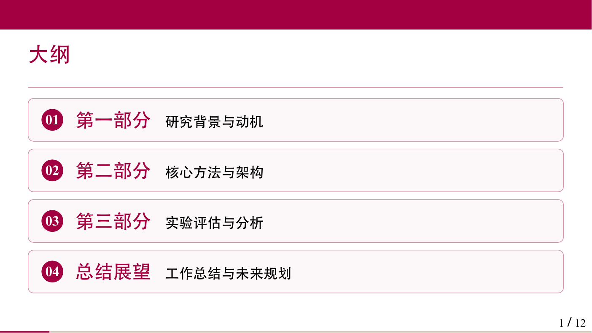
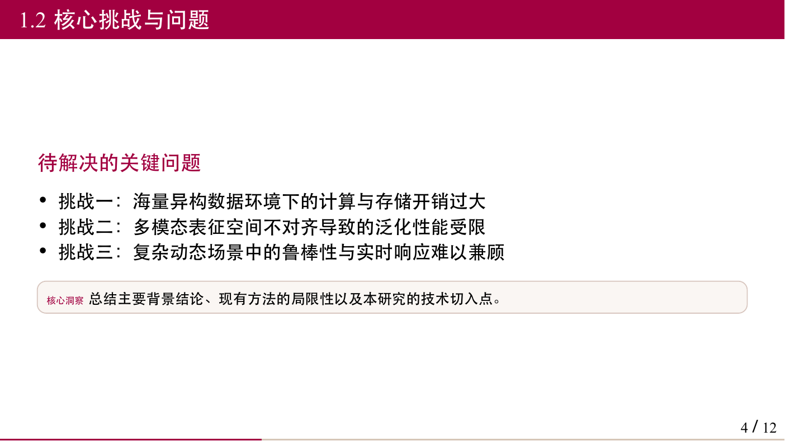
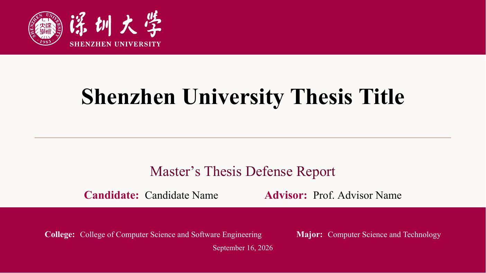
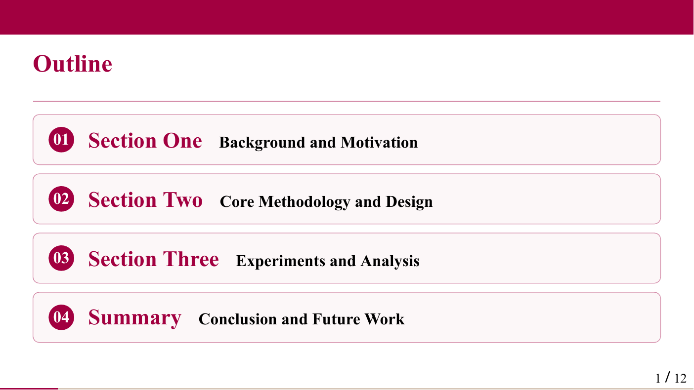
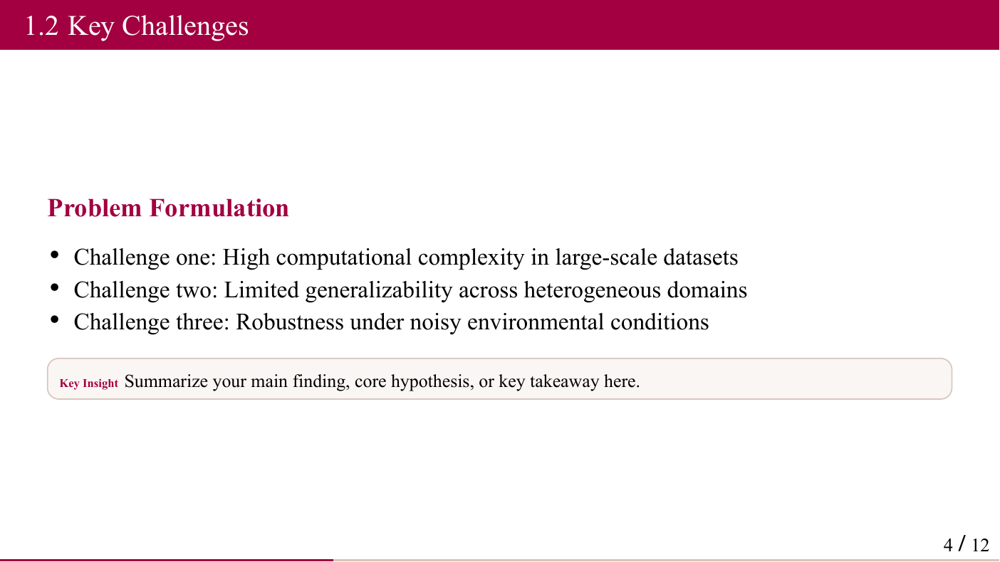

# SZU Typst Slides Template

<p align="right">
  <strong>English</strong> | <a href="README_zh.md">中文</a>
</p>

[](https://typst.app/)
[](https://touying-typ.github.io/)
[](LICENSE)

A clean, modern, and professional [Typst](https://typst.app/) slide template for Shenzhen University (SZU) presentations and thesis defenses, powered by [Touying](https://touying-typ.github.io/).

Two SZU-branded themes are included: **Metropolis** (dark red accent) and **University** (classic style). Dedicated English and Chinese templates (`xxx_en.*` / `xxx_zh.*`) are provided out-of-the-box with tailored typography and localized metadata.

---

## Preview

### Chinese Slides (中文版)

| Title Cover | Outline | Content |
| :---: | :---: | :---: |
|  |  |  |

### English Slides (英文版)

| Title Cover | Outline | Content |
| :---: | :---: | :---: |
|  |  |  |

---

## Features

- **SZU Brand Visual Identity**: Accurate SZU primary red (`#A20040`), secondary tones, and official vectors.
- **Dual Themes**: Easily switch between Metropolis and University themes.
- **Separated Bilingual Templates**: Clean English (`main_en.typ`) and Chinese (`main_zh.typ`) slide decks without mixed labels.
- **Rich Components**: Built-in cards, conclusion blocks, key metrics display, note blocks, custom tables, and more.
- **Modern Typst Ecosystem**: Fully compatible with Typst 0.14+ and Touying 0.7.4.

---

## Quick Start

### Option 1: Use via Typst Universe (Recommended)

You can initialize a new project directly with the Typst CLI:

```bash
# Initialize project template
typst init @preview/modern-szu-slides:0.1.0 my-slides
cd my-slides

# Compile default slides (Chinese)
typst compile main.typ

# Or compile English slides
typst compile main_en.typ
```

In the Typst Web App, click **Start from template** and search for `modern-szu-slides`.

### Option 2: Clone from GitHub

```bash
git clone https://github.com/Degurechaff57/szu-typst-slides.git
cd szu-typst-slides

# Compile English slides:
typst compile main_en.typ main_en.pdf

# Compile Chinese slides:
typst compile main_zh.typ main_zh.pdf

# Backward-compatible default:
typst compile main.typ
```

### Live Preview / Auto-recompile

```bash
# Watch English slides for changes:
typst watch main_en.typ

# Watch Chinese slides for changes:
typst watch main_zh.typ
```

---

## Switching Themes

The package includes two tailored themes:
- **Metropolis Theme** (default): Modern minimalist slide deck with dark red accents.
- **University Theme**: Classic academic presentation with header banner and section highlights.

When using the package:

```typst
#import "@preview/modern-szu-slides:0.1.0": *

// Default is Metropolis theme:
#show: szu-theme.with(lang: "en", title: [My Title], ...)

// Or switch to University theme:
// #show: szu-uni-theme.with(lang: "en", title: [My Title], ...)
```

---

## File Structure

The project separates the core library package and user-facing template files:

```text
modern-szu-slides/
├── lib.typ                   # Package entry point (re-exports themes, components, helpers)
├── src/                      # Library implementation modules
│   ├── szu-colors.typ        # SZU brand color definitions (red, gold, blue, cyan)
│   ├── szu-met-theme.typ     # SZU Metropolis theme implementation
│   ├── szu-uni-theme.typ     # SZU University theme implementation
│   ├── slide-cover.typ       # Cover and title slide layouts
│   ├── slide-functions.typ   # Reusable presentation components (cards, metrics, tables)
│   └── slide-text.typ        # Global font family, sizing, and color variables
├── assets/
│   └── SZU_flag.pdf          # Vector SZU flag graphic
├── gallery/                  # Rendered preview images for documentation
│   ├── preview-zh-*.png
│   └── preview-en-*.png
├── template/                 # Starter template files copied into user projects
│   ├── main.typ              # Default entry point (includes main_zh.typ)
│   ├── main_zh.typ           # Chinese presentation entry point
│   ├── main_en.typ           # English presentation entry point
│   ├── section-cover_zh.typ  # Chinese cover metadata configuration
│   ├── section-cover_en.typ  # English cover metadata configuration
│   ├── section-outline_*.typ # Outline slides
│   ├── section-*.typ         # Sample presentation sections
│   └── ref.bib               # Sample BibTeX references database
├── LICENSE                   # MIT License with University Trademark disclaimer
├── README.md                 # English documentation
└── README_zh.md              # Chinese documentation
```

---

## Built-in Components

Reusable components are defined in `slide-functions.typ`:

| Component | Usage | Description |
|-----------|-------|-------------|
| `card(title, body)` | `#card([Title], [Body text])` | Rounded container block for key concepts |
| `conclusion-card(title, body)` | `#conclusion-card([Title], [Body])` | Accent-bordered conclusion container |
| `result-conclusion(body, label: [Conclusion:])` | `#result-conclusion([Key takeaway])` | Auto-labeled conclusion highlight |
| `metric(label, value, note)` | `#metric([Accuracy], [94.8%], [+4.2% vs baseline])` | Key performance indicator block |
| `small-title(text)` | `#small-title[Subheading]` | SZU red section subheading |
| `outline-item(index, title, subtitle)` | See `section-outline_*.typ` | Numbered outline item card |
| `soft-note(body)` | `#soft-note[Note details]` | Light-colored contextual note block |
| `issue-row(tag, desc)` | `#issue-row([Problem], [Description])` | Tagged issue and resolution row |
| `img(path, caption, width)` | `#img("figures/chart.png", [Caption], width: 60%)` | Centered image with caption |
| `slide-table(...)` | `#slide-table(columns: 2, ...)` | Table wrapper with optimized presentation typography |

---

## Customization

1. **Cover Information**: Edit `section-cover_en.typ` or `section-cover_zh.typ` to update metadata variables:
   - `thesis-title` / `cover-title`
   - `thesis-subtitle`
   - `college-name`
   - `major-name`
   - `candidate-name`
   - `advisor-names`
2. **Slides Content**: Customize or replace the sample sections (`section-background_*.typ`, `section-work_*.typ`, `section-summary_*.typ`).
3. **Slide Order**: Add, remove, or reorder `#xxx-section` calls at the bottom of `main_en.typ` or `main_zh.typ`.
4. **Typography**: Fine-tune font sizes and spacing in `slide-text.typ`.

---

## Dependencies & Requirements

| Dependency | Required Version | Purpose |
|------------|------------------|---------|
| **Typst** | `0.14+` (tested on `0.14.2`) | Document compiler & CLI |
| `@preview/touying` | `0.7.4` | Presentation slide framework |
| `@preview/theorion` | `0.6.0` | Theorem and mathematical environments |
| `@preview/numbly` | `0.1.0` | Flexible heading numbering format |
| `@preview/cuti` | `0.4.0` | Chinese fake bold synthesis |

> Packages from Typst's official `@preview` package registry will be downloaded automatically by Typst on first compilation.

---

## Fonts

- **Chinese**: `Heiti SC` (macOS system font)
- **English**: `Times New Roman`

To customize fonts for Linux or Windows, change `zh-font` and `en-font` in `slide-text.typ`:
```typst
#let zh-font = "SimHei"       // e.g., for Windows
#let en-font = "Times New Roman"
```

---

## License & Trademark Notice

- **Code & Templates**: Licensed under the [MIT License](LICENSE).
- **University Trademark Notice**: The Shenzhen University (SZU) flag graphic (`assets/SZU_flag.pdf`) is a trademark and intellectual property of **Shenzhen University**. It is **not covered by the MIT License**. It is included strictly for non-commercial, academic, and educational presentations by Shenzhen University students, faculty, and researchers. All trademark and intellectual property rights belong to Shenzhen University (https://www.szu.edu.cn).

## Acknowledgements

- [Touying](https://touying-typ.github.io/) — Powerful slides framework for Typst
- [modern-szu-slides](https://github.com/yjdyamv/modern-szu-slides) — Original LaTeX inspiration
- Shenzhen University (SZU)

