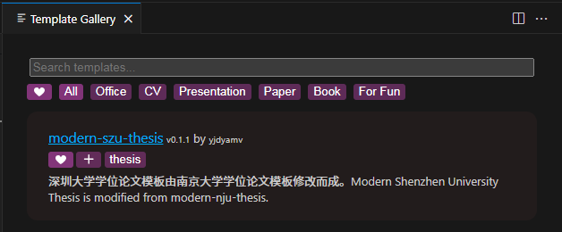

# 深圳大学学位论文 modern-szu-thesis

深圳大学毕业论文（设计）的 Typst 模板，能够简洁、快速、持续生成 PDF 格式的毕业论文，这是基于[modern-nju-thesis](https://typst.app/universe/package/modern-nju-thesis)的深大学位论文模板。

**此模板非官方模板，有不被接受的可能性**

# 优势
typst
- 编译快
- 制作模板能力强
- 现代的编程语言
- 有强大的控制力，也有标记模式

# 劣势
typst
- 新兴排版语言，积累较少
- 不够稳定，还处于发展状态

# 使用帮助

## 在线编辑

官方提供的在线编辑器，在这里你可以通过搜索模板而使用它
**由于官方在线编辑器没有提供字体，因此你必须需要上传/font目录下的字体才可以正常显示字体。**
(ps: 虽然与 Overleaf 看起来相似，但是它们底层原理并不相同。Overleaf 是在后台服务器运行了一个 LaTeX 编译器，本质上是计算密集型的服务；而 Typst 只需要在浏览器端使用 WASM 技术执行，本质上是 IO 密集型的服务，所以对服务器压力很小（只需要负责文件的云存储与协作同步功能）。)

## VS Code 本地编辑（推荐）

配置相当简单。

1. 在 VS Code 中安装 Tinymist Typst 和 Typst Preview 插件。前者负责语法高亮和错误检查等功能，后者负责预览。
- 也推荐下载 Typst Companion 插件，其提供了例如 Ctrl + B 进行加粗等便捷的快捷键。
- 你还可以下载[OrangeX4](https://github.com/OrangeX4)开发的 Typst Sync 和 Typst Sympy Calculator 插件，前者提供了本地包的云同步功能，后者提供了基于 Typst 语法的科学计算器功能。
2. 按下 Ctrl + Shift + P 打开命令界面，输入 Typst: Show available Typst templates (gallery) for picking up a template 打开 Tinymist 提供的 Template Gallery，然后从里面找到 modern-szu-thesis，点击 ❤ 按钮进行收藏，以及点击 + 号，注意需为空文件夹，就可以创建对应的论文模板了。
3. 最后用 VS Code 打开生成的目录，打开 thesis.typ 文件，并按下 Ctrl + K V 进行实时编辑和预览。

(这就好了？不错，你甚至不需要下载typst)

# 计划路线图
- **本科生毕业论文**
  - [x]封面复刻
  - [x]诚信声明
  - [x]目录
  - [x]中文摘要
  - [x]正文
  - [x]参考文献
  - [x]致谢
  - [x]英文摘要
- **研究生毕业论文**
  - [x]封面复刻
  - [x]诚信声明
  - [x]目录
  - [x]中文摘要
  - [x]正文
  - [x]参考文献
  - [x]致谢
  - [x]英文摘要

# 模板文件说明

- bachelor-thesis.typ文件是本科生模板
- master-thesis.typ文件是研究生模板
- ref.bib文件是参考文献放置处
- images里有示例图片
ps:你深的本科生和研究生论文在主体顺序上有所不同，故分成两个文件。

# 目前 Typst 有哪些第三方包和模板？

可以查看 [Typst Universe](https://typst.app/universe)。

我个人推荐的包：

- 基础绘图：[cetz](https://typst.app/universe/package/cetz)
- 绘制带有节点和箭头的图表，如流程图等：[fletcher](https://typst.app/universe/package/fletcher)
- 定理环境：[theorion](https://typst.app/universe/package/theorion)
- 伪代码：[lovelace](https://typst.app/universe/package/lovelace)
- 带行号的代码显示包：[zebraw](https://typst.app/universe/package/zebraw)
- 简洁的 Numbering 包：[numbly](https://typst.app/universe/package/numbly)
- 幻灯片和演示文档：[touying](https://typst.app/universe/package/touying)
- 相对定位布局包：[pinit](https://typst.app/universe/package/pinit)
- 数学单位包：[unify](https://typst.app/universe/package/unify)
- 数字格式化包：[zero](https://typst.app/universe/package/zero)
- 写 LaTeX 数学公式：[mitex](https://typst.app/universe/package/mitex)
- 写原生 Markdown：[cmarker](https://typst.app/universe/package/cmarker)
- 写 Markdown-like checklist：[cheq](https://typst.app/universe/package/cheq)
- 写 Markdown-like 表格：[tablem](https://typst.app/universe/package/tablem)

# 致谢
感谢 [OrangeX4](https://github.com/OrangeX4) 制作的modern-nju-thesis模板，此模板可使用性很强。本readme文件参照了此模板的readme文件编写。
