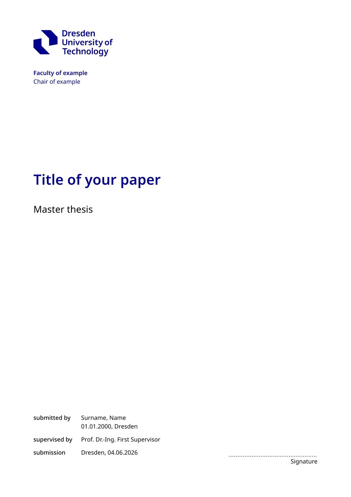
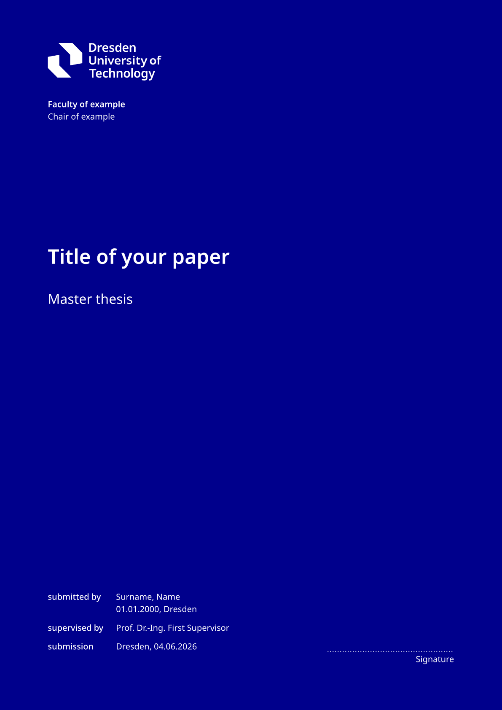
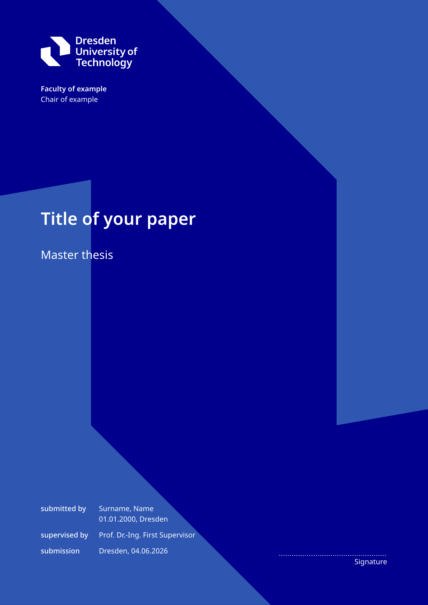
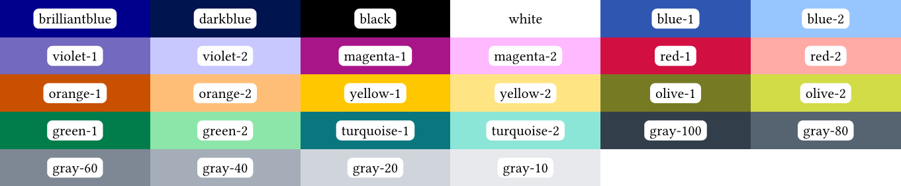

**This is not an official TU Dresden template! / Dies ist keine offizielle Vorlage der TU Dresden!**

Before using this template for an academic thesis or paper, approval should be obtained from the responsible supervisor.

# Usage

To use the template locally, run the following command in your terminal:

`typst init @preview/modern-tud-thesis:1.0.0`

## Start example

```typ
#import "@preview/modern-tud-thesis:1.0.0": *

#show: modern-tud-thesis.with(
  target: "print", // alternative values: "digital" or "print-alternating"
  title: "Title of your paper",
  thesis-type: "Master thesis",
  faculty: "Faculty of example",
  chair: "Chair of example",
  authors: (
    (
      name: "Surname, Name",
      birthdate: datetime(year: 2000, month: 1, day: 1),
      birthplace: "Dresden",
      course: "Example Course"
    ),
    // ...
  ),
  supervisors: (
    "Prof. Dr.-Ing. First Supervisor ",
    // ...
  ),
  submissionplace: "Dresden",
  abstract: "Abstract",
  number-of-attachments: 1, // optional
  // optional:
  // appearance: (
  //   titlepage: "shape-1",
  //   ...
  // )
)

// main content

#show: backmatter
// backmatter content

#show: appendix
// Appendix
```

## Arguments

Required arguments are marked with an asterisk (*). All other arguments are optional.

| Name | Description | Example Value |
|------|-------------| -- |
| `target` | Sets page margins and position of page numbers. Defaults is `print`| `print`, `print-alternating` or `digital` |
| `title`* | | `"Title of thesis"` |
| `thesis-type` |  | `"Master thesis"` |
| `faculty` | | `"\"Friedrich List\" Faculty of Transport and Traffic Sciences"` |
| `chair` | | `"Chair of Traffic Flow Science"` |
| `authors`* | List of authors. See [definition of author for arguments](#author) | ` ((name: "Max Muster"),)`
| `supervisors` | List of supervisors | `"(Prof. Dr.-Ing. First Supervisor ",)` |
| `submissionplace` | | `"Dresden"`  | 
| `submissiondate` | Default is *today* |  `datetime(year: 2020, month: 10, day: 4,)` | 
| `abstract` | | `[Short abstract.]` |
| `number-of-attachments` | Hidden if `none` | `10`
| `appearance` | Dictionary for customizing the appearance. See [definition of appearance for arguments](#appearance) | 

### Author

Each author entry may contain the following attributes.

| Name | Example Value |
|------| -- |
| `name`* | `"Max Muster"`
| `birthdate` | `datetime(year: 2020, month: 10, day: 4,)`
| `birthplace` | `"Dresden"`
| `course` | `"Traffic Engineering"`

### Appearance

The following attributes can be used to customize the appearance.

| Name | Default Value | Possible Values |
|------| -- | -- |
| `primary-color` | `colors.brilliantblue` | [TUD color](#colors) |
| `secondary-color` | `colors.blue-1` | [TUD color](#colors) |
| `tertiary-color` | `colors.blue-2` | [TUD color](#colors) |
| `black-headlines` | `false` | `true` or `false` |
| `bibliography` | `auto` | <ul><li>`auto` – show all bibliography references</li><li>`false` – hide bibliographic references</li><li>list of references to display – possible values: `outline` (headings), `pages`, `figures`, `tables`, `appendix`</li></ul>
| `outlines` | `auto` | <ul><li>`auto` – show all outlines</li><li>`false` – hide outlines</li><li>list of outlines to display – possible values: `references`, `table`, `image`</li></ul>
| `titlepage` | `"simple"` | <ul><li>`"simple"` – white background</li><li>`"simple-1"` – primary background color</li><li>`"shape-1"` – two-color background</li><li>*dict* – for custom title pages, see the template definitions in `/src/elements/titlepage.typ`</li></ul>

| [](/gallery/title-simple.typ) | [](/gallery/title-plain-1.typ)  | [](/gallery/title-shape-1.typ)  |
| -- | -- | -- |
|`titlepage: "simple" `| `titlepage: "plain-1" ` | `titlepage: "shape-1" ` |

## Language

To set the document language, add the following line before the template configuration:

```typ
#set text(lang: "de")

// #show: modern-tud-thesis.with(
//   ...
```

## Elements and functions

### Sections

Use the following commands to switch between the different document sections.
The sections change the appearance, such as the numbering style (Roman, Arabic, etc.), and other features.

```typ
#show: frontmatter // Additional frontmatter content

#show: maincontent // Only needed when #show: frontmatter was used before

#show: backmatter // backmatter content

#show: appendix // Appendix
```
### Figure with additional note

`note-figure` extends Typst's built-in `figure` element with an additional `note` field.
It is recommended to use `note-figure` for figure source attribution.

```typ
// Example using note-figure with an image
#note-figure(
    image("image.svg"),
    caption: "Caption",
    note: "Source: …"
)
```

### Declaration of Originality

Use the `declaration-of-originality` element to insert a declaration of originality.

```typ
#declaration-of-originality[
  ...
]
```

### Colors

All colors defined in the TU Dresden corporate design are available through the `colors` variable. For example `colors.brilliantblue`.

Possible values are:



To change the primary, secondary, and tertiary colors in the document, use `set-colors`.
Changing the colors affects various elements in the layout, such as the color of headings.

```typ
#set-colors(
  primary: appearance.primary-color,
  secondary: appearance.secondary-color,
  tertiary: appearance.tertiary-color
)
```

# Licensing

This template uses the TU Dresden logo. Use of the TU Dresden logo is subject to TU Dresden's branding and licensing policies.
The template in template folder is licensed under Zero-Clause BSD.
All other package files are distributed under the ISC License.

This package includes the [iso690-author-date-de.csl](http://www.zotero.org/styles/iso690-author-date-de) of Jan Drees (jdrees@mail.uni-paderborn.de) which is provided with [Creative Commons Attribution-ShareAlike 3.0 License](http://creativecommons.org/licenses/by-sa/3.0/)
