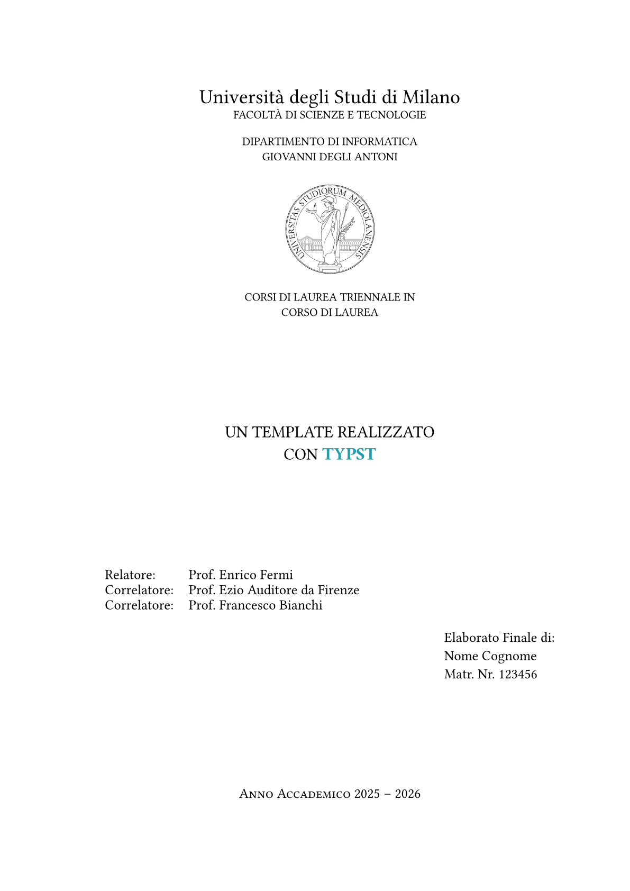

# modern-unimi-thesis 🎓

This template is the result of the conversion from the [original LaTeX template](https://www.overleaf.com/project/641879675262cde2a670826b), in Italian.

## Preview ✨

<p align="center">
  
</p>

> [!TIP]
> See `docs/instructions.pdf` for more information about the template (in Italian).

## Usage 🚀

Compile with con:

```shell
typst c main.typ --pdf-standard a-3b
```

The following excerpt is the canonical example of how the template can be structured:

```typ
#import "@preview/modern-unimi-thesis:0.1.0": *

#show: project.with(
  language: "en",
)

#show: frontmatter

// dedication

#show: acknowledgements

// acknowledgements

#toc // table of contents

#show: mainmatter

// main section of the thesis

#show: appendix

// appendix

#show: backmatter

// bibliography

// associated laboratory
#closingpage("associated_lab")

```

> [!NOTE]
> The default monospace font is [`JetBrainsMono NF`](https://fonts.google.com/specimen/JetBrains+Mono).

## Issues

- [ ] The first line after the Chapter should not be indented
