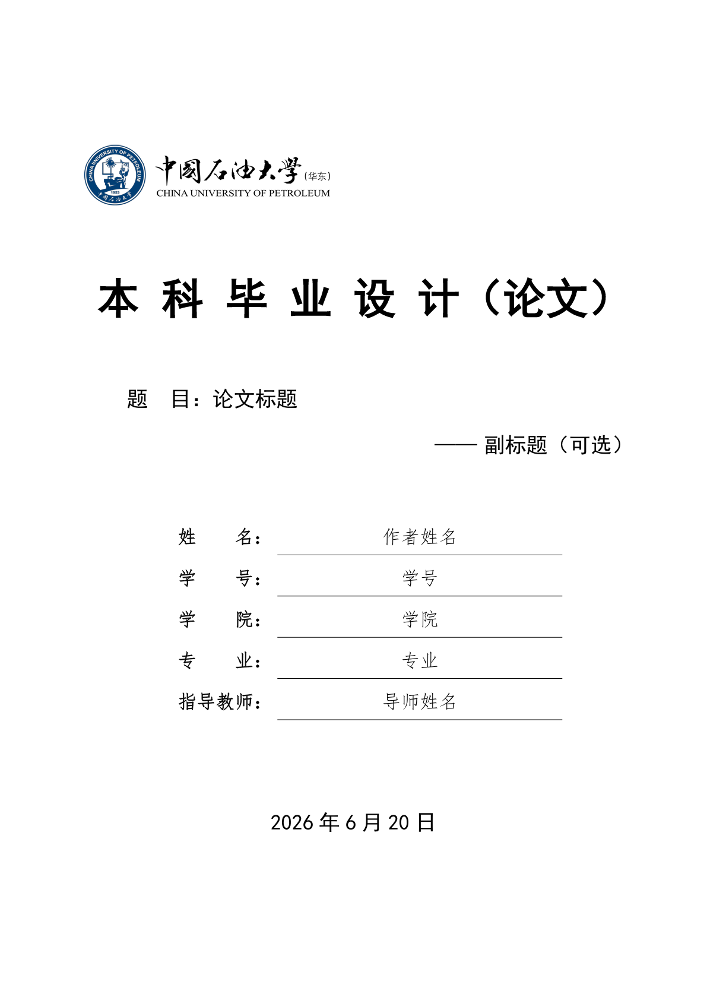

# modern-upc-thesis

A Typst template for bachelor's thesis of China University of Petroleum (East China).

中国石油大学（华东）本科毕业设计（论文）Typst 模板，独立框架，开箱即用。

[](https://typst.app/universe/package/modern-upc-thesis)

快速浏览效果：[查看 thesis-upc.pdf](https://github.com/ttOwwA/ts-upc-thesis-typst/releases/latest/download/thesis-upc.pdf)



> 🚀 **第一次使用？** 推荐阅读 [《从零开始写论文：小白上手教程》](https://github.com/ttOwwA/ts-upc-thesis-typst/blob/v0.1.0/docs/getting-started.md)，无需编程基础，15 分钟上手。

## 使用方式

### Typst Universe（推荐）

模板已上传至 [Typst Universe](https://typst.app/universe/package/modern-upc-thesis)，可直接通过包管理器导入：

```typst
#import "@preview/modern-upc-thesis:0.1.0": (
  documentclass, make-outline, three-line-table, hcell,
  upc-apply as theme-apply, setup-mainmatter,
  frontmatter-header, mainmatter-header, footer-content,
  upcabstractcn, upcabstracten, upcacknowledgements,
  upcoriginality, upclicense, appendix-env, titlepage,
)
```

在 [Typst Web App](https://typst.app/?template=modern-upc-thesis&version=0.1.0) 中选择 `Start from template` 即可在线创建项目。

### VS Code 本地编辑

1. 安装 [Tinymist Typst](https://marketplace.visualstudio.com/items?itemName=myriad-dreamin.tinymist) 插件。
2. 通过 Template Gallery 搜索 `modern-upc-thesis` 并创建项目。
3. 打开 `thesis.typ`，按 `Ctrl + K V` 实时预览。

### 本地开发

```bash
git clone https://github.com/ttOwwA/ts-upc-thesis-typst.git
cd ts-upc-thesis-typst
# 编译开发示例
cd demo && typst compile --root .. thesis-upc.typ
```

测试模板（需要先安装到本地包目录）：

```bash
bash scripts/package @preview
cd template && typst compile thesis.typ
```

## 项目结构

```text
ts-upc-thesis-typst/
├── lib.typ              # 包入口（Typst Universe）
├── lib/                 # 通用库（字号、字体、工具函数等）
├── themes/upc/          # UPC 主题（封面、样式、校徽）
├── template/            # 用户模板（发布到 Universe）
│   ├── thesis.typ       # 用户论文占位符
│   ├── ref.bib          # 示例参考文献
│   └── images/          # 示例图片
├── demo/                # 开发示例（不打包）
│   ├── thesis-upc.typ   # 完整示例论文
│   ├── chapters/        # 示例章节
│   ├── img/             # 示例图片
│   └── literature/      # 示例参考文献
├── thumbnail.png        # Typst Universe 预览缩略图
└── README.md
```

## 字体安装

编译依赖以下中文字体（至少其一）：

| 字体 | 用途 |
|------|------|
| SimSun / 宋体 | 正文 |
| SimHei / 黑体 | 标题 |
| KaiTi / 楷体 | 封面信息 |
| FangSong / 仿宋 | 封面信息 |
| Times New Roman | 西文正文（Windows）|
| DejaVu Serif | 西文正文（Linux）|

Linux/WSL 可安装 Fandol 作为中文字体回退：

```bash
sudo apt-get install fonts-fandol
```

**Typst Web App**：在线环境未预装 Windows 中文字体（SimSun/SimHei 等）。如需获得与本地 Windows 一致的字形，请将 Fandol 或系统字体文件（`.ttf`/`.otf`）上传至项目根目录，Typst 会自动发现并优先使用。

**注意**：Windows 用户编译时可能会出现 `warning: unknown font family: deja vu serif`，此为无害警告（Times New Roman 已被正确使用）。若想去掉该警告，可临时删除 `lib/fonts.typ` 中的 `"DejaVu Serif"`。

## 许可证

MIT License

---

> **说明**：本模板为个人开源项目，参考学校《本科毕业设计（论文）撰写规范》制作。使用前建议与导师确认是否符合院系具体要求。
