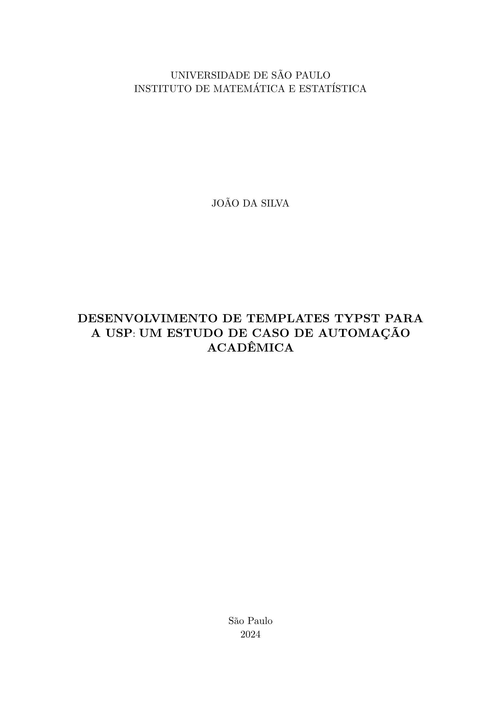

# USP Thesis Typst Template

A comprehensive, extensible Typst template for theses and dissertations at the University of São Paulo (USP) and specifically the Institute of Mathematics and Statistics (IMEUSP), following the official guidelines (5th edition, 2024).



Example output PDF generated with this template: [usp-example.pdf](https://github.com/andrader/usp-thesis-typst-template/blob/bc838c7d272bc1e3544a78fa0d8e1155db160622/examples/usp-example.pdf)

## Features
- **Official Layout**: Correct margins (3cm/2cm), A4 size, and 1.5 line spacing.
- **Automated Elements**: Generates Cover, Title Page, Approval Sheet, and Abstracts.
- **IMEUSP Support**: Specific branding and "Standard Statement" for the Institute of Mathematics and Statistics.
- **Extensible**: Easily adaptable to other USP institutes.
- **Pre-textual Elements**: Support for Dedication, Acknowledgments, and Epigraph.
- **PDF Bookmarks**: Cover, lists and table of contents appear in the PDF viewer's outline.
- **References**: ABNT (NBR 6023) layout in the IME-USP author-date style by default.
- **Appendices and Annexes**: `#show: appendix` / `#show: annex` give lettered headings ("APPENDIX A – TITLE") in the text and the table of contents.
- **Drafting Notes**: `#todo(kind: "verify")[...]` inline notes, colored by kind, listed by `#note-outline()`.

## Table of Contents
- [USP Thesis Typst Template](#usp-thesis-typst-template)
  - [Features](#features)
  - [Table of Contents](#table-of-contents)
  - [Prerequisites](#prerequisites)
  - [Getting Started](#getting-started)
  - [Example Usage](#example-usage)
  - [Configuration Options](#configuration-options)
  - [Future Extensions](#future-extensions)
  - [Development and Testing](#development-and-testing)
  - [License](#license)

## Prerequisites

- [Typst Compiler](https://typst.app/): Typst is a modern, faster, and more intuitive typesetting alternative to LaTeX, featuring cleaner syntax and instant compilation, making it ideal for new projects. 

  <details>
    <summary><b>[Click to expand] How to install Typst ⚙️</b></summary>

    ### MacOS

    Open Terminal and run:

    ```bash
    brew install typst
    ```

    ### Linux

    Open Terminal and run:

    ```bash
    # For Debian/Ubuntu-based distributions
    sudo apt install typst
    # For Fedora-based distributions
    sudo dnf install typst
    # Snap
    sudo snap install typst
    ```

    ### Windows

    Open PowerShell and run:

    ```powershell
    winget install typst
    ```

  </details>


## Getting Started

### Typst web app

Click **Start from template** on [typst.app](https://typst.app/) and search for `modern-usp-thesis`.

### Command line

Create a new project from the template:

```bash
typst init @preview/modern-usp-thesis:0.1.0
```

Then generate the PDF with:

```bash
cd modern-usp-thesis
typst compile main.typ
```

To watch for changes and recompile automatically:

```bash
typst watch main.typ
```

## Example Usage

```typst
#import "@preview/modern-usp-thesis:0.1.0": usp-thesis, appendix

#show: usp-thesis.with(
  title: [Your Thesis Title],
  author: "Your Name",
  advisor: "Advisor's Name",
  institute: "Instituto de Matemática e Estatística",
  program: "Estatística",
  degree: "Mestre", // or "Doutor"
  abstract-pt: [ ... ],
  keywords-pt: ("Keyword1", "Keyword2"),
  abstract-en: [ ... ],
  keywords-en: ("Keyword1", "Keyword2"),
  banca: (
    (nome: "Examiner 1", instituicao: "USP"),
    (nome: "Examiner 2", instituicao: "Unicamp"),
  ),
)

= Introduction
Your content starts here...

#bibliography("refs.bib") // ABNT / IME-USP style unless `style:` is given

#show: appendix
= Proofs // printed as "APPENDIX A – PROOFS", referenced as "Appendix A"
```

## Configuration Options

The `usp-thesis` function accepts the following parameters. Only `title`, `author`, `advisor`, `program` and the abstracts really need to be set; everything else has a sensible default.

| Parameter | Type | Default | Description |
| :--- | :--- | :--- | :--- |
| `title` | content | `[Título da Dissertação]` | The main title of the work. |
| `title-alt` | content | `none` | The title in the other language (required by USP), printed in the reference above that language's abstract. |
| `subtitle` | content | `none` | Optional subtitle. |
| `author` | string | `"Nome do Autor"` | Full name of the author. |
| `advisor` | string | `"Nome do Orientador"` | Full name of the supervisor. |
| `coadvisor` | string | `none` | Full name of the co-supervisor. |
| `degree` | string | `"Mestre"` | `"Mestre"` or `"Doutor"` (or `degrees.msc` / `degrees.phd`). The template prints the title "Mestre em Ciências" / "Doutor em Ciências" ("Master of Science" / "Doctor of Science" in English). If your program grants another title, pass it in full, e.g. `"Mestre em Engenharia"`. |
| `program` | string | `"Nome do Programa"` | Name of the graduate program, printed as "Programa: …", so write `"Estatística"` rather than `"Programa de Pós-Graduação em Estatística"`. |
| `area` | string | `none` | Concentration area ("Área de Concentração: …"). |
| `institute` | string | `"Instituto de Matemática e Estatística"` | Full name of the USP institute. IME gets its own statement; other institutes get the general USP one. |
| `local` | string | `"São Paulo"` | City shown on the cover and title page. |
| `year` | string / int / auto | `auto` | Year of deposit. `auto` uses the current year. |
| `version` | string | `"Original"` | `"Original"` or `"Corrigida"` (or `versions.original` / `versions.revised`), printed as "Versão Original". |
| `nature` | string | `none` | Overrides the inferred "Dissertação" / "Tese". |
| `lang` | string | `"pt"` | Main language, `"pt"` or `"en"` (or `langs.pt` / `langs.en`). |
| `font` | string / array | `"New Computer Modern"` | Document font, or a list of fallback fonts. Applies to every page, cover included. |
| `cover` | bool | `true` | Whether to print the cover. |
| `title-page` | bool | `true` | Whether to print the title page. |
| `catalog-card` | content | `none` | Optional ficha catalográfica, printed at the foot of the page after the title page (e.g. `image("ficha.png")`). Not printed without the title page. |
| `abstract-pt` | content | `none` | Abstract in Portuguese (Resumo). |
| `keywords-pt` | array | `()` | Keywords in Portuguese. |
| `abstract-en` | content | `none` | Abstract in English. |
| `keywords-en` | array | `()` | Keywords in English. |
| `reference-pt` / `reference-en` | content / auto / none | `auto` | Bibliographic reference above each abstract (auto: built from author, title, year and institute; none: omitted). |
| `dedication` | content | `none` | Optional dedication. |
| `acknowledgments` | content | `none` | Optional acknowledgments. |
| `epigraph` | content | `none` | Optional epigraph. |
| `errata` | content | `none` | Optional errata. |
| `list-of-figures` | bool / auto | `auto` | Whether to include the list of figures (auto: show if there are 5 or more). |
| `list-of-tables` | bool / auto | `auto` | Whether to include the list of tables (auto: show if there are 5 or more). |
| `table-of-contents` | bool | `true` | Whether to include the table of contents (Sumário). |
| `abbreviations` | content | `none` | Optional list of abbreviations and acronyms. |
| `symbols` | content | `none` | Optional list of symbols. |
| `banca` | array | `()` | Jury members as `(nome: "", instituicao: "")` dictionaries. The approval sheet is only printed when this is not empty. |
| `front-matter` | bool | `true` | Whether to print the pre-textual elements. `false` prints only the text, overriding the options above (see below). |

### Leaving out pre-textual elements

Most pre-textual elements are only printed when you pass them (abstracts, dedication, `banca`...). The cover, title page and table of contents are always printed unless you turn them off with `cover: false`, `title-page: false` or `table-of-contents: false`. Page numbering counts from the title page (ABNT), or from the first page printed when there is no title page.

To compile only your chapters, e.g. to share a draft with your advisor, set `front-matter: false`. Every pre-textual element is left out, whatever the other parameters say, so they can stay as they are; the text keeps the same layout, chapter references and bibliography style, numbered from page 1.

```typst
#show: usp-thesis.with(
  title: [Your Thesis Title],
  // ...
  front-matter: false,
)
```

With the defaults above, the title page of an IME master's dissertation reads:

> Dissertação apresentada ao IME-USP para obtenção do título de Mestre em Ciências. Programa: Estatística

and for another institute, e.g. `institute: "Escola Politécnica"`, `degree: "Doutor em Engenharia"`:

> Tese apresentada à Escola Politécnica da Universidade de São Paulo para obtenção do título de Doutor em Engenharia. Programa: Engenharia Elétrica

## Future Extensions

To add support for a new institute with a specific "Nature Text", modify the `nature-text` logic in `src/usp-thesis.typ`:

```typst
let nature-text = if institute.contains("Your Institute") {
  "Specific Statement for your Institute"
} else {
  // default ABNT/USP statement
}
```

## Development and Testing

To test changes before publishing, link this repository as a local package (macOS example; use `~/.local/share` on Linux or `%APPDATA%` on Windows, or run `typst info` to see the package path):

```sh
mkdir -p ~/Library/Application\ Support/typst/packages/preview/modern-usp-thesis/
ln -sfn $PWD ~/Library/Application\ Support/typst/packages/preview/modern-usp-thesis/0.1.0
```

Then `typst init @preview/modern-usp-thesis:0.1.0` uses your local copy. Run `just test` to compile the files in `examples/`.

## License

The package code is licensed under the [MIT License](LICENSE), with two exceptions:

- The files in `src/template/`, which are copied into your project by `typst init`, are licensed under [MIT No Attribution](LICENSE-MIT-0), so you can use and distribute your thesis without any license obligations.
- `src/usp-ime.csl` is the [Universidade de São Paulo – Instituto de Matemática e Estatística](https://www.zotero.org/styles/universidade-de-sao-paulo-instituto-de-matematica-e-estatistica) citation style from the Zotero Style Repository, licensed under [CC BY-SA 3.0](https://creativecommons.org/licenses/by-sa/3.0/).
