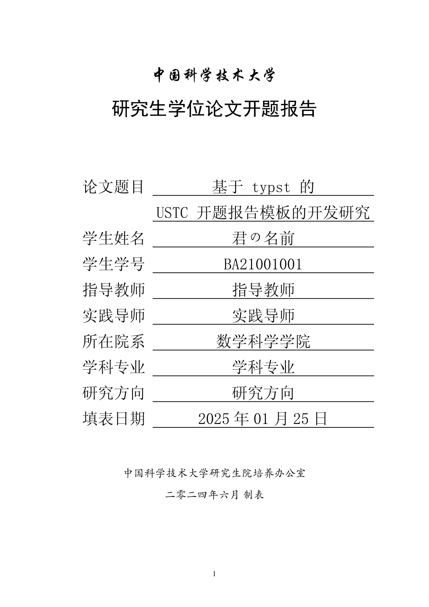

# USTC proposal

[](https://results.pre-commit.ci/latest/github/ustctug/modern-ustc-proposal/main)
[](https://github.com/ustctug/modern-ustc-proposal/actions)

[](https://github.com/ustctug/modern-ustc-proposal/releases)
[](https://github.com/ustctug/modern-ustc-proposal/releases/latest)
[](https://github.com/ustctug/modern-ustc-proposal/issues)
[](https://github.com/ustctug/modern-ustc-proposal/issues?q=is%3Aissue+is%3Aclosed)
[](https://github.com/ustctug/modern-ustc-proposal/pulls)
[](https://github.com/ustctug/modern-ustc-proposal/pulls?q=is%3Apr+is%3Aclosed)
[](https://github.com/ustctug/modern-ustc-proposal/discussions)
[](https://github.com/ustctug/modern-ustc-proposal/milestones)
[](https://github.com/ustctug/modern-ustc-proposal/network/members)
[](https://github.com/ustctug/modern-ustc-proposal/stargazers)
[](https://github.com/ustctug/modern-ustc-proposal/watchers)
[](https://github.com/ustctug/modern-ustc-proposal/graphs/contributors)
[](https://github.com/ustctug/modern-ustc-proposal/graphs/commit-activity)
[](https://github.com/ustctug/modern-ustc-proposal/commits)
[](https://github.com/ustctug/modern-ustc-proposal/releases/latest)

[](https://github.com/ustctug/modern-ustc-proposal/blob/main/LICENSE)
[](https://github.com/ustctug/modern-ustc-proposal)
[](https://github.com/ustctug/modern-ustc-proposal)
[](https://github.com/ustctug/modern-ustc-proposal)
[](https://github.com/ustctug/modern-ustc-proposal)
[](https://github.com/ustctug/modern-ustc-proposal)
[](https://github.com/ustctug/modern-ustc-proposal)



## Dependencies

- [typst](https://github.com/typst/typst) `>= 0.13.0`

## Usage

```sh
typst init @preview/modern-ustc-proposal
```

See [README.md](template).

## Related Projects

### USTC proposal template

- [docx](https://cicpi.ustc.edu.cn/indico/conferenceDisplay.py?confId=971)
- [LaTeX](https://github.com/ustctug/thesis_proposal_ustc)
