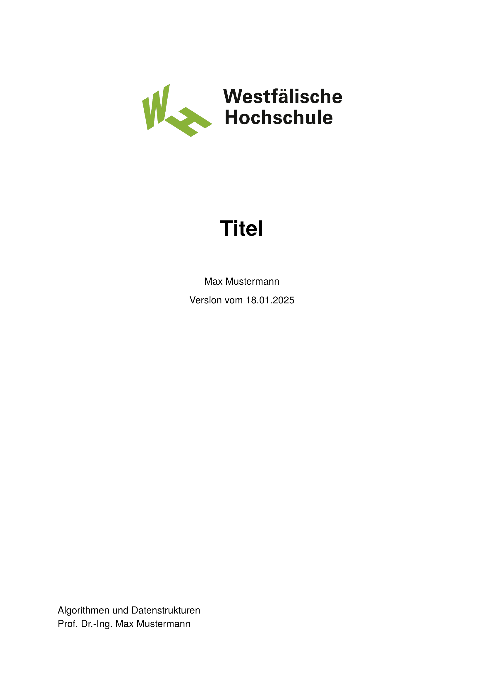

# WHS Assignment Template



This **unofficial** template can be used to write in [Typst](https://github.com/typst/typst) with the corporate design of the [Westfälische Hochschule](https://www.w-hs.de/).

#### Disclaimer

Please ask your supervisor if you are allowed to use typst and this template for your thesis or other documents.
Note that this template is not checked by the Westfälische Hochschule for correctness.
Thus, this template does not guarantee completeness or correctness.

## Usage

Create a new typst project based on this template locally.
```bash
typst init @preview/modern-whs-assignment
cd modern-whs-assignment
```

Or create a project on the typst web app based on this template.

## Configuration

The package can be configured where it is initialized. The configuration is done in the `meta.typ` file.

```typst
#show: whs-assignment.with(
  meta.title,
  meta.author,
  meta.submission-date,
  meta.keywords,
  meta.course,
  meta.lecturer,
  meta.bibliography,
)
```