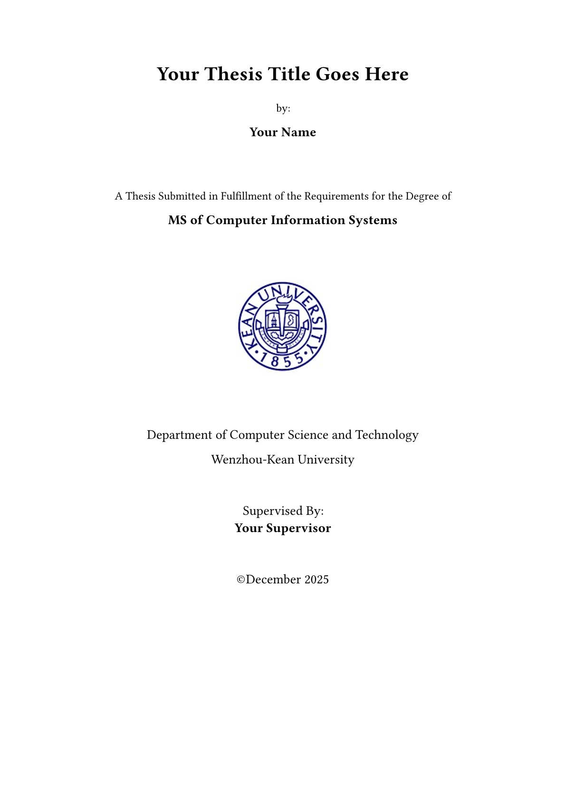

# Modern WKU Thesis

A Typst template for graduate thesis at Wenzhou-Kean University (WKU) College of Science, Mathematics and Technology.



## Usage

You can use this template in the Typst web app by clicking "Start from template" on the dashboard and searching for `modern-wku-thesis`.

Alternatively, you can use the CLI to kick this project off using the command:

```bash
typst init @preview/modern-wku-thesis
```

Typst will create a new directory with all the files needed to get you started.

### Local development (this repository)

```bash
git clone https://github.com/timmycheng/modern-wku-thesis
cd modern-wku-thesis
typst compile --root . template/main.typ   # one-shot build
typst watch --root . template/main.typ     # live preview while editing
```

> `template/main.typ` imports `../src/lib.typ` for local development. The
> publish workflow automatically rewrites it to the package import
> (`@preview/modern-wku-thesis:x.y.z`) when cutting a release.

## Configuration

This template exports the `graduate-thesis` function with the following named arguments:

- **title**: The title of the thesis
- **author**: Author name (e.g., "John Doe" or "John Doe, Jane Smith" for multiple authors)
- **degree**: Degree type (default: `MS of Computer Information Systems`)
- **department**: Department name (default: `College of Science, Mathematics and Technology`)
- **university**: University name (default: `Wenzhou-Kean University`)
- **supervisor**: Supervisor name (e.g., "Dr. John Doe" or "Dr. John Doe, Dr. Jane Smith" for multiple supervisors)
- **month**: Graduation month (default: `December`)
- **year**: Graduation year (default: `2025`)
- **degree-year**: Year of degree completion (default: `2025`)
- **program-type**: Program type (default: `Master of Computer Information Systems`)
- **degree-type**: Degree type (default: `Master`)
- **degree-department**: Department for the degree (default: `College of Science, Mathematics and Technology`)
- **abstract**: The abstract content (use empty lines for paragraph breaks)
- **keywords**: Keywords separated by semicolons (e.g., `keyword1; keyword2; keyword3`)
- **acknowledgments**: Acknowledgments content (use empty lines for paragraph breaks)
- **acronyms**: Dictionary of acronyms (e.g., `("TMS": "Traceability Management System")`)
- **bibliography**: Bibliography using IEEE style (e.g., `bibliography("refs.bib")`)

The function also accepts a single, positional argument for the body of the thesis.

## Example

```typ
#import "@preview/modern-wku-thesis:0.1.3": graduate-thesis

#show: graduate-thesis.with(
  title: [Automatic Visualization of Traceability Information],
  author: "Timmycheng",
  degree: [MS of Computer Information Systems],
  department: [College of Science, Mathematics and Technology],
  university: [Wenzhou-Kean University],
  supervisor: [Dr. Nasser Mustafa],
  month: [December],
  year: [2025],
  degree-year: [2025],
  program-type: [Master of Computer Information Systems],
  abstract: [
    Classical Traceability Management Systems (TMS) help track links between software parts like requirements, designs, code, and test cases.

    This study proposes an improved Traceability Management System for software engineering processes.
  ],
  keywords: [Traceability; Automatic; Regular Expression; Visualization; TMS.],
  acknowledgments: [
    I would like to express my sincere gratitude to my supervisor for their invaluable guidance.

    Special thanks to my family and friends for their unwavering support.
  ],
  bibliography: bibliography("refs.bib"),
  acronyms: (
    "TMS": "Traceability Management System",
    "RE": "Regular Expression",
    "CSV": "Comma-Separated Values",
  ),
)

= Introduction

Your thesis content goes here...

= Literature Review

More content...

= Methodology

Even more content...
```

## Features

- Compliant with WKU (Wenzhou-Kean University) CSMT graduate thesis formatting requirements
- Automatic generation of cover page, abstract, acknowledgments, and acronyms list
- IEEE bibliography style
- Proper heading numbering (`Chapter N`, `N.M`, `A.`, `•`) and formatting
- Chapters start on a new page; table/figure caption styling
- Professional thesis layout and typography

## Repository layout

```
src/          Template implementation (lib.typ + modules)
template/     Starter project for `typst init` / local compilation
ref/          Reference documents (formatting examples)
```

## Release workflow

1. Update the version in `typst.toml` and add a `Changelog` entry.
2. Tag and push: `git tag v0.1.2 && git push origin v0.1.2`.
3. The `push-to-fork` workflow copies the package into your `typst/packages`
   fork (with the template import rewritten to `@preview/...`) and opens the
   PR to [typst/packages](https://github.com/typst/packages) from there.

## Contributing

Contributions are welcome! Please feel free to submit issues or pull requests to improve this template.

## License

This template is licensed under the MIT License. See the [LICENSE](LICENSE) file for details.
