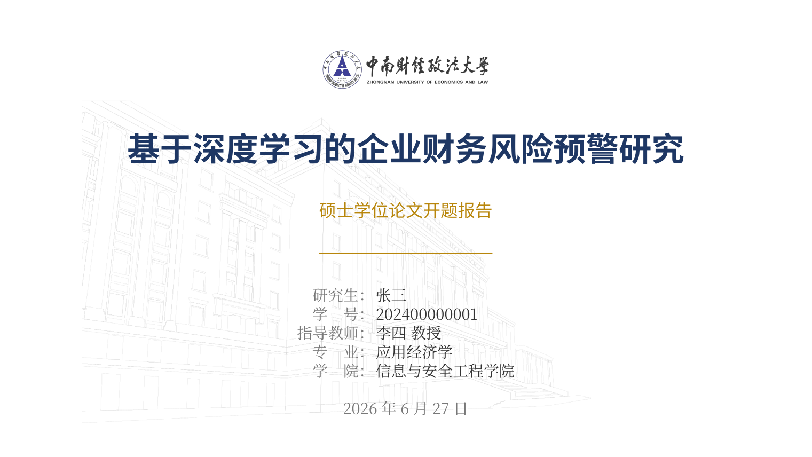
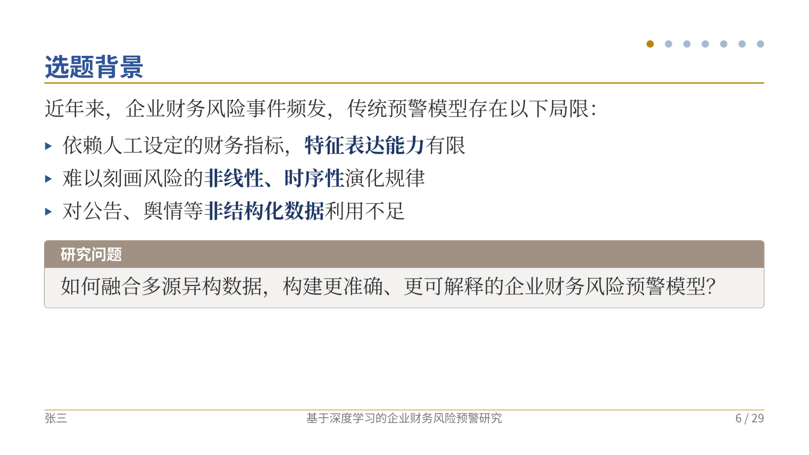
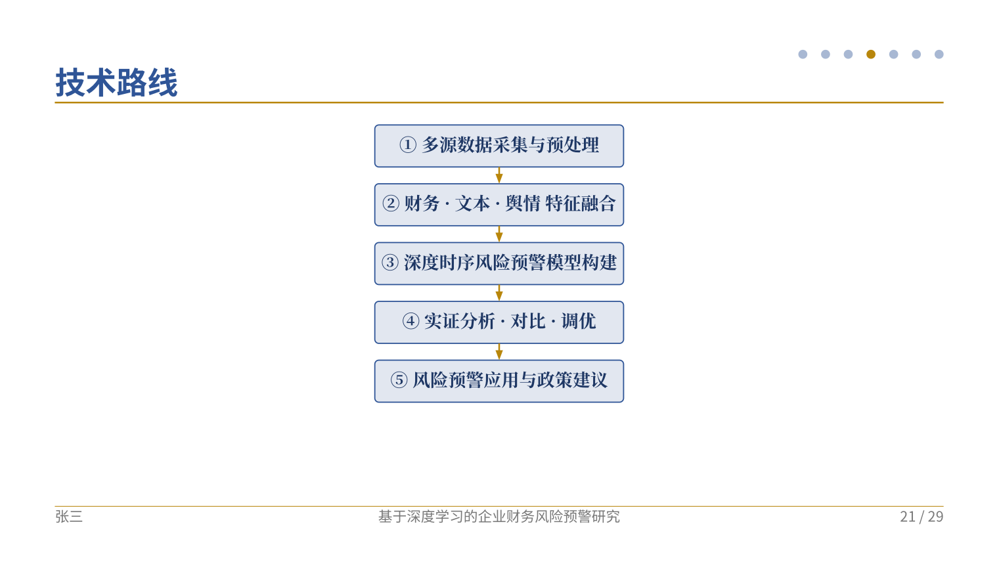
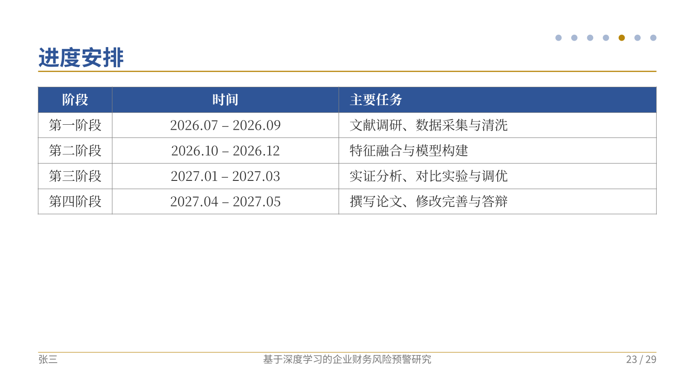
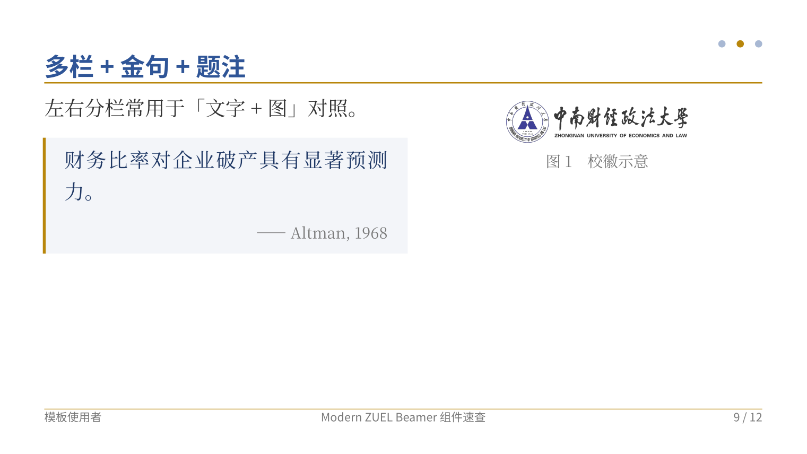
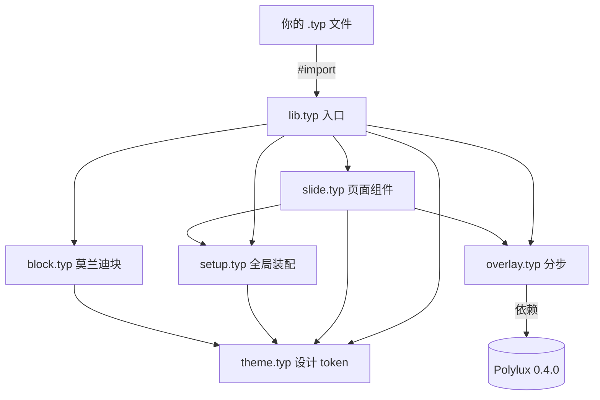

# Modern ZUEL Beamer

中南财经政法大学风格的 **Typst 演示文稿模板**，面向毕业论文**开题答辩**。蓝 + 金端庄风，支持 beamer 式分步显示。

## 特性

- 🎓 五类页面：封面 / 目录（自动汇总章节）/ 章节分隔 / 内容 / 结束
- ⏯️ 分步显示：基于 [Polylux](https://polylux.dev) 0.4.0 引擎（`uncover` / `only` / `one-by-one` / `item-by-item`）
- 🧭 页眉圆点导航：每章一点，当前高亮，**点击跳转**到对应章节页
- 📖 讲义模式：`handout: true` 一键折叠所有分步，便于打印/导出讲义
- 🎨 蓝金端庄主题 + 6 种莫兰迪语义色块（定义 / 注意 / 示例 / 定理 / 重点 / 说明）
- 📐 设计 token 集中在 [`src/theme.typ`](src/theme.typ)，改一处变全局
- 🖼️ 封面校园线描水印（`watermark: none` 可关闭）
- 📊 技术路线图用 [cetz](https://cetz-package.github.io) 原生绘制
- 📄 自动页脚：左作者 · 中标题 · 右页码

## 预览

| 封面（校徽 + 对齐信息表 + 水印） | 内容页（页眉圆点导航 + 语义色块） |
| :--: | :--: |
|  |  |
| **技术路线图（cetz 原生绘制）** | **进度安排表** |
|  |  |

组件示例（多栏布局 · 金句块 · 图片题注）：



## 环境要求

| 依赖 | 版本 | 说明 |
| --- | --- | --- |
| Typst | 0.15.0 | 本机 `/usr/local/bin/typst` |
| 中文字体 | Noto Serif/Sans CJK SC | 系统已装 |
| Polylux | 0.4.0 | 首次编译联网自动拉取 |
| cetz | 0.4.0 | 仅技术路线图用，联网自动拉取 |

## 快速开始

```bash
# 在项目根目录编译示例（注意 --root 指向项目根，否则 ../lib.typ 会被判越界）
typst compile --root . example/开题答辩-示例.typ out.pdf

# 实时预览
typst watch --root . example/开题答辩-示例.typ out.pdf
```

## 目录结构

```
modern-zuel-beamer/
├── lib.typ              # 入口：import 这一个即可
├── typst.toml           # 包元数据
├── asset/               # logo / 背景图
├── src/
│   ├── theme.typ        # ★ 设计 token（颜色/字体/字号/间距）
│   ├── setup.typ        # 全局装配（页面/字体/文档信息）
│   ├── slide.typ        # 五类页面函数 + 标题栏 + 页眉圆点 + 页脚
│   ├── overlay.typ      # 接 Polylux 分步引擎 + 讲义模式
│   ├── block.typ        # 莫兰迪语义色块
│   └── component.typ    # 多栏 / 题注 / 金句 / 编号定理
└── example/
    ├── 开题答辩-示例.typ  # 完整可填充示例
    └── 组件速查.typ       # 各组件用法参考
```

## API 速查

```typst
#import "../lib.typ": *

// 1) 装配（相当于 documentclass）
#show: zuel-beamer.with(
  title: "...", subtitle: "...",
  author: "...", student-id: "...", supervisor: "...",
  major: "...", school: "...", date: datetime.today(),
  // logo: image("自定义.png", height: 2cm),  // 可选
  // watermark: none,                         // 关闭封面水印
  // handout: true,                           // 讲义模式：去掉分步动画
)

#title-slide()                 // 封面
#outline-slide()               // 目录（自动收集所有 section）

#section("研究背景与意义")       // 章节分隔页（驱动目录与页脚）

#slide(title: "选题背景")[       // 内容页（= beamer 的 frame）
  - 第一点
  #uncover("2-")[- 第二步才出现]
  #definition-block(title: "研究问题")[ ... ]   // 语义色块
]

#end-slide(message: "敬请各位老师批评指正！")
```

**分步显示**（Polylux 0.4.0 无 `#pause`，用下列函数）：

| 函数 | 效果 |
| --- | --- |
| `uncover(2)[...]` | 第 2 步起出现（占位保留）|
| `uncover("2-")[...]` | 第 2 步起一直显示 |
| `only(3)[...]` | 仅第 3 步出现（不占位）|
| `one-by-one[A][B][C]` | A、B、C 逐步出现 |
| `item-by-item[列表]` | 列表项逐条出现 |

**语义色块**：`note-block` / `definition-block` / `alert-block` / `example-block` / `theorem-block` / `highlight-block`，均支持 `title:` 参数。

**更多组件**（见 [`example/组件速查.typ`](example/组件速查.typ)）：

| 组件 | 用法 | 说明 |
| --- | --- | --- |
| 多栏布局 | `#cols[左][右]`、`#cols(widths: (2fr, 1fr))[宽][窄]` | 文字+图、左右对照 |
| 图片题注 | `#fig(image("x.png", width: 70%), caption: [说明])` | 自动「图 N」，题注样式统一 |
| 金句/引用块 | `#quote-block(by: "来源")[内容]` | 左金条 + 斜体引文 |
| 编号定理 | `#theorem(title: "可选")[...]`、`#lemma[...]`、`#corollary[...]`、`#definition-thm[...]` | 各类独立自动编号 |

## 自定义外观

所有可调参数集中在 [`src/theme.typ`](src/theme.typ)：`color`（配色）、`font`（字体）、`size`（字号）、`layout`（间距/线条）。改这里即可整体换装，无需动组件代码。

## 架构



## 关于流程图

模板内的流程图（如技术路线图）用 **cetz** 原生绘制，矢量清晰、随主题变色、零外部构建步骤。本文档与设计沟通中的流程图用 **mermaid** 表达（如上方架构图）；Typst 编译期不渲染 mermaid，故不在幻灯片内使用。

## 许可

MIT
