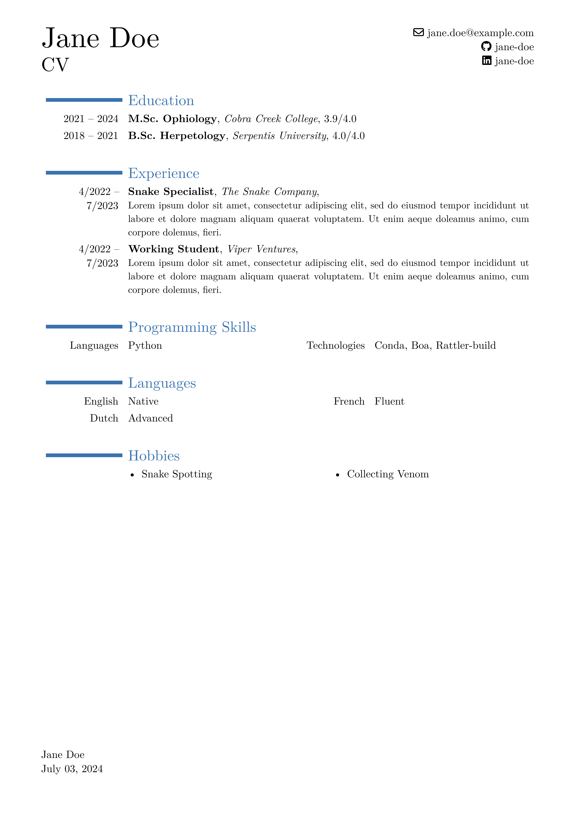

# moderner-cv

This is a typst adaptation of LaTeX's [moderncv](https://github.com/moderncv/moderncv), a modern curriculum vitae class.

## Requirements

This template uses FontAwesome icons via the [fontawesome typst package](https://typst.app/universe/package/fontawesome).
In order to properly use it, you need to have fontawesome installed on your system or have typst configured (via `--font-path`) to use the fontawesome font files.
You can download fontawesome [here](https://fontawesome.com/download).

## Usage

```typst
#import "@preview/moderner-cv:0.1.0": *

#show: moderner-cv.with(
  name: "Jane Doe",
  lang: "en",
  social: (
    email: "jane.doe@example.com",
    github: "jane-doe",
    linkedin: "jane-doe",
  ),
)

// ...
```

## Examples



## Building and Testing Locally

To build and test the template locally, you can run `pixi run watch` in the root of this repository.
Please ensure to have linked this package to your local typst packages, see [here](https://github.com/typst/packages#local-packages):

```bash
# linux
mkdir -p ~/.local/share/typst/packages/preview/moderner-cv
ln -s $(pwd) ~/.local/share/typst/packages/preview/moderner-cv/0.1.0

# macos
mkdir -p ~/Library/Application\ Support/typst/packages/preview/moderner-cv
ln -s $(pwd) ~/Library/Application\ Support/typst/packages/preview/moderner-cv/0.1.0
```
