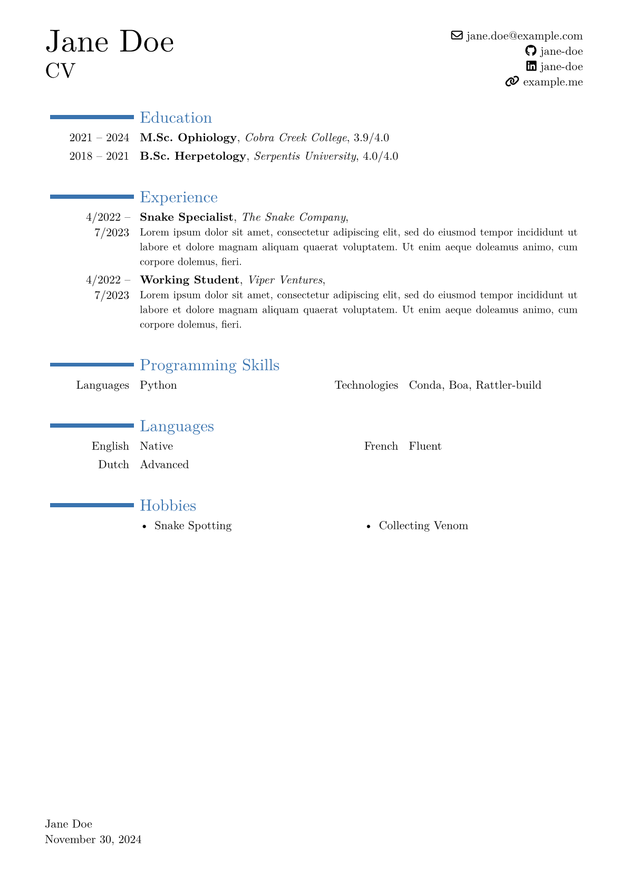

# moderner-cv

[![License][license-badge]][license]
[![CI][ci-badge]][ci]
[![Latest release][latest-release-badge]][typst-universe]

[license-badge]: https://img.shields.io/github/license/pavelzw/moderner-cv?style=flat-square
[license]: ./LICENSE
[ci-badge]: https://img.shields.io/github/actions/workflow/status/pavelzw/moderner-cv/ci.yml?style=flat-square
[ci]: https://github.com/pavelzw/moderner-cv/actions/
[latest-release-badge]: https://img.shields.io/github/v/tag/pavelzw/moderner-cv?style=flat-square&label=latest&sort=semver
[typst-universe]: https://typst.app/universe/package/moderner-cv

This is a typst adaptation of LaTeX's [moderncv](https://github.com/moderncv/moderncv), a modern curriculum vitae class.

## Requirements

This template uses FontAwesome icons via the [fontawesome typst package](https://typst.app/universe/package/fontawesome).
In order to properly use it, you need to have fontawesome installed on your system or have typst configured (via `--font-path`) to use the fontawesome font files.
You can download fontawesome [here](https://fontawesome.com/download).

> [!TIP]
> You can use typst in combination with [pixi](https://pixi.sh) to easily add fontawesome to your project and run it reproducibly anywhere.
>
> ```toml
> [dependencies]
> typst = ">=0.12.0"
> typstyle = ">=0.12"
> font-otf-fontawesome = "*"
> ```

## Usage

```typst
#import "@preview/moderner-cv:0.1.2": *

#show: moderner-cv.with(
  name: "Jane Doe",
  lang: "en",
  social: (
    email: "jane.doe@example.com",
    github: "jane-doe",
    linkedin: "jane-doe",
    // custom socials: (icon, link, body)
    // any fontawesome icon can be used: https://fontawesome.com/search
    website: ("link", "https://example.me", "example.me"),
    image-path: "/my-image.png",
  ),
)

// ...
```

### Image

To add an image to your curriculum vitae, you can a path to that image to the `image-path` parameter (the path should be from the root of your project and start with a `/`). Here are the additional parameters:

- `image-height`: size of the image
- `image-frame-stroke`: stroke of the frame. By default is 1pt + the main of the file. Can be any stroke value. Set to `none` to remove the frame.

## Examples



## Building and Testing Locally

To build and test the template locally, you can run `pixi run watch` in the root of this repository.
Please ensure to use the version of moderner-cv that is in this repository instead of the one on the typst universe by temporarily changing the import in [`cv.typ`](./template/cv.typ) to `#import "../lib.typ": *`.
