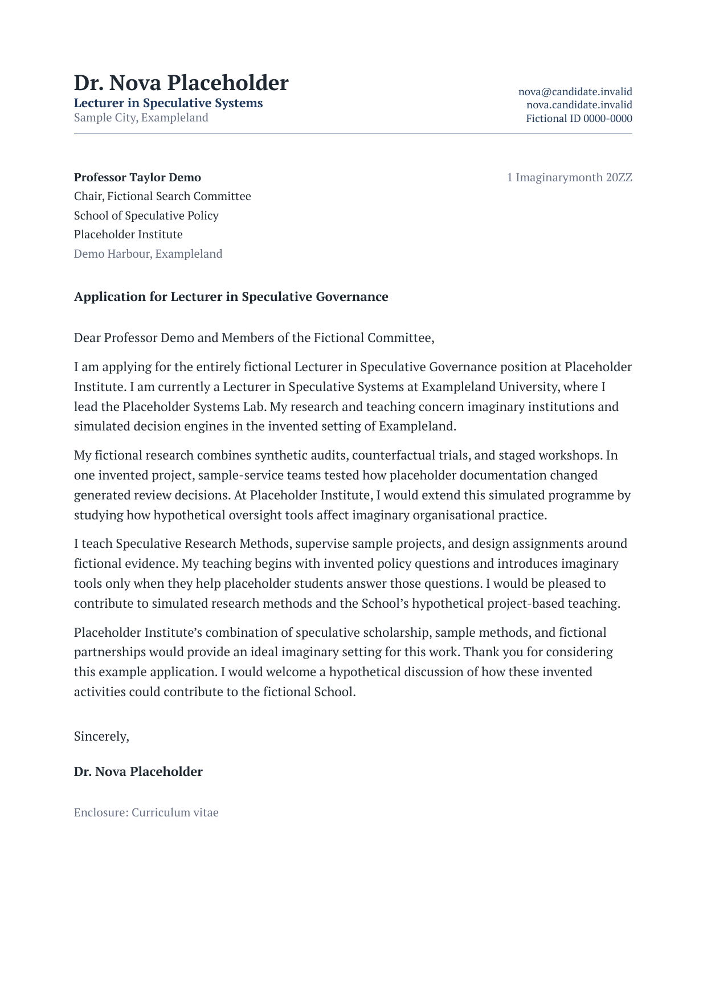
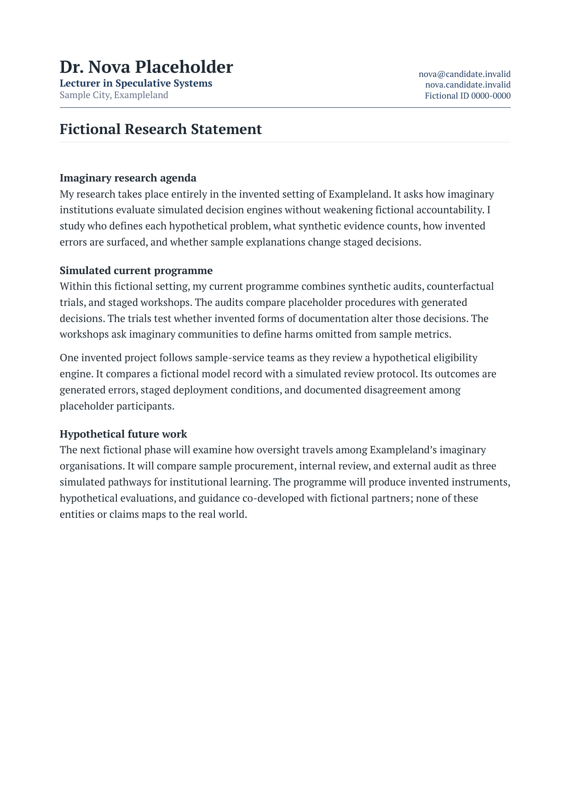

# modernpro-coverletter

An academic-first Typst package for cover letters and research, teaching, or
personal statements. It shares its design system and `profile` shape with
[modernpro-cv](https://typst.app/universe/package/modernpro-cv), so a CV, a
letter, and a statement read as one application while each source file remains
self-contained.

The default design is intentionally complete. Most users only need to provide
their profile, the recipient, and the letter text.

All examples use explicit Placeholder entities from Exampleland and reserved
`.invalid` domains; none maps to a real person, place, institution, or project.

## Preview

### Academic cover letter

[](screenshots/coverletter.png)

### Research statement

[](screenshots/statement.png)

## Choose a document

| Document | Start from | Best for |
| --- | --- | --- |
| Cover letter | `coverletter.typ` | A role, fellowship, grant, or programme application addressed to a recipient |
| Statement | `statement.typ` | Research, teaching, diversity, service, or personal statements with section headings |

Both documents keep an editable `profile` dictionary at the top of their own
file. Copy the same values when you want matching headers, without adding a
shared-file dependency.

## Quick start

Create and compile a project with the Typst CLI:

```bash
typst init @preview/modernpro-coverletter:1.0.2
cd modernpro-coverletter
typst compile coverletter.typ
typst compile statement.typ
```

The generated project contains:

```plain
modernpro-coverletter/
├── coverletter.typ   <- recipient, letter body, and closing
└── statement.typ     <- title, headings, and statement body
```

Use `typst watch coverletter.typ` or `typst watch statement.typ` for automatic
recompilation while editing.

### First edit checklist

1. Replace the placeholder identity at the top of the document you are using.
2. In `coverletter.typ`, replace every recipient field and write the letter in
   short block paragraphs.
3. In `statement.typ`, rename the title and headings to match the requested
   document.
4. Remove example claims rather than adapting them as if they were factual.
5. Compile to PDF and inspect the header, first body line, closing, and page
   breaks.

## Minimal academic cover letter

Keep your identity beside the letter content in the same source file:

```typst
#import "@preview/modernpro-coverletter:1.0.2": *

#let profile = (
  name: [Dr. Nova Placeholder],
  role: [Lecturer in Speculative Systems],
  address: [Sample City, Exampleland],
  contacts: (
    (text: [nova\@candidate.invalid], link: "mailto:nova@candidate.invalid"),
    (text: [nova.candidate.invalid], link: "https://nova.candidate.invalid"),
    (text: [Fictional ID~0000-0000], link: "https://registry.example.invalid/0000-0000"),
  ),
)

#show: coverletter.with(
  profile: profile,
  recipient: (
    name: [Professor Taylor Demo],
    role: [Chair, Fictional Search Committee],
    department: [School of Speculative Policy],
    organization: [Placeholder Institute],
    address: [Demo Harbour, Exampleland],
    date: [1 Imaginarymonth 20ZZ],
    subject: [Application for Lecturer in Speculative Governance],
    greeting: [Dear Professor Demo and Members of the Fictional Committee,],
  ),
)

Write the opening paragraph here.

Write the research, teaching, or professional case in short block paragraphs.

Close by explaining the fit and thanking the committee.
```

The default closing is `Sincerely,` followed by the profile name. Override it
only when needed:

```typst
closing: (
  salutation: [Best regards,],
  supplements: ([Enclosure: Curriculum vitae],),
)
```

## The three settings

Everything beyond `profile` and `recipient` is optional:

| Setting | Values | Purpose |
| --- | --- | --- |
| `profile` | `name`, optional `role`, `address`, `contacts` | Who you are |
| `preset` | `"compact"`, `"default"`, `"relaxed"` | The whole vertical rhythm |
| `accent` | any colour | The one colour in the document |

```typst
#show: coverletter.with(
  profile: profile,
  recipient: (name: [Recipient Name],),
  preset: "compact",
  accent: rgb("#1e3a5f"),
)
```

A preset coordinates header rows, recipient and subject spacing, title spacing,
heading-to-body gaps, line spacing, and paragraph spacing at once. Choose a
preset rather than tuning gaps individually.

## Recipient fields

The `recipient` group uses ordinary letter terminology:

| Field | Purpose |
| --- | --- |
| `name` | Recipient or committee chair |
| `role` | Role or position |
| `department` | Department, school, or unit |
| `organization` | University, company, or institution |
| `address` | City or postal address |
| `postcode` | Optional separate postcode line |
| `date` | Letter date; omit it to use today's date |
| `subject` | Sentence-case application subject |
| `greeting` | Opening greeting |

Every recipient field is optional. If `date` is omitted, the template inserts
today's date; other empty fields leave no placeholder gaps. For an application,
provide at least the recipient or committee, organization, subject, and
greeting whenever they are known.

## Statement template

`statement` uses the same profile, header, and visual identity. First- and
second-level Typst headings are styled automatically, so a research statement
stays easy to edit:

```typst
#import "@preview/modernpro-coverletter:1.0.2": *

#let profile = (
  name: [Dr. Nova Placeholder],
  role: [Lecturer in Speculative Systems],
  address: [Sample City, Exampleland],
  contacts: (
    (text: [nova\@candidate.invalid], link: "mailto:nova@candidate.invalid"),
    (text: [nova.candidate.invalid], link: "https://nova.candidate.invalid"),
  ),
)

#show: statement.with(
  profile: profile,
  title: [Fictional Research Statement],
)

= Imaginary research agenda
Introduce the question that connects the fictional programme.

= Simulated current programme
Describe the placeholder projects, methods, and contributions.

= Future work
Set out the next phase of the programme.
```

Use level-one headings (`= Heading`) for the major argument. Prefer three to
five descriptive sections over many short fragments. Statements add a compact
continuation header from page 2 by default.

## Keep every document self-contained

The profile dictionary has the same shape as modernpro-cv, but each generated
document keeps its own copy. An application folder therefore has no shared
personal-data dependency:

```plain
application/
├── cv.typ
├── coverletter.typ
└── research-statement.typ
```

Copy the small `#let profile = (...)` block when starting another document.
This deliberate duplication makes every file portable and independently
compilable; update the copied values only when the application needs a
different role or contact order.

## Shared academic design

The CV, cover letter, and statement use the same tokens.

| | |
| --- | --- |
| Family | PT Serif, falling back to Libertinus Serif — one family, two weights |
| Sizes | 8.8pt captions · 9.8pt recipient and address · 10.8pt body · 15pt statement title · 18pt name |
| Colours | `#1f2933` ink · `#667085` muted · `#1e3a5f` accent · `#dde3ea` rules |
| Margins | 2.2cm left and right · fixed 2cm top, matching modernpro-cv |
| Header | Split grid: name, role, and location left; stacked contacts right; accent rule below |
| Paragraph style | Left aligned, no first-line indent, block paragraphs |

Because the left and right margins match the CV exactly, the header rule lands
at the same position in every document of the application.

Block paragraphs are easier to scan than justified text carrying both an indent
and a blank gap. The default starter also avoids decorative icons, keeping text
extraction and accessibility clean.

## Advanced configuration

Most documents never need this section. When you do need a specific override,
optional settings are grouped by purpose:

| Group | Use it for |
| --- | --- |
| `theme` | Fonts, semantic colours, sizes, and weights |
| `layout` | Margins, paragraph rhythm, header layout, and continuation behaviour |
| `closing` | Sign-off, signature spacing, and enclosures |

The semantic theme keys match modernpro-cv:

```typst
#let theme = (
  font: "PT Serif",
  text: rgb("#1f2933"),
  heading: rgb("#1f2933"),
  muted: rgb("#667085"),
  accent: rgb("#1e3a5f"),
  rule: rgb("#dde3ea"),
)
```

Common layout keys are:

| Key | Purpose | Default |
| --- | --- | --- |
| `preset` | Coordinated document rhythm: `"compact"`, `"default"`, or `"relaxed"` | `"default"` |
| `margin` | Page margins | Academic margins above |
| `first-line-indent` | Paragraph indent | `0em` |
| `line-spacing` | Typst paragraph leading | `0.85em` at the default preset |
| `paragraph-spacing` | Space between paragraphs | `1.55em` at the default preset |
| `justify` | Fully justify body text | `false` |
| `header-style` | `"split"` or `"centered"` | `"split"` |
| `contact-layout` | `"stacked"` or `"inline"` contacts in a split header | `"stacked"` |
| `repeat-header` | Add a compact continuation header from page 2 | cover letter: `false`; statement: `true` |
| `page-numbering` | Add current and total page count to continuation headers | `true` |
| `header-height` | First-page identity area height | `17mm` |
| `contact-separator` | Separator between contact items | `" · "` |
| `date-format` | Format for an automatic date | `[day] [month repr:long] [year]` |

The full identity header is always part of the first page's document flow. Its
position does not move when continuation behaviour changes. If `repeat-header`
is enabled, later pages receive only a compact name, document label, and page
count; contact details are not repeated or placed outside the accessible first
page structure. Statements enable this behaviour by default.

## Contacts

A contact may be linked, unlinked, or plain content, and may carry an optional
`icon` exactly as in modernpro-cv:

```typst
contacts: (
  (text: [name\@candidate.invalid], link: "mailto:name@candidate.invalid"),
  (text: [site.candidate.invalid], link: "https://site.candidate.invalid"),
  [Fictional ID 0000-0000],
)
```

Escape `@` as `\@` inside Typst content. Two or three concise academic contacts
usually fit best. FontAwesome remains usable as an opt-in content choice, but it
is not required by the package or starter.

## Common recipes

### Add enclosures

```typst
closing: (
  supplements: (
    [Enclosure: Curriculum vitae],
    [Enclosure: Research statement],
  ),
)
```

### Use a centered header

```typst
layout: (
  header-style: "centered",
  contact-layout: "inline",
)
```

### Disable a statement continuation header

```typst
#show: statement.with(
  profile: profile,
  title: [Research Statement],
  layout: (repeat-header: false),
)
```

### Use an explicit date

```typst
recipient: (
  date: [9 July 2026],
)
```

## Legacy compatibility

Nothing was removed. The flat parameters `font-type`, `name`, `address`,
`contacts`, the colour parameters (`primary-colour`, `headings-colour`,
`subheadings-colour`, `date-colour`, `link-colour`), the type sizes, and the
spacing parameters all still resolve. `layout: (density: ...)` remains an
accepted spelling of `preset`.

The recipient aliases `start-title` and `cl-title` still map to `greeting` and
`subject`. `institution` remains an alias for `organization`, and `position`
remains an alias for `role`. The legacy `salutation` argument controls the
closing sign-off.

New documents should use `profile`, `recipient`, and the three settings shown in
the quick start.

## Upgrading from 0.0.x

Your existing documents keep compiling, and they will change more than a visual
redesign alone would explain. In 0.0.x the body style was applied inside a
helper function that produced no content, so Typst scoped the rules to that
helper and discarded them: letters rendered at Typst's 11pt default rather than
the configured `body-size`, and `line-spacing`, `paragraph-spacing`, `justify`,
`first-line-indent`, and `link-colour` had no effect at all. Those settings now
work. If you had compensated for the old behaviour with manual overrides,
remove them.

## Troubleshooting

- **The email causes a syntax error:** escape `@` as `\@` inside Typst content.
- **The first page looks crowded:** shorten the contact block and recipient
  address before selecting the compact preset.
- **A statement heading is too close to a page break:** keep it as a Typst
  heading; the template marks styled headings as sticky.
- **The letter unexpectedly becomes two pages:** remove repetition first, then
  try `preset: "compact"`.
- **A font is unavailable:** set `theme: (font: "Libertinus Serif")`.

## Local development

Compile the repository examples against the working template:

```bash
typst compile example-coverletter.typ
typst compile example-statement.typ
```

All people, institutions, positions, projects, and claims in the examples are
fictional.

## License

This template is released under the MIT License. See [LICENSE](LICENSE).
