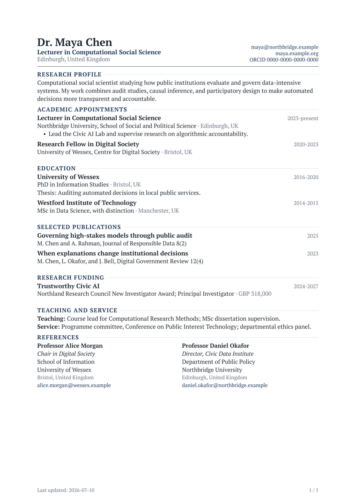
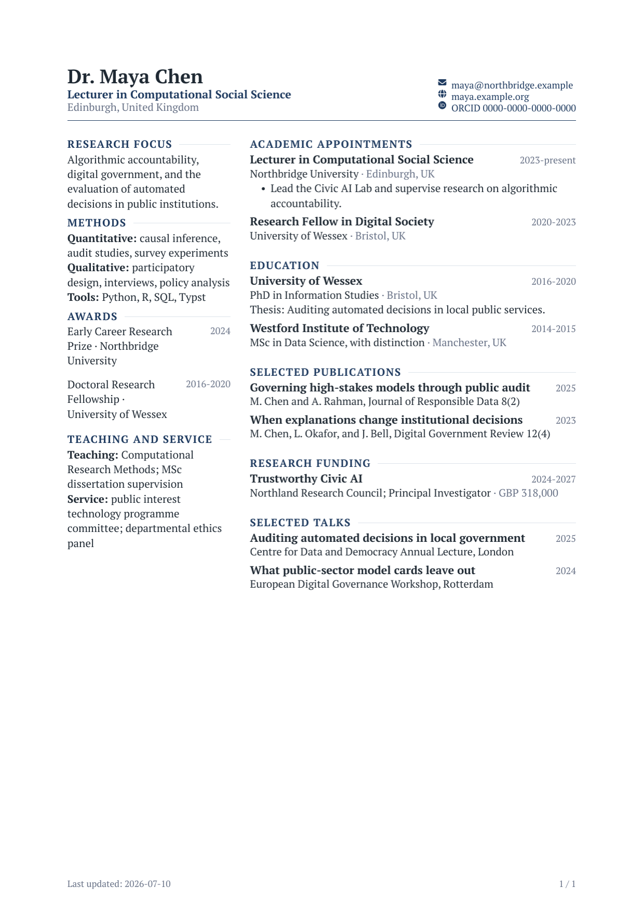

# modernpro-cv

An academic-first Typst CV template: one serif family, one accent colour, a
restrained type scale, and simple content helpers.

- `cv` is the single entry point. It is the best default for long documents,
  printing, accessibility, and applicant tracking systems (ATS).
- `cv(columns: 2, ...)` is a compact one-page variant for human readers.
  Multi-column PDF extraction can interleave content, so do not use it when ATS
  parsing matters.

The examples use fictional people, institutions, publications, and awards.

For a matching letter and statement template, see
[modernpro-coverletter](https://typst.app/universe/package/modernpro-coverletter). The two
packages share a design system and take the same `profile` dictionary, so a CV,
a cover letter, and a research statement read as one application.

## Preview

### Canonical academic CV

[](screenshots/cv-single.png)

### Compact two-column CV

[](screenshots/cv-double.png)

## Choose a layout

| Use case | Start from | Why |
| --- | --- | --- |
| Academic applications, grants, promotion, or ATS upload | `cv-single.typ` | One reading order, comfortable multi-page flow, and compact continuation headers |
| Conference bios, networking, or a one-page human-readable résumé | `cv-double.typ` | More information above the fold in a compact visual summary |

When in doubt, use the single-column version. Keep the two-column version to one
page and do not rely on it when automated PDF extraction matters.

## Quick start

Create and compile a project with the Typst CLI:

```bash
typst init @preview/modernpro-cv:2.0.0
cd modernpro-cv
typst compile cv-single.typ
```

The starter contains:

```plain
modernpro-cv/
├── bib.bib
├── profile.typ      <- your identity, defined once
├── cv-double.typ
└── cv-single.typ
```

During editing, rebuild automatically with:

```bash
typst watch cv-single.typ
```

You can also select `modernpro-cv` from the template gallery in the Typst web
app.

### First edit checklist

1. Replace the placeholder identity once in `profile.typ`.
2. Open `cv-single.typ` and delete any sections that do not apply.
3. Replace every fictional appointment, degree, publication, date, and claim.
4. Compile the document and check page breaks, contact wrapping, and the final
   line of each page.
5. Use `cv-double.typ` only if you also need a compact one-page version.

The repository examples intentionally use reserved domains, an all-zero ORCID,
and fictional people and institutions. Put real information only in your own
downstream document, not in a public template fork.

## Minimal academic CV

`profile` is the only argument a typical CV needs. Keep it in `profile.typ` and
import the same file from your cover letter and statements:

```typst
// profile.typ
#let profile = (
  name: [Dr. Maya Chen],
  role: [Lecturer in Computational Social Science],
  address: [Edinburgh, United Kingdom],
  contacts: (
    (text: [maya\@northbridge.example], link: "mailto:maya@northbridge.example"),
    (text: [maya.example.org], link: "https://maya.example.org"),
    (text: [ORCID~0000-0000-0000-0000], link: "https://orcid.org/0000-0000-0000-0000"),
  ),
)
```

```typst
#import "@preview/modernpro-cv:2.0.0": *
#import "profile.typ": profile

#show: cv.with(profile: profile)

#section("Research Profile")
#summary[
  Computational social scientist studying how public institutions evaluate
  data-intensive systems.
]
#section-gap

#section("Academic Appointments")
#experience(
  title: "Lecturer in Computational Social Science",
  institution: [Northbridge University],
  location: "Edinburgh, UK",
  date: "2023-present",
)
#section-gap

#section("Education")
#education(
  institution: [University of Wessex],
  major: [PhD in Information Studies],
  date: "2016-2020",
  location: "Bristol, UK",
)
#section-gap

#section("Selected Publications")
#entry(
  title: [Governing high-stakes models through public audit],
  right: "2025",
  meta: [M. Chen and A. Rahman, Journal of Responsible Data 8(2)],
)
```

Sections render in source order. Move a section to move it in the CV; delete it
to hide it.

## Recommended content workflow

Keep presentation decisions in the `#show: cv.with(...)` call and keep
application content below it:

- Put identity and contacts in `profile.typ`.
- Use one `#section(...)` for each academic category.
- Use semantic helpers such as `experience`, `education`, and `entry` instead
  of manually aligning dates.
- Write dates as short strings such as `"2023-present"` so the right rail stays
  compact.
- Add `#section-gap` once after a complete section; entry helpers already manage
  spacing between records.

For a long CV, begin with the default preset and let it flow to another page.
Use the compact preset only after removing redundant content.

## The four settings

Everything beyond `profile` is optional:

| Setting | Values | Purpose |
| --- | --- | --- |
| `profile` | `name`, optional `role`, `address`, `contacts` | Who you are |
| `preset` | `"compact"`, `"default"`, `"relaxed"` | The whole vertical rhythm |
| `accent` | any colour | The one colour in the document |
| `columns` | `1` or `2` | Single-column CV, or the compact variant |

```typst
#show: cv.with(
  profile: profile,
  preset: "compact",
  accent: rgb("#1e3a5f"),
)
```

- `"default"` is the academic baseline: clear section hierarchy, comfortable
  entry spacing, a compact identity header.
- `"compact"` is for unusually long CVs or strict page limits.
- `"relaxed"` suits shorter dossiers and presentation copies.

A preset coordinates header rows, section-to-content spacing, entry rows,
descriptions, body leading, and list spacing at once. Choose a preset rather
than tuning gaps individually.

## Design system

The same tokens drive modernpro-cv and modernpro-coverletter.

| | |
| --- | --- |
| Family | PT Serif, falling back to Libertinus Serif — one family, two weights |
| Sizes | 8.4-8.8pt dates and footer · 9.8-10pt body and metadata · 10.5pt entry titles · 18pt name |
| Colours | `#1f2933` ink · `#667085` muted · `#1e3a5f` accent · `#dde3ea` rules |
| Margins | 2.2cm left and right · fixed 2cm top, matching the letter template |

Entry layout is a left content block and a right date rail: the title and its
institution sit on the left, the date alone occupies the right, and location
joins the institution line. The right edge therefore stays a single clean
column, and there is no zig-zag reading path.

Hierarchy comes from weight, case, italics, colour, and position — not from
extra type sizes. Section headings are body-size, uppercase, bold, tracked, and
followed by a rule; that is enough separation without introducing another step
in the ladder.

## Contacts

Contacts are plain text by default, keeping the header quiet and PDF extraction
clean. A contact can be linked or unlinked:

```typst
contacts: (
  (text: [maya\@northbridge.example], link: "mailto:maya@northbridge.example"),
  (text: [maya.example.org], link: "https://maya.example.org"),
  [Edinburgh, United Kingdom],
)
```

Escape `@` as `\@` inside Typst content. Two or three concise contacts usually
fit best; email, a personal or institutional website, and ORCID are good
academic defaults.

For a human-facing version, add an optional `icon` field. The template accepts
any Typst content and keeps the icon in a small fixed column, so the labels stay
aligned and remain fully searchable:

```typst
#import "@preview/fontawesome:0.6.2": fa-icon

contacts: (
  (
    icon: fa-icon("envelope", solid: true, top-edge: "baseline"),
    text: [maya\@northbridge.example],
    link: "mailto:maya@northbridge.example",
  ),
  (
    icon: fa-icon("orcid", top-edge: "baseline"),
    text: [ORCID~0000-0000-0000-0000],
    link: "https://orcid.org/0000-0000-0000-0000",
  ),
)
```

The core template does not import an icon library. The example above uses
[Font Awesome for Typst](https://typst.app/universe/package/fontawesome/) and
requires the corresponding Font Awesome desktop fonts. Omit `icon` for the
lowest-friction, ATS-first setup. Icons should supplement familiar labels, not
replace them.

## Academic content helpers

Use one small helper for each kind of content:

| Helper | Purpose |
| --- | --- |
| `#section("Education")` | Start a section with the shared heading style |
| `#section-gap` | Add separation after a complete section |
| `#summary[...]` | Research profile or short overview |
| `#experience(title:, institution:, location:, date:, details:)` | Appointment, research role, teaching role, or service position |
| `#education(institution:, major:, date:, location:, description:)` | Degree or qualification |
| `#entry(title:, right:, meta:, location:, details:)` | Publication, grant, talk, project, or other entry |
| `#detail-line(title:, content:)` | Compact methods, tools, languages, or memberships line |
| `#award(award:, institution:, date:)` | Compact award entry |
| `#reference-list(references:)` | Two-column reference list |

In every entry helper, `date` (or `right`) goes to the date rail, and
`institution`/`meta` and `location` are joined on the line below the title.

`experience`, `education`, and `entry` add their own spacing after each entry.
Do not insert `#item-gap` between these helpers. `#item-gap` remains available
for custom content that is not produced by an entry helper.

A common academic sequence is:

1. Research Profile
2. Academic Appointments
3. Education
4. Publications
5. Research Funding
6. Teaching and Supervision
7. Service
8. Awards
9. References

Use only the sections that strengthen the document.

## Compact two-column variant

`columns: 2` uses the same fonts, colour tokens, and content helpers as the
canonical CV. Only the page structure changes.

```typst
#import "@preview/modernpro-cv:2.0.0": *
#import "profile.typ": profile

#show: cv.with(
  profile: profile,
  columns: 2,
  left: [
    #section("Research Focus")
    #summary[Algorithmic accountability and digital government.]
    #section-gap

    #section("Methods")
    #detail-line(title: "Methods", content: [causal inference, audit studies])
  ],
  right: [
    #section("Academic Appointments")
    #experience(
      title: "Lecturer in Computational Social Science",
      institution: [Northbridge University],
      location: "Edinburgh, UK",
      date: "2023-present",
    )
  ],
)
```

Keep this variant concise and preferably to one page. The left and right
columns are visually independent, but text extraction and screen readers may
not preserve the intended reading order.

## Common recipes

### Hide the footer date

```typst
#show: cv.with(
  profile: profile,
  options: (last-updated: false),
)
```

### Use inline contacts

```typst
#show: cv.with(
  profile: profile,
  layout: (contact-layout: "inline"),
)
```

### Disable continuation headers

```typst
#show: cv.with(
  profile: profile,
  layout: (continue-header: false),
)
```

Continuation headers are useful for an academic CV that runs beyond one page.
They repeat only the candidate name, document label, and page count—not the full
contact block.

## Advanced configuration

Most documents never need this section. When you do need a specific override,
the grouped API keeps optional settings separate from content:

| Group | Settings |
| --- | --- |
| `theme` | `font`, colours (`text`, `muted`, `heading`, `accent`, `rule`), and individual size tokens |
| `layout` | `preset`, `margin`, `continue-header`, `header-height`, individual rhythm gaps, plus `columns` and `column-gutter` for the two-column variant |
| `options` | `last-updated`, `page-count`, `date` |

```typst
#show: cv.with(
  profile: profile,
  theme: (
    font: "Libertinus Serif",
    accent: rgb("#1e3a5f"),
  ),
  layout: (
    preset: "default",
    margin: (left: 1.7cm, right: 1.7cm, top: 1.5cm, bottom: 1.5cm),
    continue-header: false,
  ),
  options: (
    last-updated: true,
    page-count: true,
    date: "2026-07-09",
  ),
)
```

For exceptional cases, the rhythm gaps map directly to the visual hierarchy:
`section-content-gap` separates a section heading from its first block,
`entry-row-gap` separates a bold entry title from its institution line,
`description-gap` separates that line from a description or bullet list, and
`item-gap` separates complete entries. The default preset intentionally leaves
more space inside a block than the compact preset so dense academic content
still scans as a sequence of distinct records.

`continue-header` defaults to `true` for `cv` and `cv-single`. The full identity
header appears only on the first page; later pages receive a compact header with
the candidate name, "Curriculum vitae", and page count instead of repeating
contact details. `cv-double` keeps the historical `false` default because it is
intended as a one-page summary.

### Optional section ordering

Direct source order is the simplest approach. If a generated workflow needs to
reorder or conditionally hide sections, use `section-block` and
`render-sections`:

```typst
#let sections = (
  section-block("profile", title: "Research Profile")[
    #summary[Research summary.]
  ],
  section-block("education", title: "Education")[
    #education(
      institution: [University of Wessex],
      major: [PhD in Information Studies],
      date: "2016-2020",
      location: "Bristol, UK",
    )
  ],
)

#render-sections(
  sections: sections,
  order: ("profile", "education"),
  include-remaining: false,
)
```

This is an advanced option; it is not required for an ordinary CV.

### BibTeX publications

For a short selected-publications section, `entry` is usually easiest. To cite
records from `bib.bib`, list the citation keys and keep the hidden bibliography
at the end of the document:

```typst
#section("Publications")
+ @article-key
+ @another-key

#show bibliography: none
#bibliography("bib.bib", style: "chicago-author-date")
```

### Legacy API

Nothing from 1.x was removed. `cv-single` and `cv-double` still work, as do the
flat arguments `font-type`, `name`, `address`, `contacts`, `continue-header`,
`lastupdated`, and `pagecount`, including string booleans such as `"true"`.
`layout: (density: ...)` remains an accepted spelling of `preset`.

Older helper names are aliases:

- `descript` -> `summary`
- `job` -> `experience`
- `twoline-item` -> `entry`
- `oneline-title-item`, `skill-line` -> `detail-line`
- `references` -> `reference-list`
- `sectionsep` -> `section-gap`
- `subsectionsep` -> `item-gap`

Use `cv`, the four settings, and the semantic helper names for new documents.

## Upgrading from 1.x

Your existing documents keep compiling. They will look different: 2.0.0 replaces
the PT Sans / PT Serif pairing with a single serif family, rebuilds the size
ladder, moves location out of the bottom-right corner, and widens the page
margins to 2.2cm to match the letter template. To modernise a 1.x document,
replace `cv-single.with` with `cv.with` and `layout: (density: "balanced")` with
nothing at all — `"default"` is the default.

## Troubleshooting

- **The email causes a syntax error:** escape `@` as `\@` inside Typst content.
- **Font Awesome icons do not render:** install the corresponding desktop fonts
  or remove the optional `icon` fields.
- **The CV feels too dense:** try `preset: "relaxed"` before changing individual
  spacing tokens.
- **The CV exceeds a page limit:** remove low-value detail first, then use
  `preset: "compact"`.
- **Copied PDF text is out of order:** submit the single-column layout.
- **A font is unavailable:** use `theme: (font: "Libertinus Serif")` for a
  broadly available serif fallback.

## Local development

Compile the repository examples against the working template:

```bash
typst compile example_single.typ
typst compile example_double.typ
```

The single-column example is the visual and behavioural reference for the
academic design. The double-column example demonstrates the compact variant.

## Release notes

See the [changelog](CHANGELOG.md) for version history and migration notes.

## License

This template is released under the MIT License. See [LICENSE](LICENSE).
