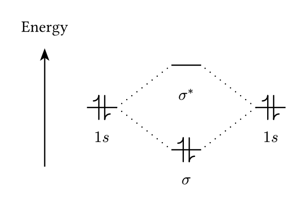

# modiagram
Draw molecular orbital and energy pathway diagrams: a package inspired by the LaTeX [`modiagram`](https://ctan.org/pkg/modiagram) package by Clemens Niederberger plus additional features for plotting energy pathway diagrams.

Requires [`@preview/cetz:0.4.2`](https://typst.app/universe/package/cetz).

---
## Quick start

```typst
#import "@preview/modiagram:0.1.0" as mo

#figure({
  modiagram(
	ao(name: "1s-L", x: -1, energy: 0, electrons: "pair", label: $1s$),
	ao(name: "1s-R", x: 1, energy: 0, electrons: "pair", label: $1s$),
	ao(name: "S", x: 0, energy: -0.5, electrons: "pair", label: $sigma$),
	ao(name: "S*", x: 0, energy: 0.5, electrons: "", label: $sigma^*$),
	connect("1s-L & S", "1s-R & S", "1s-L & S*", "1s-R & S*"),
	energy-axis(title: [Energy]),
  )
})
```


---
## Import styles

The recommended method for importing is to use an alias: this prevents certain functions in modiagram (particularly those from cetz) from overwriting the standard Typst functions (such as the `grid` function).

```typst
// Recommended — through an alias

#import "@preview/modiagram:0.1.0" as mo

#figure({
  import mo: *
  modiagram(
	ao(name: "test", x: 0, energy: 0, electrons: "pair", label: [test]),
  )
})

// Named module — explicit prefix

#import "@preview/modiagram:0.1.0" as mo

#figure(
  mo.modiagram(
	ao(name: "test", x: 0, energy: 0, electrons: "pair", label: [test]),
  )
)
```

---
## Reference

### `modiagram(...)`

Renders the complete diagram. All elements are passed as positional arguments.

| Parameter | Type | Description                                                                              |
| --------- | ---- | ---------------------------------------------------------------------------------------- |
| `...`     | any  | `ao()`, `connect()`, `config()`, `energy-axis()`, `en-pathway()`, `raw()`, cetz wrappers |
| `config`  | dict | Diagram-level overrides — same keys as `modiagram-setup()`                               |

---
### `ao(...)` — atomic / molecular orbital

Draws one orbital bar with optional electrons and label.

| Parameter      | Default | Description                                             |
| -------------- | ------- | ------------------------------------------------------- |
| `name`         | auto    | String identifier used by `connect()`                   |
| `x`            | `0`     | Horizontal position (float = cm, or any Typst length)   |
| `energy`       | `0`     | Vertical position (energy level)                        |
| `electrons`    | `""`    | Space-separated spin tokens: `"up"`, `"down"`, `"pair"` |
| `label`        | `none`  | Content placed below the bar, e.g. `$1s$`               |
| `color`        | `black` | Base color for bar, electrons, and label                |
| `bar-color`    | `auto`  | Bar color only (overrides `color`)                      |
| `el-color`     | `auto`  | Electron arrow color (overrides `color`)                |
| `label-color`  | `auto`  | Label color (overrides `color`)                         |
| `style`        | `auto`  | Per-orbital style (see **Orbital styles** below)        |
| `label-size`   | `auto`  | Font size for the label                                 |
| `label-gap`    | `auto`  | Gap between bar and label (cm)                          |
| `el-stroke-w`  | `auto`  | Electron arrow stroke width                             |
| `bar-stroke-w` | `auto`  | Bar stroke width                                        |
| `ao-width`     | `auto`  | Bar width (cm)                                          |
| `up-el-pos`    | `auto`  | X offset from bar center for ↑ electron                 |
| `down-el-pos`  | `auto`  | X offset from bar center for ↓ electron                 |

```typst
#figure({
  import mo: *
  modiagram(
	ao(name: "sigma2s1", x: 1.00, energy: 0.00, electrons: "pair", label: $sigma_(2s)$),
	ao(name: "2s1", x: 0.00, energy: 0.50, electrons: "pair", label: $2s$, bar-stroke-w: 1pt, bar-color: purple, label-color: black),
	ao(name: "2s2", x: 2.00, energy: 0.50, electrons: "pair", label: $2s$, el-stroke-w: .8pt, el-color: purple),
	ao(name: "sigma2s2", x: 1.00, energy: 1.00, electrons: "pair", label: $sigma_(2s)^*$),

	ao(name: "s2pz", x: 1.00, energy: 2.00, electrons: "pair", label: $sigma_(2p_z)$, ao-width: 0.5),
	ao(name: "π1", x: 0.75, energy: 3.00, electrons: "pair", label: $pi_(2p_x)$, color: red, label-size: 6pt, label-gap: 0.2cm),
	ao(name: "π2", x: 1.25, energy: 3.00, electrons: "pair", label: $pi_(2p_y)$, color: red, label-size: 6pt, label-gap: 0.2cm),
	ao(name: "π3", x: 0.75, energy: 4.00, electrons: "up", label: $pi_(2p_x)^*$, el-color: blue),
	ao(name: "π4", x: 1.25, energy: 4.00, electrons: "up", label: $pi_(2p_y)^*$, el-color: blue),
	ao(name: "S2pz", x: 1.00, energy: 5.00, electrons: "", label: $sigma_(2p_z)^*$, label-color: purple, ao-width: 0.5),

	ao(name: "lp1", x: +0.00, energy: 3.50, electrons: "up", label: $2p_z$, up-el-pos: 2.5pt, el-color: green),
	ao(name: "lp2", x: -0.50, energy: 3.50, electrons: "up", label: $2p_y$, up-el-pos: 0pt),
	ao(name: "lp3", x: -1.00, energy: 3.50, electrons: "pair", label: $2p_x$),

	ao(name: "rp1", x: +2.00, energy: 3.5, electrons: "pair", label: $2p_x$),
	ao(name: "rp2", x: +2.50, energy: 3.5, electrons: "up", label: $2p_y$),
	ao(name: "rp3", x: +3.00, energy: 3.5, electrons: "up", label: $2p_z$),  
  )
})
```

This is an (exaggerated) example of how all these settings can be used to represent atomic orbitals.


---
### `connect(...)` — connection lines

Draws lines between pairs of orbitals.

```typst
connect("1s-L & S", "1s-R & S", style: "dashed", color: blue)
```

| Parameter     | Default | Description                            |
| ------------- | ------- | -------------------------------------- |
| `..pairs`     | —       | One or more `"nameA & nameB"` strings  |
| `style`       | `auto`  | Line style (see **Connection styles**) |
| `color`       | `auto`  | Line color                             |
| `thickness`   | `auto`  | Stroke width                           |
| `gap`         | `auto`  | Dot/dash spacing                       |
| `dash-length` | `auto`  | Dash segment length                    |
Building on the previous example, it is possible to pair orbitals using their "name" identifiers.

```typst
#figure({
  import mo: *
  modiagram(
	ao(name: "sigma2s1", x: 1.00, energy: 0.00, electrons: "pair", label: $sigma_(2s)$),
	ao(name: "2s1", x: 0.00, energy: 0.50, electrons: "pair", label: $2s$, bar-stroke-w: 1pt, bar-color: purple, label-color: black),
	ao(name: "2s2", x: 2.00, energy: 0.50, electrons: "pair", label: $2s$, el-stroke-w: .8pt, el-color: purple),
	ao(name: "sigma2s2", x: 1.00, energy: 1.00, electrons: "pair", label: $sigma_(2s)^*$),

	connect("2s1 & sigma2s1", "sigma2s1 & 2s2", style: "gray"),
	connect("2s1 & sigma2s2", "sigma2s2 & 2s2", style: "solid", color: olive),

	ao(name: "s2pz", x: 1.00, energy: 2.00, electrons: "pair", label: $sigma_(2p_z)$, ao-width: 0.5),
	ao(name: "π1", x: 0.75, energy: 3.00, electrons: "pair", label: $pi_(2p_x)$, color: red, label-size: 6pt, label-gap: 0.2cm),
	ao(name: "π2", x: 1.25, energy: 3.00, electrons: "pair", label: $pi_(2p_y)$, color: red, label-size: 6pt, label-gap: 0.2cm),
	ao(name: "π3", x: 0.75, energy: 4.00, electrons: "up", label: $pi_(2p_x)^*$, el-color: blue),
	ao(name: "π4", x: 1.25, energy: 4.00, electrons: "up", label: $pi_(2p_y)^*$, el-color: blue),
	ao(name: "S2pz", x: 1.00, energy: 5.00, electrons: "", label: $sigma_(2p_z)^*$, label-color: purple, ao-width: 0.5),

	ao(name: "lp1", x: +0.00, energy: 3.50, electrons: "up", label: $2p_z$, up-el-pos: 2.5pt, el-color: green),
	ao(name: "lp2", x: -0.50, energy: 3.50, electrons: "up", label: $2p_y$, up-el-pos: 0pt),
	ao(name: "lp3", x: -1.00, energy: 3.50, electrons: "pair", label: $2p_x$),

	ao(name: "rp1", x: +2.00, energy: 3.5, electrons: "pair", label: $2p_x$),
	ao(name: "rp2", x: +2.50, energy: 3.5, electrons: "up", label: $2p_y$),
	ao(name: "rp3", x: +3.00, energy: 3.5, electrons: "up", label: $2p_z$),

	connect("rp3 & rp2","rp2 & rp1"),
	connect("lp3 & lp2", "lp2 & lp1"),
	connect("lp1 & π1", "π1 & π2", "π2 & rp1", color: red, style: "dashed", dash-length: 0.5mm),

	connect("lp1 & π3", "π3 & π4", "π4 & rp1"),
	connect("lp1 & S2pz", "S2pz & rp1"),
	connect("lp1 & s2pz", "s2pz & rp1"),
  )
})
```


---

### `connect-label(...)` — label along a connection

Places content along the line between two orbitals.

```typst
connect-label("a", "σ", $Delta E$, ratio: 50%, pad: 0.15, anchor: "south")
```

| Parameter | Default | Description                                   |
| --------- | ------- | --------------------------------------------- |
| `a`, `b`  | —       | Orbital names (must match a `connect()` pair) |
| `body`    | —       | Any Typst content                             |
| `ratio`   | `50%`   | Position along the line                       |
| `pad`     | `0`     | Perpendicular offset (positive = above)       |
| `size`    | `auto`  | Font size (scales text and math)              |
Useful for quickly adding annotations to the connecting lines between orbitals. For example:

```typst
#figure({
  import mo: *
	modiagram(
	ao(name: "1s-L", x: -1, energy: 0, electrons: "pair", label: $1s$),
	ao(name: "1s-R", x: 1, energy: 0, electrons: "pair", label: $1s$),
	ao(name: "S", x: 0, energy: -0.5, electrons: "pair", label: $sigma$),
	ao(name: "S*", x: 0, energy: 0.5, electrons: "", label: $sigma^*$),
	connect("1s-L & S", "1s-R & S", "1s-L & S*", "1s-R & S*"),

	connect-label("S*", "1s-R", [Higher en.], size: 5pt, pad: 0.1, ratio: 30%),
	connect-label("1s-L", "S*", [Higher en.], size: 5pt, pad: 0.1, ratio: 70%),
	connect-label("1s-L", "S", [Lower en.], size: 5pt, pad: 0.1),
	connect-label("S", "1s-R", [Lower en.], size: 5pt, pad: 0.1),
  )
})
```

---

### `energy-axis(...)` — energy arrow

Draws a vertical (or horizontal) energy arrow at the left of the diagram.

```typst
energy-axis(title: "Energy", padding: 0.7cm, style: "horizontal")
```

| Parameter | Default      | Description                         |
| --------- | ------------ | ----------------------------------- |
| `title`   | `none`       | Content near the arrowhead          |
| `padding` | `0.5`        | Gap from leftmost orbital edge (cm) |
| `style`   | `"vertical"` | `"vertical"` or `"horizontal"`      |
Example of use:

```typst
#figure({
  import mo: *
  modiagram(
	ao(name: "1s-L", x: -1, energy: 0, electrons: "pair", label: $1s$),
	ao(name: "1s-R", x: 1, energy: 0, electrons: "pair", label: $1s$),
	ao(name: "S", x: 0, energy: -0.5, electrons: "pair", label: $sigma$),
	ao(name: "S*", x: 0, energy: 0.5, electrons: "", label: $sigma^*$),
	connect("1s-L & S", "1s-R & S", "1s-L & S*", "1s-R & S*"),

	energy-axis(title: [Energy], style: "horizontal", padding: 0.7),
  )
})
```


---

### `config(...)` — inline diagram override

Applies settings to all subsequent elements within the same `modiagram()` call. Pass `auto` to reset a key to the diagram default.

```typst
modiagram(
  config(color: red, style: "square"),
  ao(...),                           // red, square
  config(color: black),              // reset color
  ao(...),                           // black, square
)
```

Accepted keys: `color`, `bar-color`, `el-color`, `label-color`, `style`, `label-size`, `label-gap`, `el-stroke-w`, `bar-stroke-w`, `ao-width`, `conn-style`, `up-el-pos`, `down-el-pos`, `x-scale`, `energy-scale`.

The `x-scale` and `energy-scale` functions are extremely useful: they allow you to scale ALL x and y coordinates without having to manually re-enter all the values. This also applies to CeTZ primitives inserted into `modiagram`. Here is an example.

```typst
#figure({
  import mo: *
  modiagram(
	config(color: blue),

	ao(name: "sigma2s1", x: 1.00, energy: 0.00, electrons: "pair", label: $sigma_(2s)$),
	ao(name: "2s1", x: 0.00, energy: 0.50, electrons: "pair", label: $2s$),
	ao(name: "2s2", x: 2.00, energy: 0.50, electrons: "pair", label: $2s$),
	ao(name: "sigma2s2", x: 1.00, energy: 1.00, electrons: "pair", label: $sigma_(2s)^*$),

	connect("2s1 & sigma2s1", "sigma2s1 & 2s2",),
	connect("2s1 & sigma2s2", "sigma2s2 & 2s2",),

	config(el-color: red, bar-color: olive, label-color: maroon, label-size: 6pt, label-gap: 6pt, energy-scale: 0.7, up-el-pos: -1.5pt, down-el-pos: 1.5pt),

	ao(name: "s2pz", x: 1.00, energy: 2.00+1, electrons: "pair", label: $sigma_(2p_z)$),
	ao(name: "π1", x: 0.75, energy: 3.00+1, electrons: "pair", label: $pi_(2p_x)$),
	ao(name: "π2", x: 1.25, energy: 3.00+1, electrons: "pair", label: $pi_(2p_y)$),
	ao(name: "π3", x: 0.75, energy: 4.00+1, electrons: "up", label: $pi_(2p_x)^*$),
	ao(name: "π4", x: 1.25, energy: 4.00+1, electrons: "up", label: $pi_(2p_y)^*$),
	ao(name: "S2pz", x: 1.00, energy: 5.00+1, electrons: "", label: $sigma_(2p_z)^*$),

	ao(name: "lp1", x: +0.00, energy: 3.50+1, electrons: "up", label: $2p_z$),
	ao(name: "lp2", x: -0.50, energy: 3.50+1, electrons: "up", label: $2p_y$),
	ao(name: "lp3", x: -1.00, energy: 3.50+1, electrons: "pair", label: $2p_x$),

	ao(name: "rp1", x: +2.00, energy: 3.5+1, electrons: "pair", label: $2p_x$),
	ao(name: "rp2", x: +2.50, energy: 3.5+1, electrons: "up", label: $2p_y$),
	ao(name: "rp3", x: +3.00, energy: 3.5+1, electrons: "up", label: $2p_z$),

	connect("rp3 & rp2","rp2 & rp1"),
	connect("lp3 & lp2", "lp2 & lp1"),

	connect("lp1 & π1", "π1 & π2", "π2 & rp1"),
	connect("lp1 & π3", "π3 & π4", "π4 & rp1"),
	connect("lp1 & S2pz", "S2pz & rp1"),
	connect("lp1 & s2pz", "s2pz & rp1"),
  )
})
```


---

### `en-pathway(...)` — evenly-spaced orbital sequence

Generates a sequence of orbitals at uniform horizontal spacing, connected by lines. Useful for energy level diagrams (reaction pathways).

```typst
en-pathway(0, 0.5, 1.0, skip, 1.5,
  color: blue, labels: ($1s$, $2s$, $2p$, $3s$),
  conn-style: "dashed", show-energies: true)
```

Use `skip` as an energy value to advance `x` without drawing an orbital.

| Parameter       | Default    | Description                                                      |
| --------------- | ---------- | ---------------------------------------------------------------- |
| `..energies`    | —          | Energy values (float, int, length, or numeric string), or `skip` |
| `color`         | `black`    | Color for bars, electrons, labels, connections                   |
| `x-step`        | `1.2`      | Horizontal distance between orbitals (cm)                        |
| `style`         | `auto`     | Orbital style                                                    |
| `conn-style`    | `"dashed"` | Connection style between adjacent orbitals (`none` to disable)   |
| `labels`        | `none`     | Array of content, one per orbital                                |
| `name-prefix`   | `"ep"`     | Prefix for auto-generated orbital names                          |
| `x-start`       | `0`        | Starting x position                                              |
| `show-energies` | `false`    | Show energy value above each orbital                             |
| `energy-format` | `auto`     | Function `v => content` for custom energy display                |
| `energy-size`   | `auto`     | Font size for energy labels                                      |
| `bar-stroke-w`  | `1.5pt`    | Stroke width for bars and electrons                              |
| `ao-width`      | `0.75`     | Bar width (cm)                                                   |

This feature is extremely useful for computational chemists who wish to represent energy pathways in a very straightforward manner. All you need to do is specify the energy values and labels. If you also specify the name, a unique identifier is assigned, allowing you to add content positioned relative to the energy bar.

```typst
#figure({
  import mo: *
  modiagram(
  
	config(energy-scale: 0.3),
	
	en-pathway(
	  -4, 4, -1, 2, -8,
	  labels: ([SM], [TS$alpha$-1], [Key], [TS$beta$-1], [P]),
	  show-energies: true,
	  name-prefix: "black"
	),
	
	en-pathway(
	  -1, 2, -5, 5, -4,
	  labels: ([SM], [$gamma$], [Int], [Ex], [`code`]),
	  color: olive,
	  name-prefix: "olive"
	),

	energy-axis(title: "E")
  )
})
```


---

### `raw(closure)` — arbitrary cetz drawing

Executes raw cetz `draw.*` calls inside the diagram canvas.

```typst
raw((xs, ys, anchors) => {
  let p = at("σ", anchors, edge: "right")
  draw.content((p.at(0) + 0.2, p.at(1)), [bond], anchor: "west")
})
```

Closure signature: `(xs, ys, anchors) => { ... }`

- `xs`, `ys` — active x-scale and energy-scale
- `anchors` — dict of all orbital anchors; query with `at()`

A complex method for using CeTZ primitives within modiagram:

```typst
#figure({
  import mo: *
  modiagram(
  
	config(energy-scale: 0.3),
	
	en-pathway(
	  -4, 4, -1, 2, -8,
	  labels: ([SM], [TS$alpha$-1], [Key], [TS$beta$-1], [P]),
	  show-energies: true,
	  name-prefix: "black"
	),
	
	en-pathway(
	  -1, 2, -5, 5, -4,
	  labels: ([SM], [$gamma$], [Int], [Ex], [`code`]),
	  color: olive,
	  name-prefix: "olive"
	),

	energy-axis(title: "E"),
	
	raw((xs, ys, anchors) => {
		let p = at("black-3", anchors, edge: "right")
		draw.content((p.at(0) + 0.2, p.at(1)), [#align(center, [BEST \ TS])], anchor: "west")
	})
  )
})
```


---
## Position forms

All cetz wrappers accept these position forms:

| Form                 | Example           | Description                                            |
| -------------------- | ----------------- | ------------------------------------------------------ |
| `(x, y)`             | `(1.5, 0.3)`      | Numeric tuple, scaled by x-scale / energy-scale        |
| `"name"`             | `"σ"`             | Center of the named orbital                            |
| `"name.edge"`        | `"σ.right"`       | Named edge: `left`, `right`, `top`, `bottom`, `center` |
| `("a", ratio%, "b")` | `("a", 50%, "b")` | Linear interpolation between two positions             |
| `rel(dx, dy)`        | `rel(1, 0)`       | Relative offset from the previous point                |

Extra keyword arguments available on all wrappers: `pad`, `dx`, `dy`.

---
## Orbital styles

| Style      | Description                             | Default connection |
| ---------- | --------------------------------------- | ------------------ |
| `"plain"`  | Horizontal line only (default)          | dotted             |
| `"square"` | Square box                              | solid              |
| `"round"`  | Square box with rounded corners         | solid              |
| `"circle"` | Circle with side extensions             | solid              |
| `"fancy"`  | Rounded box with longer side extensions | dashed             |


---

## Connection styles

| Style      | Appearance      |
| ---------- | --------------- |
| `"dotted"` | Dotted line     |
| `"dashed"` | Dashed line     |
| `"solid"`  | Solid line      |
| `"gray"`   | Solid gray line |


---

## Global configuration

**`modiagram-setup(...)`** — set document-level defaults for all `modiagram()` calls:

```typst
#modiagram-setup(style: "square", scale: 1.2cm, label-size: 6pt)
```

**`en-pathway-setup(...)`** — set document-level defaults for all `en-pathway()` calls:

```typst
#en-pathway-setup(conn-style: "solid", show-energies: true, color: blue)
```

---

## Helper functions

|Function|Description|
|---|---|
|`at(name, anchors, edge: "center")`|Resolve a named orbital to `(x, y)` — use inside `raw()`|
|`sp(pt, xs, ys)`|Manually scale a `(x, y)` pair — use inside `raw()`|
|`rel(dx, dy)`|Relative offset sentinel for multi-point wrappers|
|`skip`|Skip sentinel for `en-pathway()`|

---

## Cetz wrappers

All standard cetz primitives are available as first-class diagram elements with automatic position resolution and `rel()` support:

`line` · `content` · `circle` · `rect` · `arc` · `grid` · `bezier` · `catmull` · `hobby` · `mark` · `merge-path` · `set-style` · `on-layer` · `group` · `hide` · `intersections` · `copy-anchors`

Collision-free aliases (for star imports): `mo-line`, `mo-circle`, `mo-rect`, `mo-arc`, `mo-grid`, `mo-content`.

---

## Priority chain

Settings are resolved in this order (first match wins):

```
per-element parameter
  → config() inline override
    → modiagram(config:) dict
      → modiagram-setup() global
        → built-in defaults
```

---
## Complete example with CeTZ functions

```typst
#figure({
  import mo: *
  modiagram(
	config(energy-scale: 0.3),
	
	  line("olive-2", rel(0.9,3), stroke: 0.5pt+blue, mark:(end: ">>", fill: blue, scale: 0.5)),
	  circle("olive-2", radius: 0.6, stroke: 0.5pt+blue, fill: yellow.lighten(80%)),
	  content("olive-2", dx: 1.7, dy: 1.1, text(fill: blue)[example\ of content]),
	  content("red-1.right", pad: 0.6, )[Another\ way to\ include\ content],
	  content("red-3.right", pad: 0.6, )[#image("Caffeine_structure.svg", width: 1.3cm)],

	en-pathway(
	  -4, 4, -1, 2, -8,
	  labels: ([SM], [TS$alpha$-1], [Key], [TS$beta$-1], [P]),
	  show-energies: true,
	  color: red,
	  name-prefix: "red"
	),

	en-pathway(
	  -1, 2, -5, 5, -4,
	  labels: ([SM], [$gamma$], [Int], [Ex], [`code`]),
	  color: olive,
	  name-prefix: "olive"
	),

	energy-axis(title: "Energy in kcal/mol", style: "horizontal"),
  )
})
```


---

## License

MIT — see LICENSE for details.

Inspired by the LaTeX `modiagram` package by Clemens Niederberger (v0.3a).
