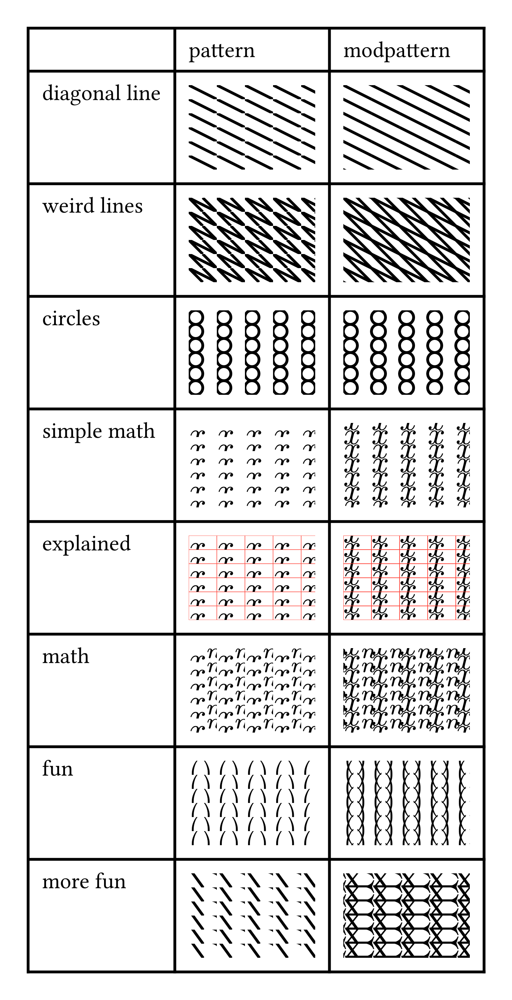

# modpattern

This package provides exactly one function: `modpattern`

It's primary goal is to create make this:

## modpattern function
The function with the signature 
`modpattern(size, body, dx: 0pt, dy: 0pt, background: none)`
has the following parameters:
- `size` is as size for patterns
- `body` is the inside/body/content of the pattern
- `dx`, `dy` allow for translations
- `background` allows any type allowed in the box fill argument. It gets applied first

Notice that, in contrast to typst patterns, size is a positional argument.

Take a look at the example directory, to understand how to use this and to see the reasoning behind the `background` argument.