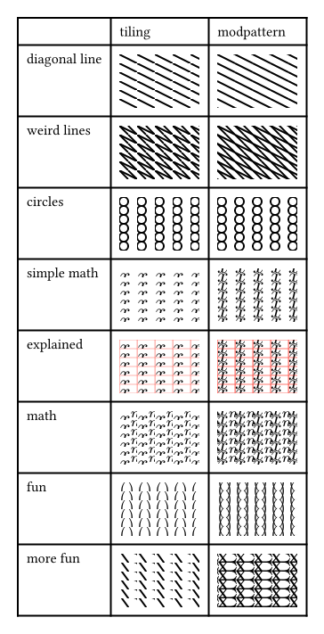

# modpattern

This package provides exactly one function: `modpattern`

It is defined similarly to the official tiling function, but it fixes some caveats, as can be seen here:

## modpattern function
The function with the signature 
`modpattern(..args, background: none)`
has the following parameters:
- `args` with
    - positional `body` as the inside/body/content of the tiling
    - necessary named `size` as a pair of two lengths
    - and the other named arguments the offical tiling type provides, currently:
        - `offset`: a pair of lengths translating the content
        - `spacing`: a pair of lengths changing distance between tiling repetition
- `background` allows any type allowed in the box fill argument. It gets applied first

Notice that, in contrast to typst `tiling`s, size is a necessary argument.

Take a look at the example directory, to understand how to use this and to see the reasoning behind the `background` argument.
