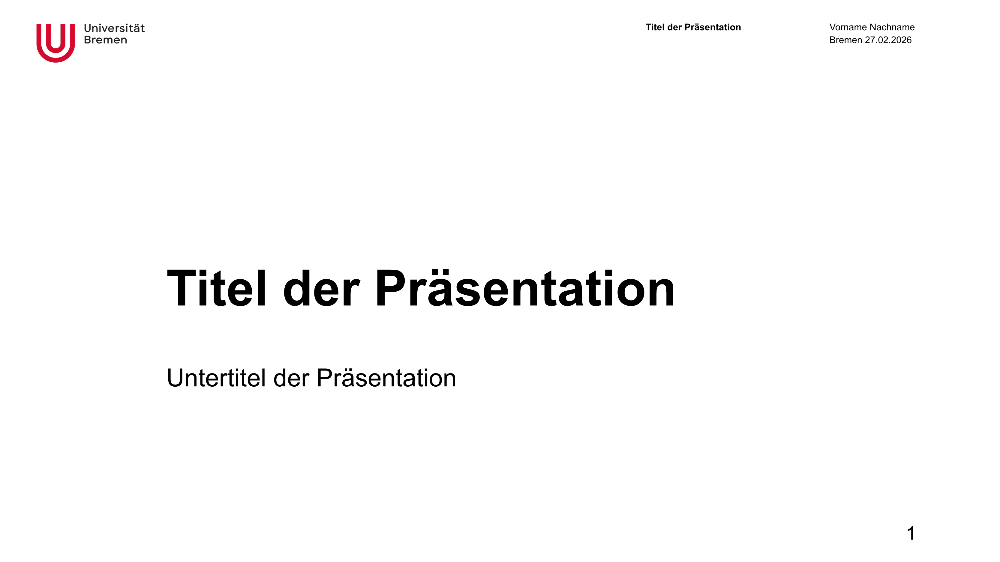

# Uni Bremen Slides Theme

A theme for [Universität Bremen](https://www.uni-bremen.de/) slides for use with [Polylux](https://typst.app/universe/package/polylux/).



## Installation

Add this template to your Typst project:

```
typst init @preview/moin-uni-slides:0.1.0
```

## Usage

Create a new typst file and import the template:

```typst
#import "@preview/polylux:0.4.0": *
#import "@preview/moin-uni-slides:0.1.0": *

#show: theme.with(
  title: "Titel der Präsentation",
  author: "Vorname Nachname",
  date: datetime.today()
)
```

## Font

You need to have the Arial font on your system or in your project, as it is the Uni design font. ([Instructions on how to add a font](https://typst.app/docs/reference/text/text/#parameters-font))

## License

MIT License