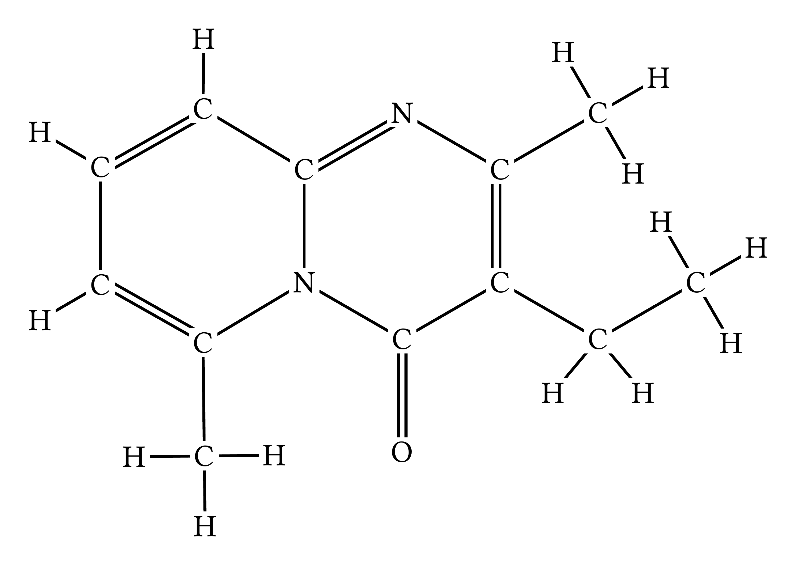
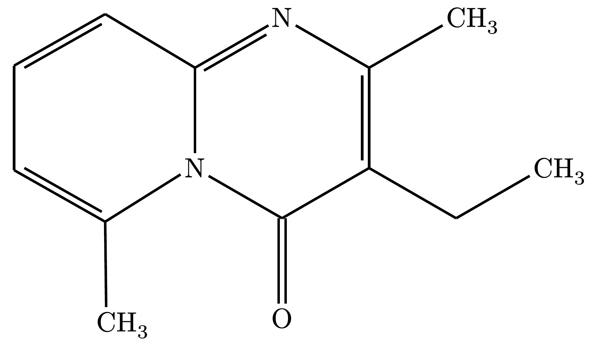
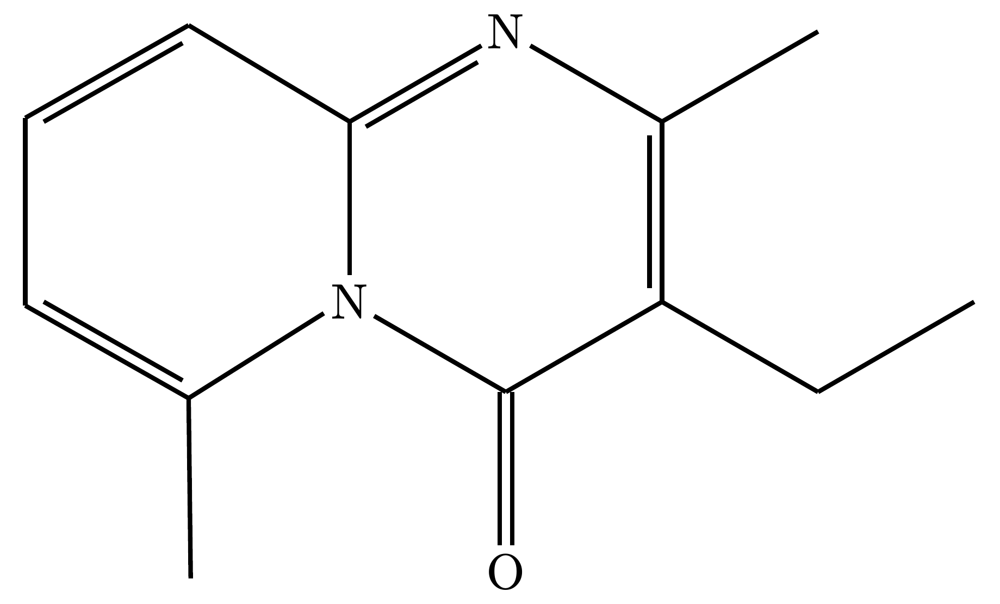
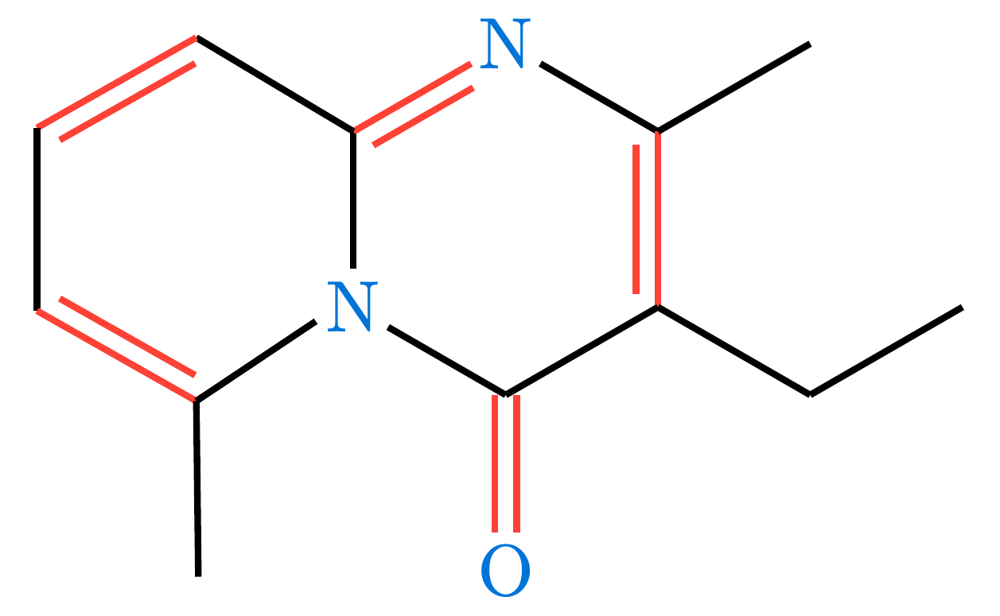
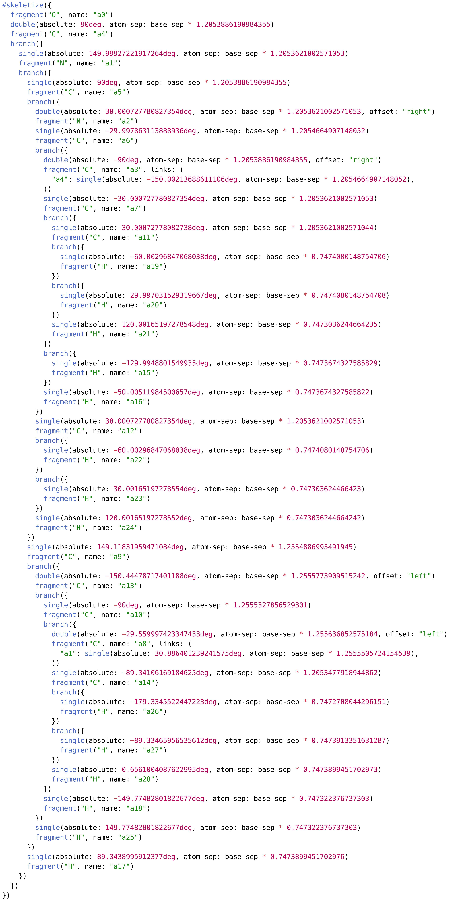

# molchemist

**molchemist** is a Typst package for rendering chemical structures directly from Molfile (`.mol`) and Structure-Data File (`.sdf`) formats. 

It leverages a blazing-fast Rust/WASM core (powered by [`sdfrust`](https://github.com/hfooladi/sdfrust)) to parse molecular graphs and detect cycles, and seamlessly renders them using the declarative drawing engine of [`alchemist`](https://github.com/Typsium/alchemist).

## Usage

Import the `render-mol` function from the package and pass the raw string data of your `.mol` or `.sdf` file.

```typ
#import "@preview/molchemist:0.1.0": render-mol

// Read your molecule data
// Example: https://pubchem.ncbi.nlm.nih.gov/compound/93406
#let mol-data = read("Structure2D_COMPOUND_CID_93406.sdf")
```

### Rendering Modes

`molchemist` supports three distinct rendering styles to suit your document's needs:

#### 1. Full Mode (Default)

Draws every single atom and bond explicitly exactly as defined in the source file, including all carbons and hydrogens.

*Note: For complex molecules, text overlapping may occur. See [Known Limitations](#known-limitations) for workarounds.*

```typ
#render-mol(mol-data)
```



#### 2. Abbreviated Mode

A standard chemical representation. It hides the carbon backbone, wraps explicit hydrogens into their parent heteroatoms (e.g., `O` + `H` becomes `OH`), and neatly formats terminal carbon groups (e.g., `CH3`).

```typ
#render-mol(mol-data, abbreviate: true)
```



#### 3. Skeletal Mode

A pure skeletal formula. All backbone carbons and their attached hydrogens are completely hidden, leaving only the zigzag lines and heteroatoms.

```typ
#render-mol(mol-data, skeletal: true)
```



### Customizing Appearance

Under the hood, `molchemist` parses the graph and generates native `alchemist` elements. You can customize the look of your molecules by passing styling arguments via the `config` dictionary, which are passed directly to `alchemist`'s `skeletize` function.

```typ
#render-mol(
  mol-data, 
  skeletal: true,
  config: (
    atom-sep: 2em,
    fragment-margin: 2pt,
    fragment-color: blue,
    fragment-font: "New Computer Modern",
    single: (stroke: 1pt + black),
    double: (gap: 0.3em, stroke: 1pt + red)
  )
)
```



**Important Note on Configuration:**

- **Routing overrides:** Because `molchemist` maps the exact 2D absolute coordinates from the source `.sdf`/`.mol` file, `alchemist`'s automatic routing configs (like `angle-increment`, `base-angle`) are bypassed and have no effect.
- **Lewis Structures:** `molchemist` does not automatically infer or generate Lewis structures from SDF files, so `lewis-*` configs are not applicable out of the box.

### Advanced: Ejecting to Alchemist Code (Dump Mode)

If you need to manually fine-tune a molecule, add a specific Lewis structure, or integrate the structure into a larger custom `alchemist` drawing, you can use the `dump` parameter.

When `dump: true` is passed, `molchemist` will not render the molecule. Instead, it will output the generated native `alchemist` code block into your document. You can then copy, paste, and modify this code directly.

```typ
#render-mol(mol-data, dump: true)
```



## Known Limitations

When rendering highly complex or dense molecules (e.g., polycyclic compounds, dense substituents) in the default **Full Mode**, you may encounter overlapping atoms or intersecting bonds. This occurs because the 2D absolute coordinates provided in the source `.sdf`/`.mol` files might not allocate enough physical space on the canvas to draw every explicit text label without collisions.

**Recommended Workarounds:**

1. **Use Abbreviated or Skeletal Mode:** For complex organic structures, it is highly recommended to set `abbreviate: true` or `skeletal: true`. This hides redundant atoms, dramatically improving readability and preventing overlaps, which aligns with standard chemical drawing practices.
2. **Increase Bond Length:** If you strictly require Full Mode, you can increase the distance between atoms to create more physical space for the text labels by adjusting the `atom-sep` property in the `config` argument:
    ```typ
    // The default atom-sep is 3em
    #render-mol(mol-data, config: (atom-sep: 4.5em))
    ```

## API Reference

- **`data`** (`str`): The raw string content of a `.mol` or `.sdf` file.
- **`abbreviate`** (`bool`): If `true`, applies standard chemical abbreviations (e.g., folding H into heteroatoms, labeling terminal CH3). Default is `false`.
- **`skeletal`** (`bool`): If `true`, renders a pure skeletal structure, overriding `abbreviate`. Hides all backbone C and H atoms. Default is `false`.
- **`dump`** (`bool`): If `true`, outputs the generated `alchemist` source code as a formatted Typst code block instead of rendering the molecule graphic. Useful for manual tweaking. Default is `false`.
- **`config`** (`dictionary`): A dictionary of visual styling options passed directly to the `alchemist` package.

## License

This project is distributed under the MIT License. See [LICENSE](LICENSE) for details.