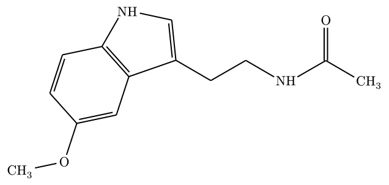
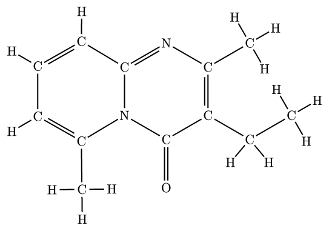
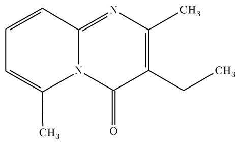
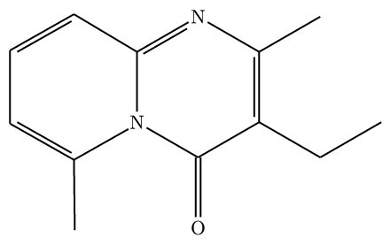
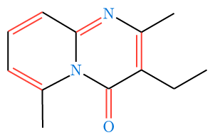

# molchemist

**molchemist** is a Typst package for rendering chemical structures from Molfile / SDF data and from SMILES strings.

It uses a Rust/WASM core to parse molecular graphs and generate `alchemist` ASTs, together with a companion WASM layout plugin for SMILES 2D coordinate generation. Molfile / SDF parsing is powered by [`sdfrust`](https://github.com/hfooladi/sdfrust), SMILES parsing is based on [`opensmiles`](https://crates.io/crates/opensmiles), SMILES 2D coordinate generation uses [`CoordgenLibs`](https://github.com/schrodinger/coordgenlibs), and the final rendering is handled by the declarative drawing engine of [`alchemist`](https://github.com/Typsium/alchemist).

Third-party license notices and bundled example-data provenance are collected in [THIRD_PARTY_NOTICES.md](THIRD_PARTY_NOTICES.md).

## Usage

Import `render-mol` for Molfile/SDF inputs, or `render-smiles` for SMILES inputs.

```typ
#import "@preview/molchemist:0.1.2": render-mol, render-smiles

// Read your molecule data
// Example: https://pubchem.ncbi.nlm.nih.gov/compound/93406
#let mol-data = read("Structure2D_COMPOUND_CID_93406.sdf")
```

On Typst 0.15.0 and later, you may also pass `path("Structure2D_COMPOUND_CID_93406.sdf")` directly to `render-mol`; `molchemist` will read the file inside the package. The examples in this README use `read(...)` for compatibility with older Typst versions.

The bundled documentation and README screenshots use small PubChem-derived example structures. See [THIRD_PARTY_NOTICES.md](THIRD_PARTY_NOTICES.md) for source URLs and NCBI data-usage notes.

For SMILES, `molchemist` generates a 2D layout internally before sending the structure to `alchemist`.

```typ
// Example: https://pubchem.ncbi.nlm.nih.gov/compound/896
#render-smiles("CC(=O)NCCC1=CNC2=C1C=C(C=C2)OC", abbreviate: true)
```



### Adding Annotations

You can overlay arrows and labels on top of a rendered molecule with the `annotations` argument. `molchemist` provides helpers for atom-level, bond-level, and molecule-level annotations without leaving the package API.

```typ
#import "@preview/molchemist:0.1.2": (
  render-smiles,
  atom-anchor,
  bond-anchor,
  molecule-anchor,
  callout-annotation,
  arrow-annotation,
)

#render-smiles(
  "OCCc1c(C)[n+](=cs1)Cc2cnc(C)nc(N)2",
  abbreviate: true,
  annotations: (
    callout-annotation(
      atom-anchor(6, anchor: "north"),
      [cationic center],
      side: "north-east",
    ),
    callout-annotation(
      bond-anchor(3, anchor: "50%"),
      [aromatic bond],
      side: "north-west",
    ),
    arrow-annotation(
      molecule-anchor(anchor: "east"),
      (rel: (2.6, 0), to: molecule-anchor(anchor: "east")),
      label: [reaction direction],
      label-offset: (0, -0.45),
      label-anchor: "north",
    ),
  ),
)
```

Use `callout-annotation(...)` for most explanatory labels, `arrow-annotation(...)` for free arrows, and `label-annotation(...)` for low-level labels. `atom-anchor(...)` targets a specific atom, `bond-anchor(...)` targets a specific bond, and `molecule-anchor(anchor: "center")` attaches to the molecule as a whole. Callouts are intentionally restrained for publication figures: unboxed labels, thin monochrome leader lines, no arrowheads by default, and enough clearance from both the label text and the chemical structure. Placement presets such as `side: "north-east"` cover the common cases, while `label-at`, `leader-start`, `leader-end`, `leader-points`, `label-gap`, and `target-gap` are available for small manual corrections when a paper figure needs precise spacing. For final figure-level adjustments, `cetz-annotation((mol) => { ... })` exposes the generated molecule name for direct Cetz drawing. To discover the atom and bond indices for a molecule, enable the debug overlay with `show-indices: true`, `show-indices: "atoms"`, or `show-indices: "bonds"`. In abbreviated or skeletal mode, the overlay only labels elements that are actually rendered.

### Publication Figure Guidance

For paper figures, prefer `skeletal: true` for hydrocarbon-heavy structures and `abbreviate: true` when heteroatom hydrogens or terminal groups should remain explicit. Use Full Mode mainly for small molecules or debugging, since explicit hydrogens can make dense structures hard to read.

Keep annotations minimal: use monochrome `callout-annotation(...)` labels, avoid arrowheads unless the line represents a process, and move labels outside the molecular graph. If a leader line visually resembles a chemical bond, increase `target-gap`, move the label with `label-at`, or route the line through `leader-points`.

### Rendering Modes

`molchemist` supports three distinct rendering styles to suit your document's needs:

#### 1. Full Mode (Default)

Draws every single atom and bond explicitly exactly as defined in the source file, including all carbons and hydrogens.

*Note: For complex molecules, text overlapping may occur. See [Known Limitations](#known-limitations) for workarounds.*

```typ
#render-mol(mol-data)
```



#### 2. Abbreviated Mode

A standard chemical representation. It hides the carbon backbone, wraps explicit hydrogens into their parent heteroatoms (e.g., `O` + `H` becomes `OH`), and neatly formats terminal carbon groups (e.g., `CH3`).

```typ
#render-mol(mol-data, abbreviate: true)
```



#### 3. Skeletal Mode

A pure skeletal formula. All backbone carbons and their attached hydrogens are completely hidden, leaving only the zigzag lines and heteroatoms.

```typ
#render-mol(mol-data, skeletal: true)
```



### Customizing Appearance

Under the hood, `molchemist` parses the graph and generates native `alchemist` elements. You can customize the look of your molecules by passing styling arguments via the `config` dictionary, which are passed directly to `alchemist`'s `skeletize` function.

```typ
#render-mol(
  mol-data, 
  skeletal: true,
  config: (
    atom-sep: 2em,
    fragment-margin: 2pt,
    fragment-color: blue,
    fragment-font: "New Computer Modern",
    single: (stroke: 1pt + black),
    double: (gap: 0.3em, stroke: 1pt + red)
  )
)
```



**Important Note on Configuration:**

- **Routing overrides:** Because `molchemist` maps the exact 2D absolute coordinates from the source `.sdf`/`.mol` file, `alchemist`'s automatic routing configs (like `angle-increment`, `base-angle`) are bypassed and have no effect.
- **Lewis Structures:** `molchemist` does not automatically infer or generate Lewis structures from SDF files, so `lewis-*` configs are not applicable out of the box.

### Advanced: Ejecting to Alchemist Code (Dump Mode)

If you need to manually fine-tune a molecule, add a specific Lewis structure, or integrate the structure into a larger custom `alchemist` drawing, you can use the `dump` parameter.

When `dump: true` is passed, `molchemist` will not render the molecule. Instead, it will output the generated native `alchemist` code block into your document. You can then copy, paste, and modify this code directly.

```typ
#render-mol(mol-data, dump: true)
```


**Output (Example):**

```typ
#let base-sep = 3em
#skeletize({
  fragment("O", name: "a0")
  double(absolute: 90deg, atom-sep: base-sep * 1.2053886190984355)
  fragment("C", name: "a4")
  branch({
    single(absolute: 149.99927221917264deg, atom-sep: base-sep * 1.2053621002571053)
    fragment("N", name: "a1")
    branch({
      single(absolute: 90deg, atom-sep: base-sep * 1.2053886190984355)
      fragment("C", name: "a5")
      branch({
        double(absolute: 30.000727780827354deg, atom-sep: base-sep * 1.2053621002571053, offset: "right")
        fragment("N", name: "a2")
        single(absolute: −29.997863113888936deg, atom-sep: base-sep * 1.2054664907148052)
        fragment("C", name: "a6")
        branch({
          double(absolute: −90deg, atom-sep: base-sep * 1.2053886190984355, offset: "right")
          fragment("C", name: "a3", links: (
            "a4": single(absolute: −150.00213688611106deg, atom-sep: base-sep * 1.2054664907148052),
          ))
          single(absolute: −30.000727780827354deg, atom-sep: base-sep * 1.2053621002571053)
          fragment("C", name: "a7")
          branch({
            single(absolute: 30.00072778082738deg, atom-sep: base-sep * 1.2053621002571044)
            fragment("C", name: "a11")
            branch({
              single(absolute: −60.00296847068038deg, atom-sep: base-sep * 0.7474080148754706)
              fragment("H", name: "a19")
            })
            branch({
              single(absolute: 29.997031529319667deg, atom-sep: base-sep * 0.7474080148754708)
              fragment("H", name: "a20")
            })
            single(absolute: 120.00165197278548deg, atom-sep: base-sep * 0.7473036244664235)
            fragment("H", name: "a21")
          })
          branch({
            single(absolute: −129.9948801549935deg, atom-sep: base-sep * 0.7473674327585829)
            fragment("H", name: "a15")
          })
          single(absolute: −50.00511984500657deg, atom-sep: base-sep * 0.7473674327585822)
          fragment("H", name: "a16")
        })
        single(absolute: 30.000727780827354deg, atom-sep: base-sep * 1.2053621002571053)
        fragment("C", name: "a12")
        branch({
          single(absolute: −60.00296847068038deg, atom-sep: base-sep * 0.7474080148754706)
          fragment("H", name: "a22")
        })
        branch({
          single(absolute: 30.00165197278554deg, atom-sep: base-sep * 0.747303624466423)
          fragment("H", name: "a23")
        })
        single(absolute: 120.00165197278552deg, atom-sep: base-sep * 0.7473036244664242)
        fragment("H", name: "a24")
      })
      single(absolute: 149.11831959471084deg, atom-sep: base-sep * 1.2554886995491945)
      fragment("C", name: "a9")
      branch({
        double(absolute: −150.44478717401188deg, atom-sep: base-sep * 1.2555773909515242, offset: "left")
        fragment("C", name: "a13")
        branch({
          single(absolute: −90deg, atom-sep: base-sep * 1.2555327856529301)
          fragment("C", name: "a10")
          branch({
            double(absolute: −29.559997423347433deg, atom-sep: base-sep * 1.255636852575184, offset: "left")
            fragment("C", name: "a8", links: (
              "a1": single(absolute: 30.886401239241575deg, atom-sep: base-sep * 1.2555505724154539),
            ))
            single(absolute: −89.34106169184625deg, atom-sep: base-sep * 1.2053477918944862)
            fragment("C", name: "a14")
            branch({
              single(absolute: −179.3345522447223deg, atom-sep: base-sep * 0.7472708044296151)
              fragment("H", name: "a26")
            })
            branch({
              single(absolute: −89.33465956535612deg, atom-sep: base-sep * 0.7473913351631287)
              fragment("H", name: "a27")
            })
            single(absolute: 0.6561004087622995deg, atom-sep: base-sep * 0.7473899451702973)
            fragment("H", name: "a28")
          })
          single(absolute: −149.77482801822677deg, atom-sep: base-sep * 0.747322376737303)
          fragment("H", name: "a18")
        })
        single(absolute: 149.77482801822677deg, atom-sep: base-sep * 0.747322376737303)
        fragment("H", name: "a25")
      })
      single(absolute: 89.3438995912377deg, atom-sep: base-sep * 0.7473899451702976)
      fragment("H", name: "a17")
    })
  })
})
```

## Known Limitations

When rendering highly complex or dense molecules (e.g., polycyclic compounds, dense substituents) in the default **Full Mode**, you may encounter overlapping atoms or intersecting bonds. This occurs because the 2D absolute coordinates provided in the source `.sdf`/`.mol` files might not allocate enough physical space on the canvas to draw every explicit text label without collisions.

**Recommended Workarounds:**

1. **Use Abbreviated or Skeletal Mode:** For complex organic structures, it is highly recommended to set `abbreviate: true` or `skeletal: true`. This hides redundant atoms, dramatically improving readability and preventing overlaps, which aligns with standard chemical drawing practices.
2. **Increase Bond Length:** If you strictly require Full Mode, you can increase the distance between atoms to create more physical space for the text labels by adjusting the `atom-sep` property in the `config` argument:
    ```typ
    // The default atom-sep is 3em
    #render-mol(mol-data, config: (atom-sep: 4.5em))
    ```

For SMILES input, the default `render-smiles(...)` mode expands implicit hydrogens into explicit `H` atoms so that `full` mode stays closer to the behavior of `render-mol(...)`. Highly complex or dense molecules can still become visually busy in `full` mode, so `abbreviate: true` or `skeletal: true` will often produce a clearer result. The current implementation also supports tetrahedral `@` / `@@` centers and `/` / `\` double-bond geometry as stereochemical depictions. Extended OpenSMILES chirality classes such as `@AL`, `@SP`, `@TB`, and `@OH` are accepted as well; because the current `alchemist`-based renderer does not have native glyphs for those geometries, they are preserved as stereo annotations below the rendered structure instead of wedge/dash depictions.

## Feature Plan

- **Native depiction for extended chirality:** Extended OpenSMILES chirality classes such as allene (`@AL`), square-planar (`@SP`), trigonal-bipyramidal (`@TB`), and octahedral (`@OH`) are currently preserved as textual stereo annotations. A future version may render these classes natively once the expected 2D depiction conventions and the required `alchemist` primitives are clarified.

## API Reference

### Renderers

```typ
#render-mol(data, ..options)
#render-smiles(smiles, ..options)
```

| Function | Input | Description |
| --- | --- | --- |
| `render-mol` | `data: str`, `bytes`, or Typst 0.15+ `path` | Renders Molfile or SDF data. Coordinates are read from the input. |
| `render-smiles` | `smiles: str` | Parses SMILES, generates a 2D layout, and renders the result. |

Both renderers accept the same options:

| Option | Type | Default | Description |
| --- | --- | --- | --- |
| `abbreviate` | `bool` | `false` | Folds common hydrogens and terminal groups into labels. |
| `skeletal` | `bool` | `false` | Draws a skeletal formula. Overrides `abbreviate`. |
| `dump` | `bool` | `false` | Returns generated `alchemist` source instead of rendering. |
| `config` | `dictionary` | `(:)` | Passes visual settings directly to `alchemist`. |
| `annotations` | `annotation`, `array`, `none` | `none` | Adds labels, arrows, or custom CeTZ overlays. |
| `show-indices` | `bool`, `str` | `false` | Shows debug labels for annotation authoring. Use `true`, `"all"`, `"atoms"`, or `"bonds"`. |

### Anchors

Use anchors to target atoms, bonds, or the whole molecule from annotations.

| Function | Returns | Use |
| --- | --- | --- |
| `atom-anchor(index, anchor: "mid")` | anchor selector | Target a rendered atom. |
| `bond-anchor(index, anchor: "50%")` | anchor selector | Target a rendered bond. |
| `molecule-anchor(anchor: "center")` | anchor selector | Target the rendered molecule group. |
| `atom-ref(index)` | `str` | Inspect the generated atom anchor name. |
| `bond-ref(index)` | `str` | Inspect the generated bond anchor name. |

### Annotations

Pass one annotation or an array of annotations to `annotations`.

| Function | Purpose |
| --- | --- |
| `callout-annotation(at, label, ..options)` | External publication-style label with a thin leader line. |
| `arrow-annotation(from, to, ..options)` | Free arrow overlay for process arrows or directional marks. |
| `label-annotation(at, label, ..options)` | Free text label without a leader line. |
| `cetz-annotation(body, ..options)` | Low-level CeTZ overlay. The callback receives the generated molecule name. |

Common `callout-annotation` controls include `side`, `label-at`, `leader`, `leader-start`, `leader-end`, `leader-points`, `label-gap`, and `target-gap`. Use these when a final figure needs precise spacing.

Use `cetz-annotation` as the escape hatch for advanced figure polishing:

```typ
#render-smiles(
  "c1ccccc1",
  skeletal: true,
  annotations: cetz-annotation(mol => {
    import cetz.draw: *
    content((to: (name: mol, anchor: "north"), rel: (0, 0.45)))[benzene]
  }),
)
```

## License

The `molchemist` package code is distributed under the MIT License. See [LICENSE](LICENSE) for details.

Redistributed third-party code and bundled example-data provenance, including PubChem-derived SDF/example images, are documented separately in [THIRD_PARTY_NOTICES.md](THIRD_PARTY_NOTICES.md).
