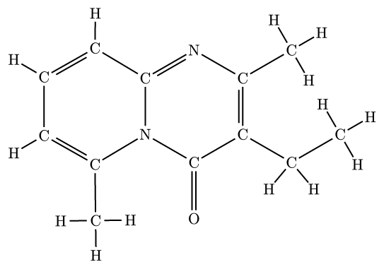
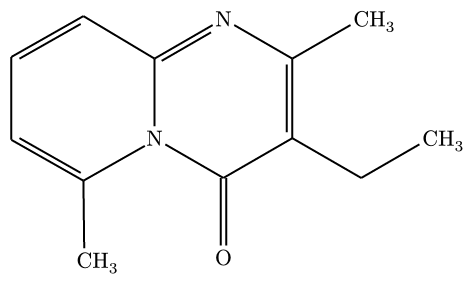
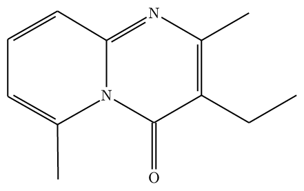
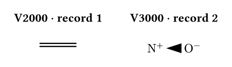
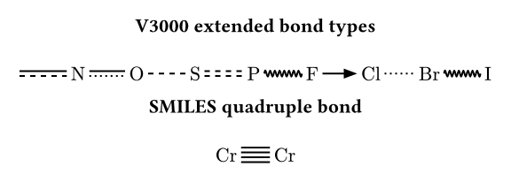
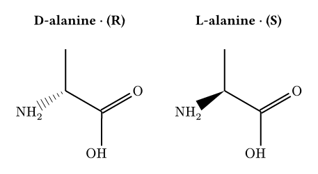
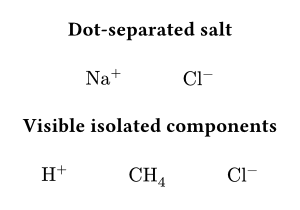
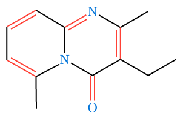
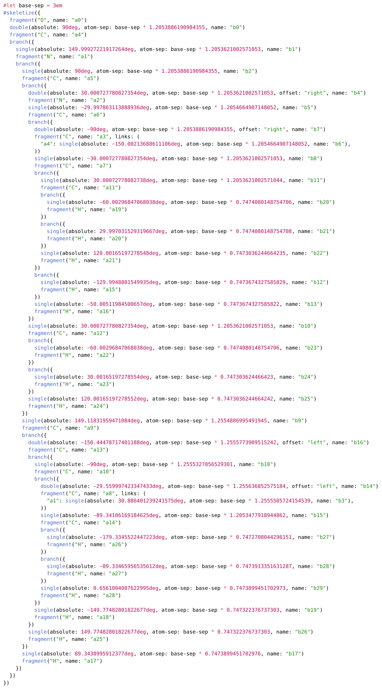

# molchemist

**molchemist** is a Typst package for rendering chemical structures from Molfile / SDF data and from SMILES strings.

It uses a Rust/WASM core to parse molecular graphs and generate `alchemist` ASTs, together with a companion WASM layout plugin for SMILES 2D coordinate generation. Molfile / SDF parsing is powered by [`sdfrust`](https://github.com/hfooladi/sdfrust), SMILES parsing is based on [`opensmiles`](https://crates.io/crates/opensmiles), SMILES 2D coordinate generation uses [`CoordgenLibs`](https://github.com/schrodinger/coordgenlibs), and the final rendering is handled by the declarative drawing engine of [`alchemist`](https://github.com/Typsium/alchemist).

Third-party license notices are collected in [THIRD_PARTY_NOTICES.md](THIRD_PARTY_NOTICES.md).

## Usage

Import `render-mol` for Molfile/SDF inputs, or `render-smiles` for SMILES inputs.

```typ
#import "@preview/molchemist:0.1.4": render-mol, render-smiles

// Read your molecule data
// Example: https://pubchem.ncbi.nlm.nih.gov/compound/93406
#let mol-data = read("Structure2D_COMPOUND_CID_93406.sdf")
```

On Typst 0.15.0 and later, you may also pass `path("Structure2D_COMPOUND_CID_93406.sdf")` directly to `render-mol`; `molchemist` will read the file inside the package. The examples in this README use `read(...)` for compatibility with older Typst versions.

The bundled documentation and README screenshots use small PubChem-derived and synthetic example structures. 

For SMILES, `molchemist` generates a 2D layout internally before sending the structure to `alchemist`.

SMILES parsing is strict: malformed branch, dot, bond, bracket-property, charge, isotope, atom-class, directional-bond, and aromatic notation is rejected instead of being normalized silently. Atom classes from `0` through `9999` are accepted, and aromatic systems must satisfy Hückel's rule and admit a valence-compatible Kekulé assignment.

```typ
// Example: https://pubchem.ncbi.nlm.nih.gov/compound/896
#render-smiles("CC(=O)NCCC1=CNC2=C1C=C(C=C2)OC", abbreviate: true)
```


### Adding Annotations

You can overlay arrows and labels on top of a rendered molecule with the `annotations` argument. `molchemist` provides helpers for atom-level, bond-level, and molecule-level annotations without leaving the package API.

```typ
#import "@preview/molchemist:0.1.4": (
  render-smiles,
  atom-anchor,
  bond-anchor,
  molecule-anchor,
  callout-annotation,
  arrow-annotation,
)

#render-smiles(
  "OCCc1c(C)[n+](=cs1)Cc2cnc(C)nc(N)2",
  abbreviate: true,
  annotations: (
    callout-annotation(
      atom-anchor(6, anchor: "north"),
      [cationic center],
      side: "north-east",
    ),
    callout-annotation(
      bond-anchor(3, anchor: "50%"),
      [aromatic bond],
      side: "north-west",
    ),
    arrow-annotation(
      molecule-anchor(anchor: "east"),
      (rel: (2.6, 0), to: molecule-anchor(anchor: "east")),
      label: [reaction direction],
      label-offset: (0, -0.45),
      label-anchor: "north",
    ),
  ),
)
```

Use `callout-annotation(...)` for most explanatory labels, `arrow-annotation(...)` for free arrows, and `label-annotation(...)` for low-level labels. `atom-anchor(...)` targets a specific atom, `bond-anchor(...)` targets a specific bond, and `molecule-anchor(anchor: "center")` attaches to the molecule as a whole. Callouts are intentionally restrained for publication figures: unboxed labels, thin monochrome leader lines, no arrowheads by default, and enough clearance from both the label text and the chemical structure. Placement presets such as `side: "north-east"` cover the common cases, while `label-at`, `leader-start`, `leader-end`, `leader-points`, `label-gap`, and `target-gap` are available for small manual corrections when a paper figure needs precise spacing. For final figure-level adjustments, `cetz-annotation((mol) => { ... })` exposes the generated molecule name for direct Cetz drawing. To discover the atom and bond indices for a molecule, enable the debug overlay with `show-indices: true`, `show-indices: "atoms"`, or `show-indices: "bonds"`. In abbreviated or skeletal mode, the overlay only labels elements that are actually rendered.

### Publication Figure Guidance

For paper figures, prefer `skeletal: true` for hydrocarbon-heavy structures and `abbreviate: true` when heteroatom hydrogens or terminal groups should remain explicit. Use Full Mode mainly for small molecules or debugging, since explicit hydrogens can make dense structures hard to read.

Keep annotations minimal: use monochrome `callout-annotation(...)` labels, avoid arrowheads unless the line represents a process, and move labels outside the molecular graph. If a leader line visually resembles a chemical bond, increase `target-gap`, move the label with `label-at`, or route the line through `leader-points`.

### Rendering Modes

`molchemist` supports three distinct rendering styles to suit your document's needs:

#### 1. Full Mode (Default)

Draws every single atom and bond explicitly exactly as defined in the source file, including all carbons and hydrogens.

*Note: For complex molecules, text overlapping may occur. See [Known Limitations](#known-limitations) for workarounds.*

```typ
#render-mol(mol-data)
```



#### 2. Abbreviated Mode

A standard chemical representation. It hides the carbon backbone, wraps explicit hydrogens into their parent heteroatoms (e.g., `O` + `H` becomes `OH`), and neatly formats terminal carbon groups (e.g., `CH3`).

```typ
#render-mol(mol-data, abbreviate: true)
```



#### 3. Skeletal Mode

A pure skeletal formula. All backbone carbons and their attached hydrogens are completely hidden, leaving only the zigzag lines and heteroatoms.

```typ
#render-mol(mol-data, skeletal: true)
```



### SDF Versions and Record Selection

Molfile/SDF input is detected as V2000 or V3000 for each selected record. For a multi-record SDF, pass the one-based `record` option; the default is the first record.

```typ
#let sdf-data = read("structures.sdf")

#grid(
  columns: 2,
  gutter: 2em,
  align: top,
  align(center)[
    *V2000 · record 1*
    #v(0.6em)
    #render-mol(sdf-data, record: 1, abbreviate: true)
  ],
  align(center)[
    *V3000 · record 2*
    #v(0.6em)
    #render-mol(sdf-data, record: 2, abbreviate: true)
  ],
)
```



The CLI uses the same selection and validation path:

```sh
molchemist dump structures.sdf --record 2 --mode skeletal
```

Empty structures, malformed records, non-finite coordinates, and out-of-range record numbers produce an explicit error instead of an empty drawing.

Usable 2D coordinates are preserved exactly. If all bonded atoms collapse onto the same XY positions, a 3D record has no usable XY projection, or bond lengths are numerically unstable, `molchemist` generates a fresh 2D layout with Coordgen. Atom metadata, bond semantics, and stereochemical wedges/dashes still come from the selected SDF record.

### Bond Semantics

SDF bond orders are retained through the complete parser, AST, package, and CLI pipeline. In addition to single, double, and triple bonds, `molchemist` distinguishes aromatic, single-or-double, single-or-aromatic, double-or-aromatic, any, coordination/dative, and hydrogen bonds. V2000 `either` stereochemistry is also preserved instead of being drawn as an ordinary single bond. SMILES quadruple bonds written with `$`, such as `[Cr]$[Cr]`, are rendered as four parallel lines.

Extended bonds use conventional visual cues: partial dashed or dotted parallel lines for aromatic and query bonds, a wavy line for any/either bonds, a direction-preserving filled arrow for coordination bonds, and a dotted line for hydrogen bonds. These helpers inherit the configured `single` or `double` stroke where applicable. Long hydrogen bonds are excluded from bond-length normalization when covalent bonds are available, so they do not shrink the rest of the structure.

```typ
#let bond-data = read("bond-semantics.sdf")

#grid(
  columns: 1,
  row-gutter: 1em,
  align(center)[
    *V3000 extended bond types*
    #v(0.6em)
    #render-mol(bond-data, abbreviate: true, config: (atom-sep: 3.0em))
  ],
  align(center)[
    *SMILES quadruple bond*
    #v(0.6em)
    #render-smiles("[Cr]$[Cr]")
  ],
)
```



### Stereochemistry

For Molfile/SDF input, up/down single bonds remain wedge/dash bonds. Undefined double-bond geometry (V2000 stereo code 3 or V3000 double-bond `CFG=2`) is rendered as a crossed double bond. Atom `CFG` parity and V3000 enhanced stereo groups (`STEABS`, `STEREL`, and `STERAC`) are retained as stereo annotations below the structure and in dump/CLI source.

Extended OpenSMILES chirality classes are depicted natively when their topology permits an unambiguous 2D projection. Allene (`@AL`) configurations use complementary terminal wedge/dash bonds; square-planar (`@SP`) configurations use the specified U, 4, or Z ligand path; and trigonal-bipyramidal (`@TB`) and octahedral (`@OH`) configurations combine the specified ligand winding with solid/hashed viewing-axis bonds.

```typ
#grid(
  columns: 2,
  gutter: 2em,
  align: top,
  align(center)[
    *D-alanine · (R)*
    #v(0.6em)
    #render-smiles("N[C@H](C)C(=O)O", skeletal: true)
  ],
  align(center)[
    *L-alanine · (S)*
    #v(0.6em)
    #render-smiles("N[C@@H](C)C(=O)O", skeletal: true)
  ],
)
```



### Multi-component Structures

Disconnected Molfile/SDF graphs and dot-separated SMILES are rendered as distinct components in one figure. Components keep their source order and global atom/bond indices, but are separated by whitespace without adding a visible chemical operator.

```typ
#grid(
  columns: 1,
  row-gutter: 1em,
  align(center)[
    *Dot-separated salt*
    #v(0.6em)
    #render-smiles("[Na+].[Cl-]", abbreviate: true)
  ],
  align(center)[
    *Visible isolated components*
    #v(0.6em)
    #render-smiles("[H+].C.[Cl-]", skeletal: true)
  ],
)
```



Isolated atoms remain visible in abbreviated and skeletal modes, including standalone hydrogen and zero-heavy-neighbor carbon components such as methane. Annotation anchors and `show-indices` continue to address the original input-wide indices across every component.

### Customizing Appearance

Under the hood, `molchemist` parses the graph and generates native `alchemist` elements. You can customize the look of your molecules by passing styling arguments via the `config` dictionary, which are passed directly to `alchemist`'s `skeletize` function.

```typ
#render-mol(
  mol-data, 
  skeletal: true,
  config: (
    atom-sep: 2em,
    fragment-margin: 2pt,
    fragment-color: blue,
    fragment-font: "New Computer Modern",
    single: (stroke: 1pt + black),
    double: (gap: 0.3em, stroke: 1pt + red)
  )
)
```



**Important Note on Configuration:**

- **Routing overrides:** Because `molchemist` maps absolute 2D coordinates from the source `.sdf`/`.mol` file or its automatic fallback layout, `alchemist`'s automatic routing configs (like `angle-increment`, `base-angle`) are bypassed and have no effect.
- **Lewis Structures:** `molchemist` does not automatically infer or generate Lewis structures from SDF files, so `lewis-*` configs are not applicable out of the box.

### Advanced: Ejecting to Alchemist Code (Dump Mode)

If you need to manually fine-tune a molecule, add a specific Lewis structure, or integrate the structure into a larger custom `alchemist` drawing, you can use the `dump` parameter.

When `dump: true` is passed, `molchemist` will not render the molecule. Instead, it will output the generated native `alchemist` code block into your document. You can then copy, paste, and modify this code directly.

```typ
#render-mol(mol-data, dump: true)
```



### Command-Line Export

For scripts and editor workflows, install the optional `molchemist` executable from the `molchemist-cli` crate. It accepts Molfile/SDF files, SMILES strings, or standard input and writes formatted `alchemist` source to standard output.

```sh
cargo install --locked molchemist-cli

molchemist dump molecule.sdf > molecule.typ
molchemist dump --smiles 'CC(=O)O' --mode skeletal --standalone --output acetic-acid.typ
```

For example:

```console
$ molchemist dump --smiles 'CC(=O)O' --mode skeletal
#let base-sep = 3em
#skeletize({
  hook("a0")
  single(absolute: 29.79036703670196deg, atom-sep: base-sep * 1, name: "b0")
  hook("a1")
  branch({
    double(absolute: 89.79373607661383deg, atom-sep: base-sep * 1.000062954206203, name: "b1")
    fragment("O", name: "a2")
  })
  single(absolute: −30.20116835518715deg, atom-sep: base-sep * 0.9999817671902098, name: "b2")
  fragment("OH", name: "a3")
})
```

The CLI embeds the same WASM conversion modules as this Typst package, so its default source matches `dump: true`. Use `molchemist dump --help` for format, record-selection, indentation, and standalone-document options.

## Known Limitations

### Dense Full-Mode Labels

Highly complex or dense molecules can contain overlapping atom labels or intersecting bonds in **Full Mode**. Explicit hydrogens and atom text occupy page space that is not represented in the underlying 2D coordinates.

**Recommended Workarounds:**

1. **Use Abbreviated or Skeletal Mode:** For complex organic structures, it is highly recommended to set `abbreviate: true` or `skeletal: true`. This hides redundant atoms, dramatically improving readability and preventing overlaps, which aligns with standard chemical drawing practices.
2. **Increase Bond Length:** If you strictly require Full Mode, you can increase the distance between atoms to create more physical space for the text labels by adjusting the `atom-sep` property in the `config` argument:
    ```typ
    // The default atom-sep is 3em
    #render-mol(mol-data, config: (atom-sep: 4.5em))
    ```

### Layout Boundaries

- A valid Molfile/SDF 2D layout is preserved even when its full-mode labels are crowded. Automatic relayout is limited to collapsed or numerically unstable XY coordinates.
- SMILES and unusable SDF coordinates are laid out with Coordgen. The result is deterministic for a given bundled plugin, but it may differ from an external chemical drawing program.
- Relayout preserves explicit SDF wedge, parity, and enhanced-stereo metadata. It does not infer stereochemistry solely from 3D coordinates.

### Fallbacks and Test Boundaries

- If an invalid or cyclic extended-chirality topology prevents ligand branches from being placed independently, the original chirality tag is retained as a textual stereo annotation.
- Annotation helpers cover common callouts and arrows, not automatic collision-free figure composition. Use `cetz-annotation(...)` or dumped Alchemist source for complex layouts.
- Rendering CI catches compilation failures and package/CLI source divergence on the listed Typst versions. It is not a pixel-snapshot guarantee, so fonts and final PDF appearance should still be reviewed for publication output.
- Maintainers can use `scripts/check-pubchem-visual-regression.py` with the ignored local PubChem corpus for opt-in pixel regression checks; its baseline is machine-local and is not distributed with the package.

## API Reference

### Renderers

```typ
#render-mol(data, ..options)
#render-smiles(smiles, ..options)
```

| Function | Input | Description |
| --- | --- | --- |
| `render-mol` | `data: str`, `bytes`, or Typst 0.15+ `path` | Renders V2000/V3000 Molfile or SDF data. Usable input coordinates are preserved; unusable coordinates receive a generated 2D layout. |
| `render-smiles` | `smiles: str` | Parses SMILES, generates a 2D layout, and renders the result. |

Both renderers accept the same options:

| Option | Type | Default | Description |
| --- | --- | --- | --- |
| `abbreviate` | `bool` | `false` | Folds common hydrogens and terminal groups into labels. |
| `skeletal` | `bool` | `false` | Draws a skeletal formula. Overrides `abbreviate`. |
| `dump` | `bool` | `false` | Returns generated `alchemist` source instead of rendering. |
| `config` | `dictionary` | `(:)` | Passes visual settings directly to `alchemist`. |
| `annotations` | `annotation`, `array`, `none` | `none` | Adds labels, arrows, or custom CeTZ overlays. |
| `show-indices` | `bool`, `str` | `false` | Shows debug labels for annotation authoring. Use `true`, `"all"`, `"atoms"`, or `"bonds"`. |

`render-mol` additionally accepts `record: int`, a one-based SDF record number whose default is `1`.

### Anchors

Use anchors to target atoms, bonds, or the whole molecule from annotations.

| Function | Returns | Use |
| --- | --- | --- |
| `atom-anchor(index, anchor: "mid")` | anchor selector | Target a rendered atom. |
| `bond-anchor(index, anchor: "50%")` | anchor selector | Target a rendered bond. |
| `molecule-anchor(anchor: "center")` | anchor selector | Target the rendered molecule group. |
| `atom-ref(index)` | `str` | Inspect the generated atom anchor name. |
| `bond-ref(index)` | `str` | Inspect the generated bond anchor name. |

### Annotations

Pass one annotation or an array of annotations to `annotations`.

| Function | Purpose |
| --- | --- |
| `callout-annotation(at, label, ..options)` | External publication-style label with a thin leader line. |
| `arrow-annotation(from, to, ..options)` | Free arrow overlay for process arrows or directional marks. |
| `label-annotation(at, label, ..options)` | Free text label without a leader line. |
| `cetz-annotation(body, ..options)` | Low-level CeTZ overlay. The callback receives the generated molecule name. |

Common `callout-annotation` controls include `side`, `label-at`, `leader`, `leader-start`, `leader-end`, `leader-points`, `label-gap`, and `target-gap`. Use these when a final figure needs precise spacing.

Use `cetz-annotation` as the escape hatch for advanced figure polishing:

```typ
#render-smiles(
  "c1ccccc1",
  skeletal: true,
  annotations: cetz-annotation(mol => {
    import cetz.draw: *
    content((to: (name: mol, anchor: "north"), rel: (0, 0.45)))[benzene]
  }),
)
```

## License

The molchemist-authored Typst source is distributed under the MIT License. See [LICENSE](LICENSE) for its terms.

The published package also contains precompiled WASM components, so its manifest uses the aggregate SPDX expression `MIT AND BSD-3-Clause AND Apache-2.0 AND (Apache-2.0 WITH LLVM-exception)`. In particular, `molchemist_plugin.wasm` contains MIT- and Apache-2.0-licensed components, and `molchemist_smiles_plugin.wasm` contains MIT-, BSD-3-Clause-, and Apache-2.0-with-LLVM-exception components. `wasm-minimal-protocol`, incorporated into the Rust plugin, is released under the Unlicense and is recorded in the notices rather than the manifest expression.

The complete file-to-license mapping and required license texts are documented in [THIRD_PARTY_NOTICES.md](THIRD_PARTY_NOTICES.md).
