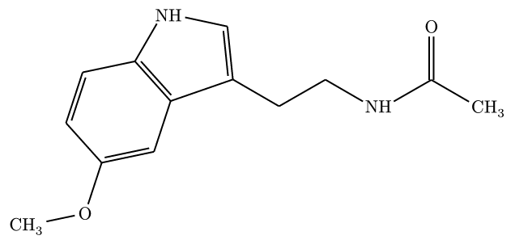
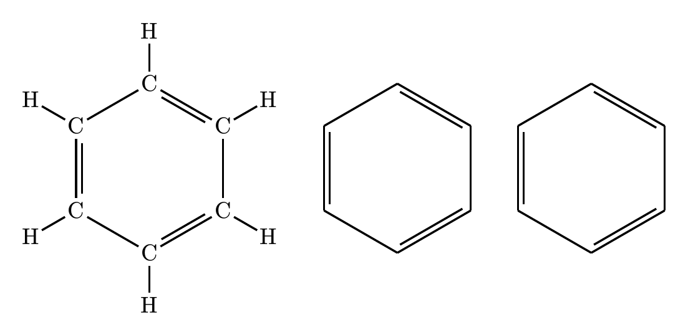

# molchemist

**molchemist** renders chemical structures in Typst from Molfile/SDF data or SMILES. It preserves usable input coordinates and uses a Rust/WASM layout plugin when a 2D layout must be generated.

Molfile/SDF parsing is powered by [`sdfrust`](https://github.com/hfooladi/sdfrust), SMILES parsing by [`opensmiles`](https://crates.io/crates/opensmiles), SMILES and fallback SDF 2D coordinate generation by [`CoordgenLibs`](https://github.com/schrodinger/coordgenlibs), and final Typst drawing by [`alchemist`](https://github.com/Typsium/alchemist). The Rust/WASM components connect these libraries and preserve chemical semantics across parsing, layout, and rendering.

## Quick start

This SDF example uses the bundled PubChem record for CID 93406:

```typ
#import "@preview/molchemist:0.1.5": render-mol, render-smiles

#let molecule = read("Structure2D_COMPOUND_CID_93406.sdf")
#render-mol(molecule, abbreviate: true)
```


Source data: [PubChem Compound CID 93406](https://pubchem.ncbi.nlm.nih.gov/compound/93406).

SMILES input uses the same renderer after generating a 2D layout. This example is melatonin (PubChem CID 896):

```typ
#render-smiles(
  "CC(=O)NCCC1=CNC2=C1C=C(C=C2)OC",
  abbreviate: true,
)
```



Source data: [PubChem Compound CID 896](https://pubchem.ncbi.nlm.nih.gov/compound/896).

`render-mol` accepts V2000/V3000 Molfile and multi-record SDF input. Its one-based `record` option selects an SDF record. Typst 0.15 or later can also pass a `path(...)` directly; `read(...)` remains portable across supported Typst versions.

## Rendering modes

All three modes below use the bundled 2D SDF for benzene, PubChem CID 241:

```typ
#let benzene = read("Structure2D_COMPOUND_CID_241.sdf")

#grid(
  columns: 3,
  gutter: 8mm,
  align: center + horizon,
  render-mol(benzene),
  render-mol(benzene, abbreviate: true),
  render-mol(benzene, skeletal: true),
)
```



From left to right: full, abbreviated, and skeletal mode.

Source data: [PubChem Compound CID 241](https://pubchem.ncbi.nlm.nih.gov/compound/241).

Appearance is controlled through the `config` dictionary passed to Alchemist.

## CTfile fidelity

This real ACD/Labs fixture distributed by RDKit contains two multi-atom `SUP` SGroups. `inspect-mol` preserves the source semantics while strict rendering contracts them to `NO₂` and `COOH` glyphs:

```typ
#import "@preview/molchemist:0.1.5": inspect-mol, render-mol

#let data = read("Sgroups_Abbreviations.mol", encoding: none)
#let semantic = inspect-mol(data)
#render-mol(data, skeletal: true, fidelity: "strict")
```


Source data: [RDKit `Sgroups_Abbreviations.mol`](https://github.com/rdkit/rdkit/blob/b421f19c9f564d0cb66148c4e614c59abadf5413/Code/GraphMol/FileParsers/sgroup_test_data/Sgroups_Abbreviations.mol). The bundled copy only normalizes CRLF line endings to LF.

The inspected record includes source IDs, query attributes, SGroups, Collections, link nodes, ordered SDF properties, and diagnostics. Strict mode reports unsupported or malformed fidelity data rather than inventing a glyph.

## Annotations

Atom, bond, and molecule anchors support restrained callouts and arrows. Enable `show-indices: true` while authoring them. Use `cetz-annotation` for custom CeTZ overlays or `dump: true` for manual Alchemist editing.

## Command line

The optional CLI emits the same generated Alchemist source:

```sh
cargo install --locked molchemist-cli

molchemist dump Structure2D_COMPOUND_CID_241.sdf --mode skeletal --standalone --output benzene.typ
molchemist dump --smiles 'CC(=O)NCCC1=CNC2=C1C=C(C=C2)OC' --standalone --output melatonin.typ
molchemist inspect Sgroups_Abbreviations.mol --output sgroups.json
molchemist dump Sgroups_Abbreviations.mol --mode skeletal --fidelity strict --standalone --output sgroups.typ
```

These commands use the same benzene, melatonin, and RDKit/ACD Labs records shown above. `inspect` writes semantic JSON; strict fidelity belongs to `dump`.

## Documentation

The [complete manual](https://github.com/rice8y/molchemist/blob/v0.1.5/package/docs/documentation.pdf) contains the API reference, CTfile fidelity tables, sample code with corresponding typeset output, configuration details, and CLI workflows.

Dependency licenses and example-data provenance are recorded in [THIRD_PARTY_NOTICES.md](THIRD_PARTY_NOTICES.md). PubChem data usage is described by the [NCBI Website and Data Usage Policies](https://www.ncbi.nlm.nih.gov/home/about/policies/).

## Current boundaries

- Dense structures may overlap in full mode; prefer abbreviated or skeletal mode, or set a larger `config: (atom-sep: ...)` value.
- Reaction SMILES/RXN, atom mapping, automatic reaction-center handling, and MOL2 input are planned for a later release.
- User-defined Collections, non-graph HILITE members, and unknown future SGroup types are preserved for inspection but do not receive invented default depictions.
- Automatic annotations do not replace final collision checking for publication figures.

See the manual for the precise support matrix and diagnostic behavior.

## License

The molchemist-authored source is MIT licensed. Published WASM components add BSD-3-Clause, Apache-2.0, and Apache-2.0 WITH LLVM-exception obligations; see [THIRD_PARTY_NOTICES.md](THIRD_PARTY_NOTICES.md) for the complete mapping.
