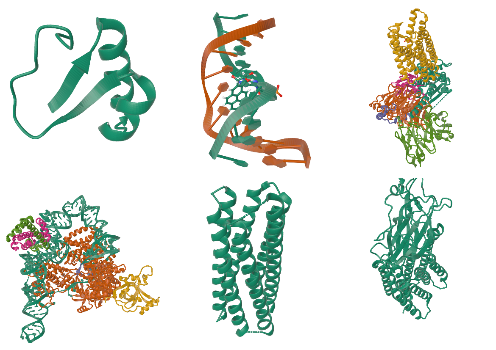
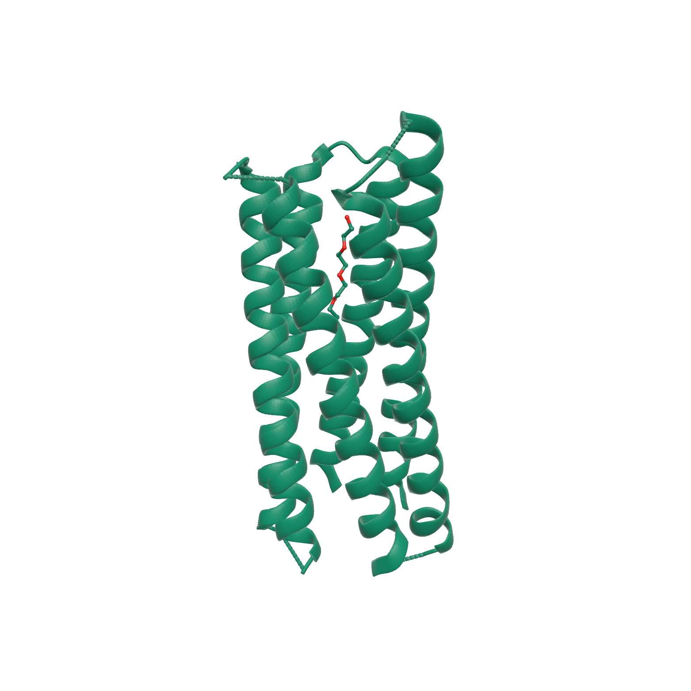

# Molfig

**Molfig** is a Typst package for rendering molecular structure files in static documents.

It accepts PDB, mmCIF, and BinaryCIF input, converts structures through a CPU-side [Mol*](https://molstar.org/)-style Model/Structure/Unit layer, exports static OBJ/STL/PLY mesh bytes, and delegates final document rendering to [`maquette`](https://typst.app/universe/package/maquette).



## Quickstart

```typst
#import "@preview/molfig:0.1.1"
#set page(width: auto, height: auto, margin: 0mm)

// Uses structural data from RCSB PDB / wwPDB.
// PDB ID: 9R1O
// PDB DOI: https://doi.org/10.2210/pdb9R1O/pdb
// Deposition authors: Petrenas, R.; Ozga, K.; Chubb, J.J.; Woolfson, D.N.
// PDB archive data files are available under CC0 1.0.
#let pdb = read("9R1O.pdb", encoding: none)

#molfig.render(
  pdb,
  format: "pdb",
  representation: "molstar",
  assembly: "1",
  mesh-format: "obj",
  quality: "high",
  center: true,
  output-format: "svg",
  config: (
    azimuth: 35,
    elevation: 24,
    background: "",
  ),
)
```

The manual uses PDB entry 9R1O as its complete example. Put `9R1O.typ` and `9R1O.pdb` in the same directory, then compile the figure PDF:

```sh
typst compile 9R1O.typ
```

**Rendered 9R1O Example**



Structural data source: RCSB PDB / wwPDB, PDB ID `9R1O`, DOI [`10.2210/pdb9R1O/pdb`](https://doi.org/10.2210/pdb9R1O/pdb). PDB archive data files are distributed under CC0 1.0.

Use `format: "mmcif"` or `format: "bcif"` for text mmCIF and BinaryCIF inputs.
For reproducible documents, prefer explicit `format`, `representation`, `assembly`, `alt-loc`, `mesh-format`, and geometry quality options instead of relying on auto-detection.

## Examples

The [`examples`](examples) directory contains complete example sources, PNG images generated from the rendered PDFs, and their accompanying structural data files. The example data files are kept under [`examples/data`](examples/data), together with attribution metadata.

## Features

- Inputs: PDB, text CIF/mmCIF, and BinaryCIF.
- Structure layer: Mol*-style Model/Structure/Unit concepts, assembly operators, altLoc handling, bond metadata, lookup3d/boundary summaries, secondary structure, coarse IHM spheres/gaussians, and semantic render-object metadata.
- Representations: Mol* default, spacefill, ball-and-stick, cartoon, ribbon, and backbone.
- Assembly support: biological assemblies are represented as source model plus unit operators before static mesh export.
- Alternate locations: select a concrete altLoc, all altLocs, or the highest-occupancy conformer.
- Color themes: `color-theme: "chain-id"` assigns Mol* Chain ID colors and forwards OBJ materials to maquette.
- Outputs: OBJ, companion MTL, binary STL, and ASCII PLY.
- Rendering: `render` passes generated mesh bytes to maquette; `render-object` exposes the mesh, rendered content, and normalized metadata for advanced documents.

## Public API

- `render(data, ..., config: (:), width: auto, height: auto)` converts and renders through maquette.
- `render-object(data, ...)` returns generated mesh bytes, rendered content, and metadata.
- `to-obj(data, ...)`, `to-mtl(data, ...)`, `to-stl(data, ...)`, and `to-ply(data, ...)` return export bytes.
- `info(data, ...)` returns molecular and mesh-planning metadata without rendering.
- `mesh-info(data, mesh-format: "obj", config: (:), ...)` delegates to maquette's mesh metadata helpers for the generated mesh.
- `v15-or-later()` returns whether the active Typst compiler supports project-side `path(...)` values.

Common options include `format`, `representation`, `color-theme`, `assembly`, `alt-loc`, `block-index`, `block-header`, `quality`, `sphere-detail`, `linear-segments`, `radial-segments`, `radius-scale`, `atom-radius`, `bond-radius`, `ribbon-radius`, `ribbon-width`, `helix-profile`, `round-cap`, `sheet-arrow-factor`, `tubular-helices`, `infer-bonds`, and `center`.

The `data` argument accepts bytes from `read(..., encoding: none)`, inline string data for small examples, and Typst 0.15+ path values created with `path("...")`.

## Choosing A Mesh Format

- Use OBJ for the closest static Mol* exporter parity and readable diffs.
- Use STL when a downstream tool specifically requires binary triangle data.
- Use PLY when package-owned face group metadata is useful in a compact text mesh.

OBJ output can be paired with `to-mtl`. During `render`, OBJ material colors are automatically converted to maquette's `materials` map; entries supplied through `config.materials` override generated colors. OBJ and PLY preserve Molfig group or operator metadata where the format can represent it. Binary STL follows Mol* static exporter behavior and keeps the two-byte facet attribute field at zero.

## Documentation

The full Molfig manual is available at [`documentation.pdf`](https://github.com/rice8y/molfig/blob/v0.1.1/package/docs/documentation.pdf). It documents:

- installation and import conventions;
- input format handling and BinaryCIF block selection;
- every public command and return shape;
- mesh, representation, assembly, altLoc, and quality options;
- maquette passthrough configuration;
- metadata fields returned by `info` and `render-object`;
- licensing, third-party notices, and example data attribution;
- troubleshooting and development commands;
- the embedded 9R1O rendering and its data source.

## Notes And Limits

Molfig emits static presentation meshes. It does not implement Mol*'s interactive WebGL surface or volume rendering pipeline. Molecular surface, gaussian surface, gaussian volume, and density/volume visuals are outside the current static export contract.

IHM coarse gaussian rows remain available as coarse model units, but they are not converted into gaussian surface or volume visuals.

## License And Notices

Molfig package code is licensed under the MIT License. See [`LICENSE`](LICENSE).

Molfig ports or adapts [Mol*](https://github.com/molstar/molstar) behavior and includes Mol*-derived reference data in `molfig.wasm`. Mol* is licensed under the MIT License, copyright (c) 2017 - now, Mol* contributors.

Bundled example structure files under [`examples/data`](examples/data) are PDB archive data from RCSB PDB / wwPDB and are available under CC0 1.0. Per-file PDB IDs, DOIs, and recommended attributions are listed in [`examples/data/README.md`](examples/data/README.md).

See [`NOTICE.md`](NOTICE.md) and [`THIRD_PARTY_NOTICES.md`](THIRD_PARTY_NOTICES.md) for the full distribution notice.

## Development

```sh
cd ../wasm-plugin
cargo fmt --check
cargo test
cargo build --release --target wasm32-unknown-unknown
cp target/wasm32-unknown-unknown/release/molfig.wasm ../package/molfig.wasm
cd ../package
typst compile --root . docs/documentation.typ docs/documentation.pdf
```

The checked-in `molfig.wasm` should be regenerated after Rust changes that affect the Typst plugin. Regenerate `docs/documentation.pdf` after public API or documentation changes.
