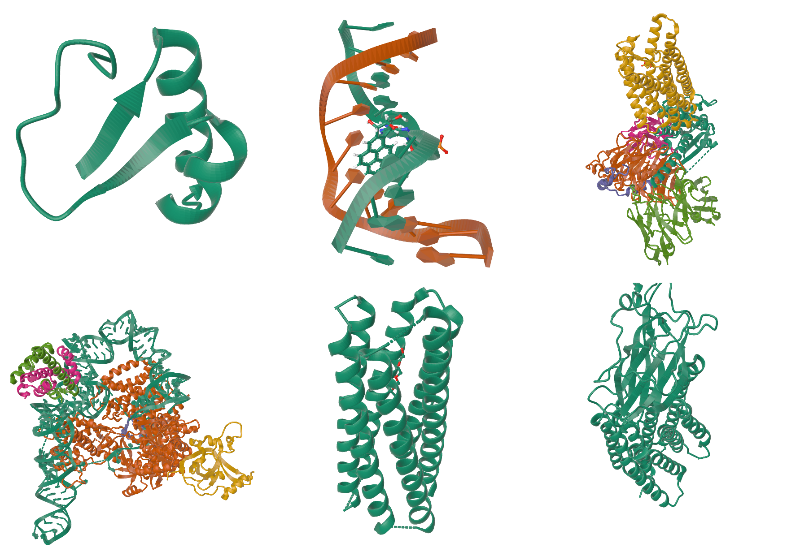
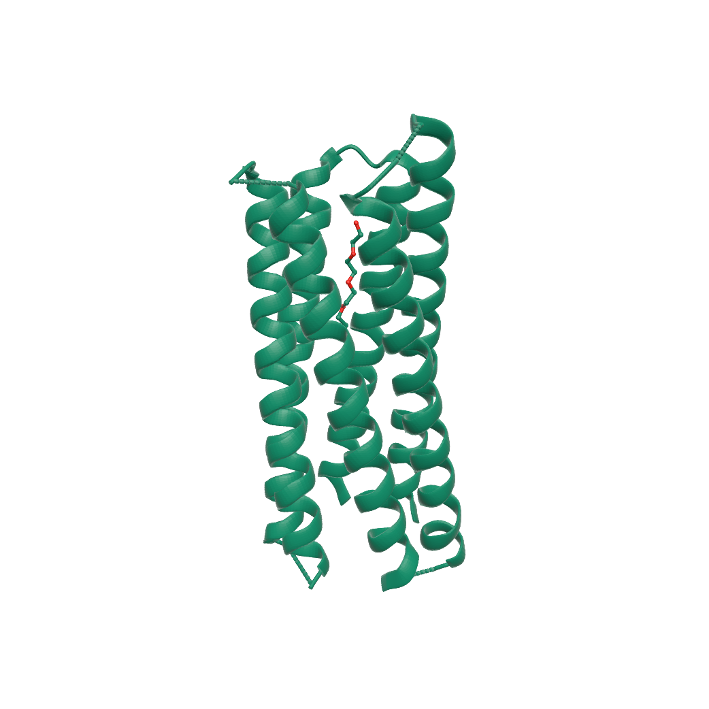

# Molfig

**Molfig** is a Typst package for rendering molecular structure files in static documents.

It accepts PDB, mmCIF, BinaryCIF, and XYZ input, converts structures through a CPU-side [Mol*](https://molstar.org/)-style Model/Structure/Unit layer, exports static OBJ/STL/PLY mesh bytes, and delegates final document rendering to [`maquette`](https://typst.app/universe/package/maquette).

You can try the [web demo](https://bernsteining.github.io/maquette/?a=9R1O) by [maquette's author](https://github.com/bernsteining) to adjust the scene and copy the Typst source.



## Quickstart

```typst
#import "@preview/molfig:0.1.5"
#set page(width: auto, height: auto, margin: 0mm)

// Uses structural data from RCSB PDB / wwPDB.
// PDB ID: 9R1O
// PDB DOI: https://doi.org/10.2210/pdb9R1O/pdb
// Deposition authors: Petrenas, R.; Ozga, K.; Chubb, J.J.; Woolfson, D.N.
// PDB archive data files are available under CC0 1.0.
#let pdb = read("9R1O.pdb", encoding: none)

#molfig.render(
  pdb,
  format: "pdb",
  representation: "cartoon",
  assembly: "1",
  mesh-format: "obj",
  quality: "high",
  center: true,
  output-format: "svg",
  config: (
    azimuth: 35,
    elevation: 24,
    background: "",
  ),
)
```

**Rendered 9R1O Example**



Structural data source: RCSB PDB / wwPDB, PDB ID `9R1O`, DOI [`10.2210/pdb9R1O/pdb`](https://doi.org/10.2210/pdb9R1O/pdb). PDB archive data files are distributed under CC0 1.0.

## XYZ Example

```typst
#import "@preview/molfig:0.1.5"

// Uses coordinate data from PubChem.
// PubChem CID: 702 (ethanol)
// PubChem3D conformer: 000002BE00000001
#let xyz = read("ethanol.xyz", encoding: none)

#molfig.render(
  xyz,
  format: "xyz",
  representation: "default",
  color-theme: "element-symbol",
  mesh-format: "obj",
  quality: "high",
  center: true,
  output-format: "svg",
  config: (
    azimuth: 35,
    elevation: 24,
    background: "",
  ),
)
```

**Rendered Ethanol Example**


Coordinate data source: PubChem CID [`702`](https://pubchem.ncbi.nlm.nih.gov/compound/702), PubChem3D conformer `000002BE00000001`, retrieved through [PubChem PUG REST](https://pubchem.ncbi.nlm.nih.gov/docs/pug-rest).

Use `format: "mmcif"`, `format: "bcif"`, or `format: "xyz"` for text mmCIF, BinaryCIF, and XYZ inputs. For reproducible documents, prefer explicit `format`, `representation`, `assembly`, `alt-loc`, `mesh-format`, and geometry quality options instead of relying on auto-detection.

## Examples

The [`examples`](https://github.com/rice8y/molfig/tree/v0.1.5/package/examples) directory contains complete example sources, rendered PDFs, and their accompanying structural data files. The example data files are kept under [`examples/data`](https://github.com/rice8y/molfig/tree/v0.1.5/package/examples/data), together with attribution metadata.

## Public API

- `render(data, ..., config: (:), width: auto, height: auto)` converts and renders through maquette.
- `render-object(data, ...)` returns generated mesh bytes, rendered content, and metadata.
- `to-obj(data, ...)`, `to-mtl(data, ...)`, `to-stl(data, ...)`, and `to-ply(data, ...)` return export bytes.
- `info(data, ...)` returns molecular and mesh-planning metadata without rendering.
- `mesh-info(data, mesh-format: "obj", config: (:), ...)` delegates to maquette's mesh metadata helpers for the generated mesh.

Common options include `format`, `representation`, `color-theme`, `theme`, `assembly`, `alt-loc`, `block-index`, `block-header`, `quality`, `decimate`, `sphere-detail`, `linear-segments`, `radial-segments`, `radius-scale`, `atom-radius`, `bond-radius`, `ribbon-radius`, `ribbon-width`, `helix-profile`, `round-cap`, `sheet-arrow-factor`, `tubular-helices`, `infer-bonds`, and `center`.

The `data` argument accepts bytes from `read(..., encoding: none)`, inline string data for small examples, and Typst 0.15+ path values created with `path("...")`.

## Choosing A Mesh Format

- Use OBJ for the closest static Mol* exporter parity and readable diffs.
- Use STL when a downstream tool specifically requires binary triangle data.
- Use PLY when package-owned face group metadata is useful in a compact text mesh.

OBJ output can be paired with `to-mtl`. During `render`, OBJ material colors are automatically converted to maquette's `materials` map; entries supplied through `config.materials` override generated colors. OBJ and PLY preserve Molfig group or operator metadata where the format can represent it. Binary STL follows Mol* static exporter behavior and keeps the two-byte facet attribute field at zero.

## Choosing A Render Format

`output-format: "png"` is the default and is recommended for high-poly meshes, large assemblies, and spacefill representations. Maquette rasterizes PNG output with a Z-buffer, avoiding the document-node cost of representing every visible mesh face as SVG content.

Use `output-format: "svg"` when vector output is important and the mesh is small or moderately sized. A large SVG render can exceed Typst's SVG node limit and fail with `failed to parse SVG (nodes limit reached)`. If that happens, switch to PNG or reduce the mesh complexity with `quality: "auto"`, a lower quality preset, `decimate: 0.3`, or smaller `sphere-detail`, `linear-segments`, and `radial-segments` values.

`decimate` is a Molfig-side molecular level-of-detail control. It reduces sphere detail, polymer curve/profile segments, surface resolution, probe sampling, and exported cylinder detail before maquette sees the mesh. When `config.decimate` is used with `render` or `render-object`, Molfig consumes it for semantic mesh generation and does not pass that key on to maquette's generic triangle decimator.

## Documentation

The full Molfig manual is available at [`documentation.pdf`](https://github.com/rice8y/molfig/blob/v0.1.5/package/docs/documentation.pdf). It documents:

- installation and import conventions;
- input format handling, XYZ model behavior, and BinaryCIF block selection;
- every public command and return shape;
- mesh, representation, assembly, altLoc, and quality options;
- maquette passthrough configuration;
- metadata fields returned by `info` and `render-object`;
- licensing, third-party notices, and example data attribution;
- troubleshooting and development commands;
- embedded 9R1O and PubChem ethanol XYZ renderings.

## Notes And Limits

Molfig emits static presentation meshes. `representation: "surface"` implements the Mol* Viewer Quick Styles Molecular Surface preset on the CPU and exports the result as OBJ/STL/PLY. Gaussian volume and density/volume visuals remain outside the static export contract; the size-dependent ViewerAuto path uses a CPU Gaussian surface for Huge and Gigantic structures.

IHM coarse sphere and gaussian rows remain available as coarse model units and participate in the size-dependent ViewerAuto Gaussian-surface path.

## License And Notices

Molfig package code is licensed under the MIT License. See [`LICENSE`](LICENSE).

Molfig ports or adapts [Mol*](https://github.com/molstar/molstar) behavior and includes Mol*-derived reference data in `molfig.wasm`. Mol* is licensed under the MIT License, copyright (c) 2017 - now, Mol* contributors.

Bundled example structure files under [`examples/data`](https://github.com/rice8y/molfig/tree/v0.1.5/package/examples/data) include CC0 PDB archive data from RCSB PDB / wwPDB and four PubChem-generated conformers in XYZ format. Per-file identifiers, source records, usage terms, and recommended attributions are listed in [`examples/data/README.md`](https://github.com/rice8y/molfig/tree/v0.1.5/package/examples/data/README.md).

See [`NOTICE.md`](NOTICE.md) and [`THIRD_PARTY_NOTICES.md`](THIRD_PARTY_NOTICES.md) for the full distribution notice.

## Development

```sh
cd ../wasm-plugin
cargo fmt --check
cargo test
node tests/validate-pubchem-xyz.mjs
cargo build --release --target wasm32-unknown-unknown
cp target/wasm32-unknown-unknown/release/molfig.wasm ../package/molfig.wasm
cd ../package
just docs
```

The checked-in `molfig.wasm` should be regenerated after Rust changes that affect the Typst plugin. Regenerate `docs/documentation.pdf` after public API or documentation changes.
