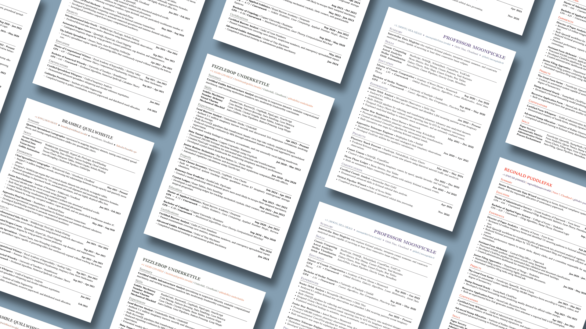

# Monofolio

[](https://typst.app/universe/package/monofolio)
[](https://typst.app/universe/package/monofolio)
[](LICENSE)
[](https://github.com/harshkaso/monofolio/stargazers)

A modular, data-driven, and minimal Typst resume framework designed to make customization simple.



## Features

* Structured resume sections for contact information, summary, skills, experience, projects, education, and certifications.
* Configurable typography, spacing, colours, margins, list markers, and alignment.
* Automatic formatting of dates, metadata, and section headings.
* Built-in support for LinkedIn, GitHub, email, phone, and arbitrary contact fields.
* Reorderable output sections.
* Optional page breaks for individual entries.
* Minimal interface designed to keep resume content separate from presentation.

## Installation

Create a new Typst project using the package or import it directly:

```typst
#import "@preview/monofolio:0.1.0": *
```

The package exposes the resume configuration and content functions directly.

## Basic Usage

Configure the appearance of the resume with `resume.with`:

```typst
#import "@preview/monofolio:0.1.0": *

#show: resume.with(
  contact-info-position: center,
  contacts-separator: [#h(0.4em)◆#h(0.4em)],
  inline-separator: [ \/ ],
  link-color: rgb("#B5651D"),
  accent-color: rgb("#654321"),
  font: "Libertinus Serif",
  font-size: 11pt,
  line-spacing: 0.65em,
  page-margin: 0.5in,
  list-marker: [--],
  justify: true,
)
```

Add the resume content using the provided functions:

```typst
#contact-info(
  name: [Bramble Quillwhistle],
  phone: [+1 (OWL) HOO-HOOT],
  email: [bramble@example.invalid],
  address: [Moonbeam, Cloudland],
  linkedin: [bramble-qw],
)

#summary[
  #strong[Quantum Spreadsheet Cartographer] experienced in mapping
  imaginary datasets and turning complicated business riddles into
  questionable charts.
]

#skillset(
  category: [Arcane Machinery],
  skills: [WobbleScript, QuantaQL, HyperCalc, FluxLogic],
)

#experience(
  title: [Chief Spreadsheet Cartographer],
  company: [Whizzlewick Data],
  location: [Moonbeam],
  start-date: [Mar 2023],
  end-date: [Present],
  [Mapped millions of imaginary records and uncovered previously
  undocumented relationships between fictional business metrics.],
  [Designed data-processing workflows that transformed chaotic
  datasets into structured analytical tables.],
)

#project(
  name: [Interdimensional Sales Oracle],
  info: [WobbleScript, FluxLogic],
  start-date: [Jan 2024],
  end-date: [Mar 2024],
  [Predicted fictional sales across twelve dimensions using
  historical sandwich observations.],
)

#education(
  degree: [Master of Computational Whimsy],
  school: [Royal Academy of Impossibility],
  location: [Starling Valley],
  start-date: [Sep 2021],
  end-date: [Jun 2023],
  gpa: [4.87],
)

#certification(
  name: [Certified Spreadsheet Whisperer],
  issuer: [Guild of Imaginary Analysts],
  date: [Jun 2024],
  [Demonstrated advanced spreadsheet whispering and
  circular-reference negotiation.],
)
```

Finally, print the sections in the desired order:

```typst
#print-contact
#print-summary
#print-skills
#print-experience
#print-projects
#print-education
#print-certifications
```

The data definitions and printed sections are independent, so the output order can be changed without moving the resume data.

## Configuration

The `resume.with` function accepts the following options.

| Option                  | Default              | Description                               |
| ----------------------- | -------------------- | ----------------------------------------- |
| `contact-info-position` | `left`               | Alignment of contact information.         |
| `link-color`            | `navy`               | Colour used for links.                    |
| `accent-color`          | `navy`               | Colour used for headings and accents.     |
| `font`                  | `"libertinus serif"` | Font used throughout the document.        |
| `font-size`             | `11pt`               | Base document font size.                  |
| `line-spacing`          | `0.65em`             | Paragraph leading.                        |
| `page-margin`           | `0.5in`              | Page margin.                              |
| `list-marker`           | `[--]`               | Marker used for resume accomplishments.   |
| `contacts-separator`    | `[/]`                | Separator between contact fields.         |
| `inline-separator`      | `[/]`                | Separator between inline metadata fields. |
| `justify`               | `true`               | Whether paragraph text is justified.      |

## Contact Information

```typst
#contact-info(
  name: [Bramble Quillwhistle],
  phone: [+1 (OWL) HOO-HOOT],
  email: [bramble@example.invalid],
  address: [Moonbeam, Cloudland],
  linkedin: [bramble-qw],
  github: [bramble-qw],
)
```

`name` is required. The other standard contact fields are optional.

Supported fields include:

* `phone`
* `email`
* `address`
* `linkedin`
* `github`

Additional named arguments can be supplied for custom contact fields:

```typst
#contact-info(
  name: [Bramble Quillwhistle],
  email: [bramble@example.invalid],
  portfolio: [https://example.invalid],
)
```

URL values are automatically formatted using their domain as the displayed text. Custom anchors can also be supplied using Typst's `link` function.

## Summary

Add a professional summary with `summary`:

```typst
#summary[
  A concise description of your background, experience,
  and professional focus.
]
```

## Skills

Create skill categories with `skillset`:

```typst
#skillset(
  category: [Arcane Machinery],
  skills: [WobbleScript, QuantaQL, FluxLogic],
)
```

Multiple skill categories can be added independently.

## Experience

Add professional experience with `experience`:

```typst
#experience(
  title: [Chief Spreadsheet Cartographer],
  company: [Whizzlewick Data],
  location: [Moonbeam],
  start-date: [Mar 2023],
  end-date: [Present],
  [Mapped imaginary datasets and uncovered fictional relationships.],
  [Built automated data-processing workflows.],
)
```

The following arguments are available:

* `title`
* `company`
* `location`
* `start-date`
* `end-date`
* `new-page`
* Positional accomplishment entries

Set `new-page: true` to force an entry to begin on a new page:

```typst
#experience(
  title: [Senior Data Enchanter],
  company: [Institute of Nonsense],
  new-page: true,
  [Transformed imaginary datasets into structured analytical records.],
)
```

## Projects

Projects use the `project` function:

```typst
#project(
  name: [Interdimensional Sales Oracle],
  info: [WobbleScript, FluxLogic],
  start-date: [Jan 2024],
  end-date: [Mar 2024],
  [Built a predictive model for fictional sales activity.],
)
```

Available arguments:

* `name`
* `info`
* `start-date`
* `end-date`
* `new-page`
* Positional accomplishment entries

## Education

Add education with `education`:

```typst
#education(
  degree: [Master of Computational Whimsy],
  school: [Royal Academy of Impossibility],
  location: [Starling Valley],
  start-date: [Sep 2021],
  end-date: [Jun 2023],
  gpa: [4.87],
  coursework: [Nonsense Theory, Imaginary Data, Moon Mathematics],
)
```

Available arguments:

* `degree`
* `school`
* `location`
* `start-date`
* `end-date`
* `gpa`
* `coursework`
* `new-page`

## Certifications

Add certifications with `certification`:

```typst
#certification(
  name: [Certified Spreadsheet Whisperer],
  issuer: [Guild of Imaginary Analysts],
  date: [Jun 2024],
  [Demonstrated advanced spreadsheet whispering skills.],
)
```

Available arguments:

* `name`
* `issuer`
* `date`
* `new-page`
* Positional highlight entries

## Output Sections

Each resume section has a corresponding print function:

```typst
#print-contact
#print-summary
#print-skills
#print-experience
#print-projects
#print-education
#print-certifications
```

These can be placed in any order. For example:

```typst
#print-contact
#print-summary
#print-experience
#print-skills
#print-education
#print-projects
#print-certifications
```

This allows the same resume data to be presented using different section orders without modifying the underlying content.

## Complete Example

A complete working example is available in the package [template](template/resume.typ).

## License

This project is licensed under the MIT License. See [`LICENSE`](LICENSE) for the full license text.