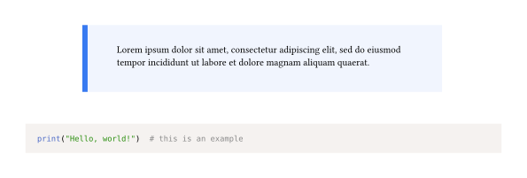
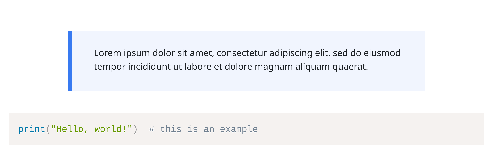

# Moodular

Use Typst's HTML export to generate content for your Moodle courses, but preview them faithfully in Tinymist or the webapp.

This package is somewhat opinionated, as it contains features tailored towards specific Moodle plugins used at our own school:

- [Components for Learning (C4L)](https://componentsforlearning.org/) ([Atto](https://moodle.org/plugins/atto_c4l)/[TinyMCE](https://moodle.org/plugins/tiny_c4l) plugin): Moodular recreates the HTML structure of C4L blocks, and also renders them for PDF export. Most but not all components are currently supported; please [open an issue](https://github.com/SillyFreak/typst-moodular/issues) if you need a specific one.

The [gallery](https://github.com/SillyFreak/typst-moodular/tree/main/gallery) has an example document rendered as PDF, HTML, and screenshots of the Moodle-rendered HTML to get an idea of what the package does.

## Getting Started

To add this package to your project, use this:

````typ
#import "@preview/moodular:0.1.0" as moodular: c4l

#show: moodular.preview()  // if you only want HTML export, and use "regular" mode only to preview
// or
#show: moodular.export()   // if you want HTML and PDF export for your document

// start writing

#c4l.key-concept[#lorem(20)]

```py
print("Hello, world!")  # this is an example
```
````

In preview, that example looks like this:



Exporting to HTML (and for now, manually extracting the `<body>` tag) gives you this (line breaks inserted for preview purposes):

```html
<p class="c4l-spacer"></p>
<div class="c4lv-keyconcept" aria-label="Key concept">Lorem ipsum dolor sit amet,
consectetur adipiscing elit, sed do eiusmod tempor incididunt ut labore et dolore
magnam aliquam quaerat.</div>
<pre class="language-py"><code>print("Hello, world!")  # this is an example</code></pre>
```

... which is almost identical to what you get when entering the same in Moodle using the TinyMCE editor with the C4L plugin.

the `<p class="c4l-spacer"></p>` elements that are part of the components according to the C4L Moodle plugins seem to actually have a negative effect on spacing.
See [this issue](https://github.com/reskit/moodle-tiny_c4l/issues/20) to track progress on this.
By default, Moodular does not remove the spacer to remain consistent with the official plugins, but you can change this by calling `#c4l.remove-spacer(true)` or passing the `--input moodular-remove-spacer=true` option when compiling.

With that option applied, the rendered result would look like this:



For comparison, you can see the version with spacer [here](./thumbnail-moodle.png).

## Usage

See the [manual](docs/manual.pdf) for details.

## License

> Copyright (C) 2025 Clemens Koza
>
> This program is free software: you can redistribute it and/or modify
> it under the terms of the GNU General Public License as published by
> the Free Software Foundation, either version 3 of the License, or
> (at your option) any later version.
>
> This program is distributed in the hope that it will be useful,
> but WITHOUT ANY WARRANTY; without even the implied warranty of
> MERCHANTABILITY or FITNESS FOR A PARTICULAR PURPOSE.  See the
> GNU General Public License for more details.
>
> You should have received a copy of the GNU General Public License
> along with this program.  If not, see <https://www.gnu.org/licenses/>.

(GPL licensed Typst packages are somewhat rare, so I'll comment on that here:
I have chosen this license as I build on top of C4L – although I don't believe that this package is strictly speaking a derivative work – and because the Moodle ecosystem uses GPL throughout.
In case you are unsure whether you can use this package in your project, take a look [here](https://forum.typst.app/t/lgplv3-licence-in-popular-typst-library-how-to-understand/1746).
Most importantly: it is definitely ok to use this package to create content for your Moodle courses; the license will not affect your content in any way.)
