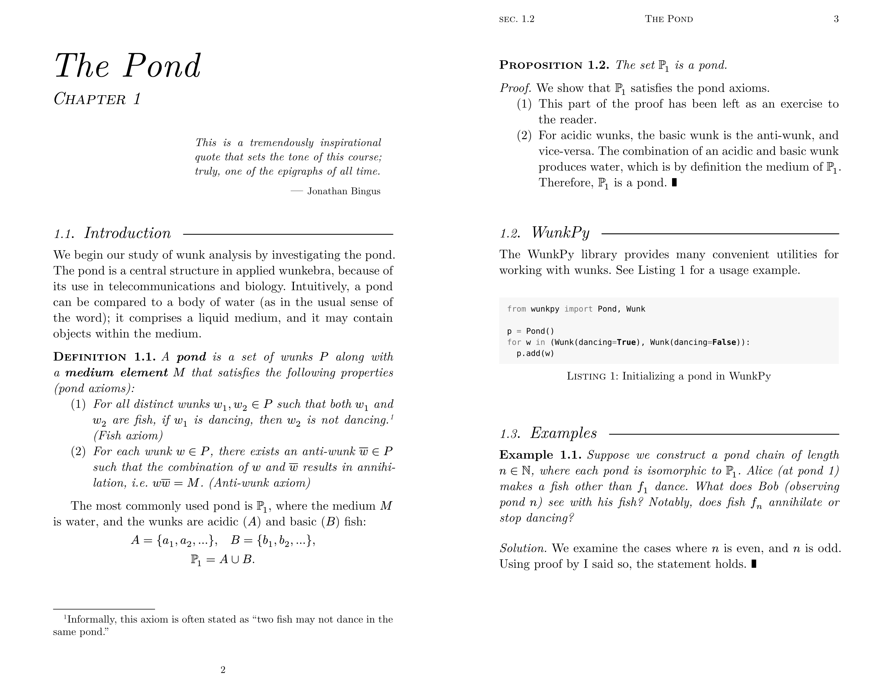

**Mousse notes** is a [Typst](https://typst.app) template for taking course notes, inspired by old-ish math books.

<picture>
  
</picture>

## Getting Started

On the Typst web app, use "Start from template" and select this template to
create a new file with Mousse. For the Typst CLI, run

```
typst init @preview/mousse-notes dir
```

to create a Mousse notes directory.

## Documentation

The documentation for this package is included directly in the template. See
`template/main.typ`, or instantiate the template to see how to use this
package.

### Development

To install this package for development, install Typst,
[Just](https://github.com/casey/just), `optipng`, and ImageMagick.
Clone this git repository, then use `just install` to install the
package to the `@local` namespace.

Alternatively, use `git worktree add` to create a worktree at
`~/.local/share/typst/packages/local/mousse-notes`.

Run `just thumbnail` to generate thumbnails for the docs. To make a
release, make a `vx.x.x` version tag and push it to GitHub. Regenerate
the fine-grained personal access token (under Credentials on GitHub)
