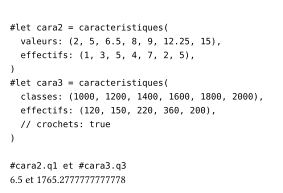
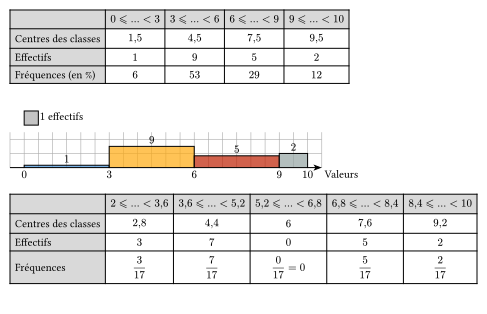

# moustaches

Package for french statistics (using french definitions of quartiles or interpolating them in the case of continuous values, drawing true histograms ...) and with the ability to use weights (absent from every other packages I have looked at). Inspired by the LaTeX package ProfCollege and using cetz:0.5.2, cetz-plot:0.1.4 and tiptoe:0.4.0. A few tilings and colormaps (from lilaq) are also defined.

[](LICENSE.txt)

## Installing

Install moustaches by cloning it or importing like this:

```typ
#import "@preview/moustaches:0.1.0": caracteristiques

#let cara2 = caracteristiques(
  valeurs: (2, 5, 6.5, 8, 9, 12.25, 15),
  effectifs: (1, 3, 5, 4, 7, 2, 5),
)

#let cara3 = caracteristiques(
  classes: (1000, 1200, 1400, 1600, 1800, 2000),
  effectifs: (120, 150, 220, 360, 200),
  // crochets: true
)
#cara2.q1 et #cara3.q3
```

<div align="center">
  
</div>

```typ
#import "@preview/moustaches:0.1.0": stat

#stat(
  valeurs: ("Lundi", "Mardi", "Mercredi", "Jeudi", "Vendredi", "Samedi"),
  effectifs: (25, 18, 17, 10, 5, 20),
  totaux: false,
  angle: "s",
  frequences: false,
  ListeCouleurs: std.color.map.viridis,
  diagramme: "hbar semicirc",
  circ:(couleurs:auto)
)

#stat(
  valeurs: (2, 5, 6.5, 8, 9, 12.25, 15),
  effectifs: (1, 3, 5, 4, 7, 2, 5),
  couleur-tableau: teal.lighten(50%),
  qualitatif: false,
  frequences: "v",
  angle: true,
  diagramme: "bar box",
  cbar: (width: .2),
  ECC: false, cases-vide: (4,19), colonnes-vide: (3,)
)

#stat(
  classes: (1000, 1200, 1500, 1700, 2000),
  effectifs: (120, 150, 220, 480),
  totaux: false,
  frequences: false,
  centre: false,
  angle: false,
  print: true,
  diagramme: "histo",
)
```

<div align="center">
  
</div>

```typ
#import "@preview/moustaches:0.1.0": stat

#stat(sondage: (5,7,8,9,4,4,3,2,8,5,4,3,9,8,7,5,4,10),classes:(0,3,6,9,10),diagramme: "histo")
#stat(sondage: (5,7,8,9,4,4,3,2,8,5,4,3,9,8,7,5,4),bins:5,frequences: "f")
```

<div align="center">
  
</div>

More on these functions in the [french manual](Exemples/moustaches-fr.pdf) or the [english manual](Exemples/moustaches-en.pdf).

## Contributing

Any contributions are welcome! Just fork the repository and make a pull request.
