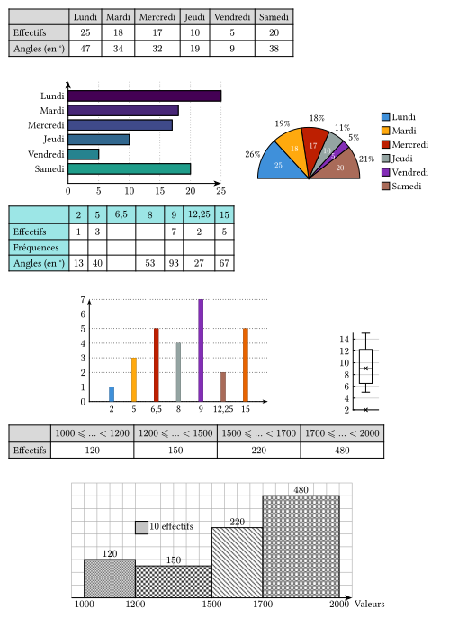
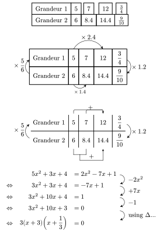

# moustaches

Package for french statistics (using french definitions of quartiles or interpolating them in the case of continuous values, drawing true histograms ...) and with the ability to use weights (absent from every other packages I have looked at). Inspired by the LaTeX package ProfCollege and using cetz:0.5.2, cetz-plot:0.1.4, tiptoe:0.4.0 and fletcher:0.5.8. A few tilings and colormaps (from lilaq) are also defined. 

The new release also brings proportionality tables (tables of nodes with each cell associated with a fletcher label for better positioning of edges and equal-sized columns and heights) and equation solving, both with the math-grid function, and two functions help-en and help-fr may be used to get help about a function or a parameter (ex: #help-fr("lin-up") or #help-en("col-op(flip)")). The manuals and the help functions are made with help from tidy.

[](LICENSE)
[][french manual]
[][english manual]

## Installing

Install moustaches by cloning it or importing like this:

```typ
#import "@preview/moustaches:0.1.1": caracteristiques

#let cara2 = caracteristiques(
  valeurs: (2, 5, 6.5, 8, 9, 12.25, 15),
  effectifs: (1, 3, 5, 4, 7, 2, 5),
)

#let cara3 = caracteristiques(
  classes: (1000, 1200, 1400, 1600, 1800, 2000),
  effectifs: (120, 150, 220, 360, 200),
  // crochets: true
)
#cara2.q1 et #cara3.q3
```

<div align="center">
  
</div>

```typ
#import "@preview/moustaches:0.1.1": stat, viridis

#stat(
  valeurs: ("Lundi", "Mardi", "Mercredi", "Jeudi", "Vendredi", "Samedi"),
  effectifs: (25, 18, 17, 10, 5, 20),
  totaux: false,
  angle: "s",
  frequences: false,
  liste-couleurs: viridis,
  diagramme: "hbar semicirc",
  circ:(couleurs:auto)
)

#stat(
  valeurs: (2, 5, 6.5, 8, 9, 12.25, 15),
  effectifs: (1, 3, 5, 4, 7, 2, 5),
  couleur-tableau: teal.lighten(50%),
  qualitatif: false,
  frequences: "v",
  angle: true,
  diagramme: "bar box",
  cbar: (width: .2),
  ecc: false, cases-vide: (4,19), colonnes-vide: (3,)
)

#stat(
  classes: (1000, 1200, 1500, 1700, 2000),
  effectifs: (120, 150, 220, 480),
  totaux: false,
  frequences: false,
  centre: false,
  angle: false,
  print: true,
  diagramme: "histo",
)
```

<div align="center">
  
</div>

```typ
#import "@preview/moustaches:0.1.1": stat

#stat(sondage: (5,7,8,9,4,4,3,2,8,5,4,3,9,8,7,5,4,10),classes:(0,3,6,9,10),diagramme: "histo")
#stat(sondage: (5,7,8,9,4,4,3,2,8,5,4,3,9,8,7,5,4),bins:5,frequences: "f")
```

<div align="center">
  
</div>

```typ
#import "@preview/moustaches:0.1.1": gridmath
#import gridmath:*

// An example with the diagram function of fletcher to compare:
#diagram(
  $ "Grandeur 1" & 5 & 7   & 12    & 3/4 \
   "Grandeur 2" & 6 & 8.4 & 14.4 & 9/10 $,
   node-shape: rect,node-stroke: 1pt,spacing: 0pt,
)

// Two examples for a proportionality table:
#math-grid(
  $ "Grandeur 1" & 5 urarrow(times 2.4,n:#2) & 7   & 12   & 3/4 \
    "Grandeur 2" & 6                         & 8.4 & 14.4 & 9/10 $,
   coef: $times 1.2$,
   coef-recip: $times 5/6$,
   col-op(1,1,2,$times 1.4$,label-sep:1pt,),
)

// Getting a table with no external border and showing 2 of the modes for 'adding' columns:
#math-grid(
  $ "Grandeur 1" & 5 & 7   & 12   & 3/4 \
    "Grandeur 2" & 6 & 8.4 & 14.4 & 9/10 $,
   coef: $times 1.2$,
   coef-recip: $times 5/6$,
   coef-args: (layer:2),coef-recip-args: (layer:2),
   lin-up(1,2,3,mode:3,layer:2),
   lin-down(1,2,3,layer:2,),
   node-stroke: .6pt,
   node(enclose: (<0-0>,<4-1>),inset:0pt,stroke:white+5pt,layer: 1)
)

// An example for equation solving:
#math-grid(
  $
        & 5x^2+3x+4 &= 2x^2-7x+1 rdarrow(-2x^2) \ 
   // luarrow(+2x^2) 
   <=> & 3x^2 + 3x + 4  &= - 7x +1 rdarrow(+7x) \
   <=> & 3x^2 + 10x + 4  &= 1 rdarrow(-1) \
   <=> & 3x^2 + 10x + 3  &= 0 rdarrow("using" Delta...,shift:#(-5pt)) \
   <=> & 3(x+3)(x+1/3) &= 0 
  $,
  equation: true,
)
```

<div align="center">
  
</div>

More on these functions in the [french manual](Exemples/moustaches-fr.pdf) or the [english manual](Exemples/moustaches-en.pdf).

## Changelog
- 0.1.1 adds :
  - math-grid and its helper-functions in the module gridmath, 
  - help-fr and help-en to get help (from tidy) in french or english.

## Contributing

Any contributions are welcome! Just fork the repository and make a pull request.

[french manual]: Exemples/moustaches-fr.pdf
[english manual]: Exemples/moustaches-en.pdf
