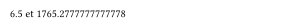
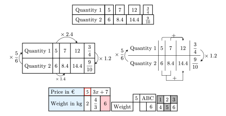
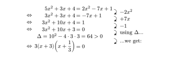
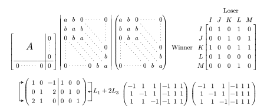
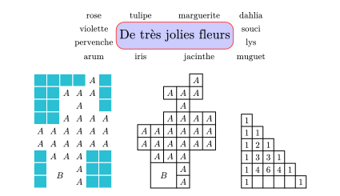

# moustaches

Package for french statistics (using french definitions of quartiles or interpolating them in the case of continuous values, drawing true histograms ...) and with the ability to use weights (absent from every other packages I have looked at). Inspired by the LaTeX package ProfCollege and using cetz:0.5.2, cetz-plot:0.1.4, tiptoe:0.4.0 and fletcher:0.5.8. A few tilings and colormaps (from lilaq) are also defined. 

The new releases also brings proportionality tables (tables of nodes with each cell associated with a fletcher label for better positioning of edges and equal-sized columns and heights), equation solving and matrix (with col or row operations), all with the math-grid function and it's helpers (mblock and a few "arrows"), and two functions help-en and help-fr may be used to get help about a function or a parameter (ex: #help-fr("lin-up") or #help-en("col-op(flip)")). The manuals and the help functions are made with help from tidy.

[](LICENSE.txt)
[][french manual]
[][english manual]

## Installing

Install moustaches by cloning it or importing like this:

```typ
#import "@preview/moustaches:0.1.2": caracteristiques

#let cara2 = caracteristiques(
  valeurs: (2, 5, 6.5, 8, 9, 12.25, 15),
  effectifs: (1, 3, 5, 4, 7, 2, 5),
)

#let cara3 = caracteristiques(
  classes: (1000, 1200, 1400, 1600, 1800, 2000),
  effectifs: (120, 150, 220, 360, 200),
  // crochets: true
)
#cara2.q1 et #cara3.q3
```

<div align="center">
  
</div>

```typ
#import "@preview/moustaches:0.1.2": stat, viridis

#stat(
  valeurs: ("Lundi", "Mardi", "Mercredi", "Jeudi", "Vendredi", "Samedi"),
  effectifs: (25, 18, 17, 10, 5, 20),
  totaux: false,
  angle: "s",
  frequences: false,
  liste-couleurs: viridis,
  diagramme: "hbar semicirc",
  circ:(couleurs:auto)
)

#stat(
  valeurs: (2, 5, 6.5, 8, 9, 12.25, 15),
  effectifs: (1, 3, 5, 4, 7, 2, 5),
  couleur-tableau: teal.lighten(50%),
  qualitatif: false,
  frequences: "v",
  angle: true,
  diagramme: "bar box",
  cbar: (width: .2),
  ecc: false, cases-vide: (4,19), colonnes-vide: (3,)
)

#stat(
  classes: (1000, 1200, 1500, 1700, 2000),
  effectifs: (120, 150, 220, 480),
  totaux: false,
  frequences: false,
  centre: false,
  angle: false,
  print: true,
  diagramme: "histo",
)
```

<div align="center">
  
</div>

```typ
#import "@preview/moustaches:0.1.2": stat

#stat(sondage: (5,7,8,9,4,4,3,2,8,5,4,3,9,8,7,5,4,10),classes:(0,3,6,9,10),diagramme: "histo")
#stat(sondage: (5,7,8,9,4,4,3,2,8,5,4,3,9,8,7,5,4),bins:5,frequences: "f")
```

<div align="center">
  
</div>

```typ
#import "@preview/moustaches:0.1.2": gridmath
#import gridmath:*

// An example with the diagram function of fletcher to compare:
#diagram(
  $ "Quantity 1" & 5 & 7   & 12    & 3/4 \
    "Quantity 2" & 6 & 8.4 & 14.4 & 9/10 $,
   node-shape: rect,node-stroke: 1pt,spacing: 0pt,
)

// math-grid is a wrapper for fletcher.diagram that gives it equally sized cells for each column and row

// Two examples for a proportionality table:
#math-grid(
  $ "Quantity 1" & 5 urarrow(times 2.4,n:#2) & 7   & 12   & 3/4 \
    "Quantity 2" & 6                         & 8.4 & 14.4 & 9/10 $,
   coef: $times 1.2$,
   coef-recip: $times 5/6$,
   col-op(1,1,2,$times 1.4$,label-sep:1pt,),
   // col-op(0,1,2,$times 1.4$,label-sep:1pt,),
   // node-stroke: 0.6pt+navy,
   // spacing: 3pt,
)
// Getting a table with no external border and showing 2 of the modes for 'adding' columns:
#math-grid(
  $ "Quantity 1" & 5 & 7   & 12   & 3/4 \
    "Quantity 2" & 6 & 8.4 & 14.4 & 9/10 $,
   coef: $times 1.2$,
   coef-recip: $times 5/6$,
   cadre: false,
   lin-up(1,2,3,mode:3,),
   lin-down(1,2,3,),
   node-stroke: .6pt,
)

// Automatic styling of header and styling of other cells and a weird side-effect of the parsing
#math-grid(
  $
    "Price in €" & node(5,stroke:#red,inset:#(3.5pt)) & mblock(#2)3x+7 & A \
    "Weight in kg" & 2 & 4/3 & 6
  $,
  header-col: true,
  header-fill: rgb("e3f2fd"),
  fill-map: (
    "3-1": rgb("ffcdd2"), // Surligne la case (15, 6) en rouge clair
  ),
  header-align: left,
  // cadre: false, // Only the inside lines are visible and the border is gone
  // node-align: left,
  // flip:true
  // node-stroke: (top:1pt,bottom:.5pt)
  // debug:true,  // fletcher.diagram parameters can be used
)
// How mblock should be used and showing how empty cells disappear, a simple "" make the cell re-appear
#math-grid(
  $
     & 5 & #mblock(2,[ABC]) &  \
    "Weight" &  & "" & 6
  $,
  // no-empty-node: false,
  // node(enclose: ((2,0),(3,0)),"ABC",inset:0pt,stroke:1pt) // equivalent to the mblock
)
// Using a fonction for the fill (ex: checkerboard)
#math-grid(
  $
    1 & 2 & 3 \
    4 & 5 & 6
  $,
  fill-map: (x, y) => if calc.even(x + y) { luma(180) } else { none },
)

```

<div align="center">
  
</div>

```typ
#import "@preview/moustaches:0.1.2": gridmath
#import gridmath:*

// An example for equation solving:
#math-grid(
  $
        & 5x^2+3x+4     &= 2x^2-7x+1  rdarrow(-2x^2) \ 
   // luarrow(+2x^2) 
   <=> & 3x^2 + 3x + 4  &= - 7x +1    rdarrow(+7x) \
   <=> & 3x^2 + 10x + 4 &= 1          rdarrow(-1) \
   <=> & 3x^2 + 10x + 3 &= 0          rdarrow("using" Delta...,) \
     #mblock(3,[$Delta = 10^2-4 dot 3 dot 3 = 64>0$],) & 0 & = 0 \
   <=> & 3(x+3)(x+1/3)  &= 0          ruarrow(..."we get:",shift:#(5pt),marks:"<{-")
  $,
  equation: true,
  // debug:true,
  inset:(2,2),
  // node(enclose:((0,4),(2,4)),outset: -6pt,place(center+horizon)[$Delta = b^2 - 4 a c =10^2-4 dot 3 dot 3 =...$]) // equivalent to the mblock
)
```

<div align="center">
  
</div>

```typ
#import "@preview/moustaches:0.1.2": gridmath
#import gridmath:*

// Examples for block matrix:
// Note that no-empty-node:false is incompatible with a function for node-stroke
#math-grid(
  $
    #mblock(4, 3, 1.5em, $ A $,)
      &  &  & &
      0 edge("dd",dash:"loosely-dotted") 
      \
      & & & & "" \
      & & & & 0 \
    0 edge("rrr",dash:"loosely-dotted") & "" & "" & 0 & 0
  $,
  matrix-mode: "[]",
  augment:(hline:3,vline:4),
  // node-stroke: (x, y) => if x > 3 and y> 2 { (left: 1pt, top:1pt) } else if x > 3 { (left: 1pt) } else if y > 2 {(top:1pt)}, // Does the same as the augment lines but with a function
  // debug:3,
)
#math-grid(
  $
    a & b & 0 edge("rrr",dash:"loosely-dotted") edge("dddrrr",dash:"loosely-dotted") & &  & 0 edge("ddd",dash:"loosely-dotted") \
    b & a & b edge("dddrrr",dash:"loosely-dotted") &  & &  \
    0 edge("ddd",dash:"loosely-dotted") edge("dddrrr",dash:"loosely-dotted") & b edge("dddrrr",dash:"loosely-dotted") & a edge("dddrrr",dash:"loosely-dotted") &  & & \
     &  &  &  & & 0 \
     & & & & & b \
    0 edge("rrr",dash:"loosely-dotted") &  & & 0 & b & a
  $,
  matrix-mode: "|",
)
#math-grid(
  $
    a & b & 0 edge("rrr",dash:"loosely-dotted") edge("dddrrr",dash:"loosely-dotted") & &  & 0 edge("ddd",dash:"loosely-dotted") \
    b & a & b edge("dddrrr",dash:"loosely-dotted") &  & &  \
    0 edge("ddd",dash:"loosely-dotted") edge("dddrrr",dash:"loosely-dotted") & b edge("dddrrr",dash:"loosely-dotted") & a edge("dddrrr",dash:"loosely-dotted") &  & & \
     &  &  &  & & 0 \
     & & & & & b \
    0 edge("rrr",dash:"loosely-dotted") &  & & 0 & b & a
  $,
  matrix-mode: true,
  matrix-sep: -5pt, // give a negative length to make the parens closer
)
#math-grid(
  $
  mat(,,#mblock(5,"Loser"),,; 
             ,,I, J, K, L, M;
    #mblock(1,5,"Winner"), 
      I, 0, 1, 0, 1, 0;
    , J, 0, 0, 1, 0, 1;
    , K, 1, 0, 0, 1, 1;
    , L, 0, 1, 0, 0, 0;
    , M, 0, 0, 0, 1, 0;
  )
  $,
  matrix-mode: "[]",
  first-column: 2,
  first-line: 2,
  matrix-sep: -3pt,
)

// An example showing row operations:
#math-grid(
  $
      edge("l,dd,r","<{-}>",corner-radius:#0pt,) 
      1 & 0 & -1 & 1 & 0 & 0 \
      0 & 1 & 2 & 0 & 1 & 0 \
      2 & 1 & 0 & 0 & 0 & 1
  $,
  node((-1,0),box(width:3em)),
  row-op(0,1,b:2,$L_1+2L_3$,n:6,width: 3em,),
  augment: 3,
  // augment:(vline:3,hline:(1,2),stroke:red+2pt),
  matrix-mode:"()",
  node-align: right,
)
// The equation can be given as a matrix: so you can copy and drop it in math-grid with nearly no visual changes, but with the ability to add arrows, mblocks etc
#box(baseline: -40%,$ mat(-1, 1, 1,-1, 1, 1; 1, -1, 1,-1, 1, 1; 1, 1, -1,-1, 1, 1,augment:#3,) $)
#math-grid(
  $ mat(-1, 1, 1,-1, 1, 1 ; 1, -1, 1,-1, 1, 1; 1, 1, -1,-1, 1, 1) $,
  matrix-mode: "()",
  augment: 3, 
  inset: (2.2,3),
  // node-align: right
  // debug:3
)
```

<div align="center">
  
</div>

```typ
#import "@preview/moustaches:0.1.2": gridmath
#import gridmath:*

// A few other possibilities (inspired by nicematrix)
#math-grid(
  $
  "rose" & "tulipe"  & "marguerite" & "dahlia" \
  "violette" & #mblock(2,2, text(1.5em)[De très jolies fleurs], stroke:red, corner-radius:10pt, fill:rgb(204,204,255),) & & "souci" \
  "pervenche" & & & "lys" \
  "arum" & "iris" & "jacinthe" & "muguet"
$,
node-stroke: none, 
// equation: true,
// debug:3
)

#math-grid(
  $
     & & & & A & \
     & & A & A & A & \
     & & "" & A & "" & \
     & & A & A & A & A \
   A & A & A & A & A & A \
   A & A & A & A & A & A \
     & A & A & A & & \
     & #mblock(2,2)B & & A & &\
     & & & A & &
  $,
  fill-empty: rgb("2abfd3"),// rgb("e6e6ff"),rgb("239dad"),
  node-stroke: white + 1pt,
  no-empty-node: false
)
#math-grid(
  $
     & & & & A \
     & & A & A & A \
     & & & A \
     & & A & A & A & A \
   A & A & A & A & A & A \
   A & A & A & A & A & A \
     & A & A & A \
     & #mblock(2,2)B & & A \
     & & & A \
  $, 
) #h(1cm)
#math-grid(
  $ 1\
    1 &1\
    1 &2  &1\
    1 &3  &3   &1\
    1 &4  &6   &4   &1\
    1& "" & "" & "" & "" &1
 $,
)
```

<div align="center">
  
</div>

More on these functions in the [french manual](Exemples/moustaches-fr.pdf) or the [english manual](Exemples/moustaches-en.pdf).

## Changelog
- 0.1.2 improve :
  - gridmath module with better math-grid, and helper functions to use it for matrix...
- 0.1.1 adds :
  - math-grid and its helper-functions in the module gridmath, 
  - help-fr and help-en to get help (from tidy) in french or english.

## Contributing

Any contributions are welcome! Just fork the repository and make a pull request.

[french manual]: Exemples/moustaches-fr.pdf
[english manual]: Exemples/moustaches-en.pdf