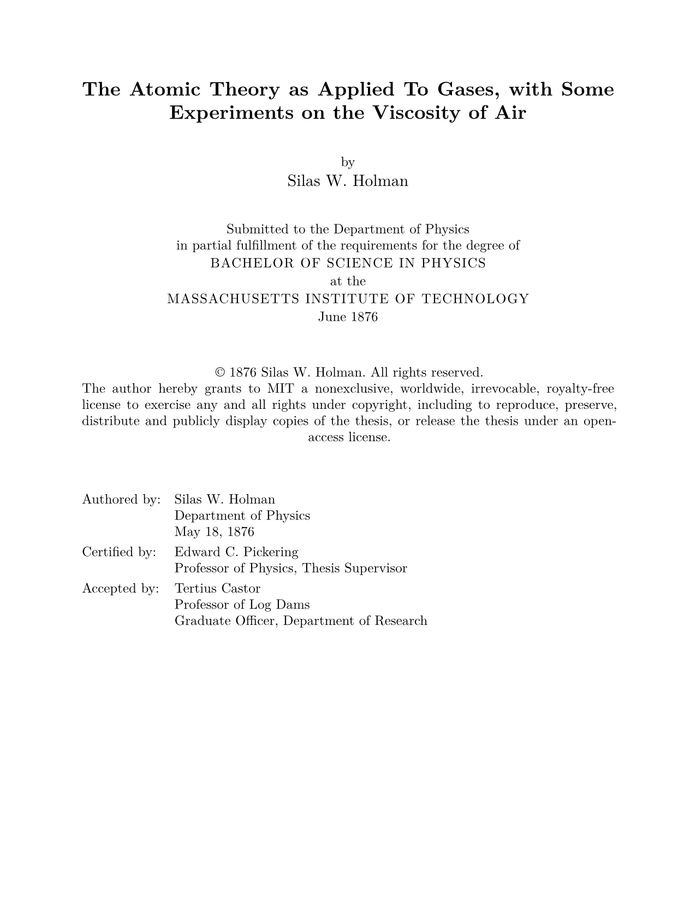

# muddy-mit-thesis

A Typst port of the [MIT `mitthesis` LaTeX class](https://ctan.org/pkg/mitthesis) (v1.22), producing a thesis document that conforms to [MIT Libraries dissertation formatting requirements](https://libraries.mit.edu/distinctive-collections/thesis-specs/).

Named after the [Muddy Charles](https://muddy.mit.edu/), the legendary MIT pub.

> **Unofficial template.** This is an independent port and is not affiliated with or endorsed by MIT or the `mitthesis` LaTeX package authors.

## Preview



## Usage

### Via Typst Universe (recommended)

```sh
typst init @preview/muddy-mit-thesis:0.2.0
```

This copies the sample document into your working directory. Edit `MIT-Thesis.typ` and the included content files to write your thesis.

### Template parameters

All parameters are passed to `#show: mitthesis.with(...)` in your main file:

| Parameter | Type | Description |
|-----------|------|-------------|
| `title` | content | Thesis title |
| `authors` | array | Each entry: `(name:, department:, prev-degrees:)` |
| `degrees` | array | Each entry: `(name:, department:)` |
| `supervisors` | array | Each entry: `(name:, title:, department:)` |
| `readers` | array | Each entry: `(name:, title:, department:)` — thesis committee readers |
| `acceptors` | array | Each entry: `(name:, department:, title:)` — graduate officer |
| `degree-month` | string | Month of degree award (e.g. `"June"`) |
| `degree-year` | string | Year of degree award (e.g. `"2025"`) |
| `thesis-date` | string | Date submitted (e.g. `"May 15, 2025"`) |
| `institution` | string | Defaults to `"Massachusetts Institute of Technology"` |
| `cc-license` | dict or `none` | Optional Creative Commons license: `(name: "CC BY 4.0", url: "...")` |
| `abstract-body` | content | Abstract text (typically `include "abstract.typ"`) |

### Helper functions

```typst
#import "@preview/muddy-mit-thesis:0.2.0": mitthesis, start-appendix, tracked

// In the document body, before your first appendix:
#start-appendix()  // switches numbering to A, B, … and resets chapter counter

// Letter-spaced uppercase text (used internally for degree/institution names):
#tracked[Massachusetts Institute of Technology]
```

### Heading hierarchy

| Syntax | Renders as |
|--------|-----------|
| `= Part Title` | Part I (full divider page, vertically centred) |
| `== Chapter Title` | Chapter 1 |
| `=== Section` | 1.1 |
| `==== Subsection` | 1.1.1 |
| `===== Subsubsection` | (unnumbered) |

Parts are optional — documents that omit `=` headings compile correctly with chapters at level `==` numbering from 1.

## Page layout

Matches the `mitthesis` LaTeX class defaults:

- Paper: US Letter
- Margins: 1 in all sides
- Font: New Computer Modern, 12 pt
- Line spacing: single (14.5 pt baseline-to-baseline)
- Paragraph indent: 1.5 em, no extra inter-paragraph space
- Page numbers: centered in footer, suppressed on title page
- Equation numbers: per-chapter `(1.1)`, reset at each chapter/appendix
- Figure/table numbers: per-chapter `1.1`, `A.1` in appendices
- Table captions: above the table (LaTeX convention)
- Bibliography: IEEE numeric style

## Compiling

```sh
typst compile MIT-Thesis.typ
```

Only known warning: `unknown font family: new computer modern mono` if New Computer Modern Mono is not installed — the template falls back to DejaVu Sans Mono for code listings.

## Known differences from the LaTeX original

- Appendix B title wraps to two lines at 24.88 pt (long title)

## License

MIT — see [LICENSE](LICENSE).

The sample bibliography `mitthesis-sample.bib` and biographical content are derived from the `mitthesis` LaTeX package and are used here for demonstration purposes.
