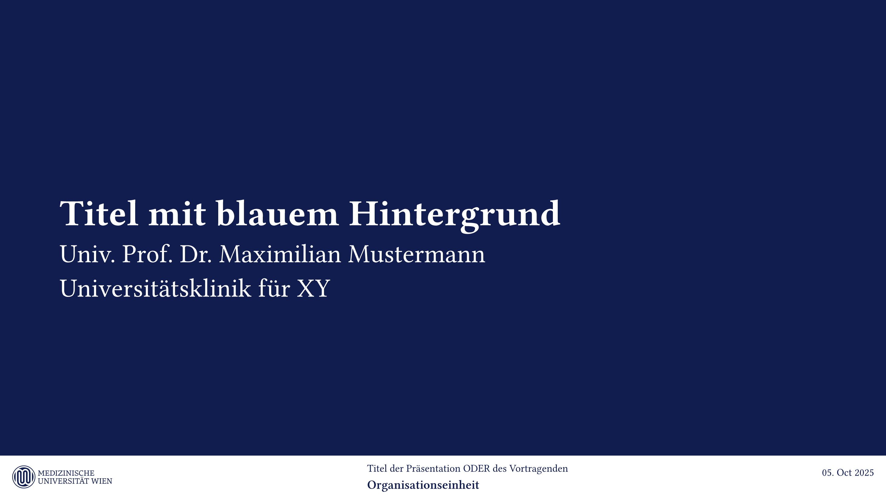
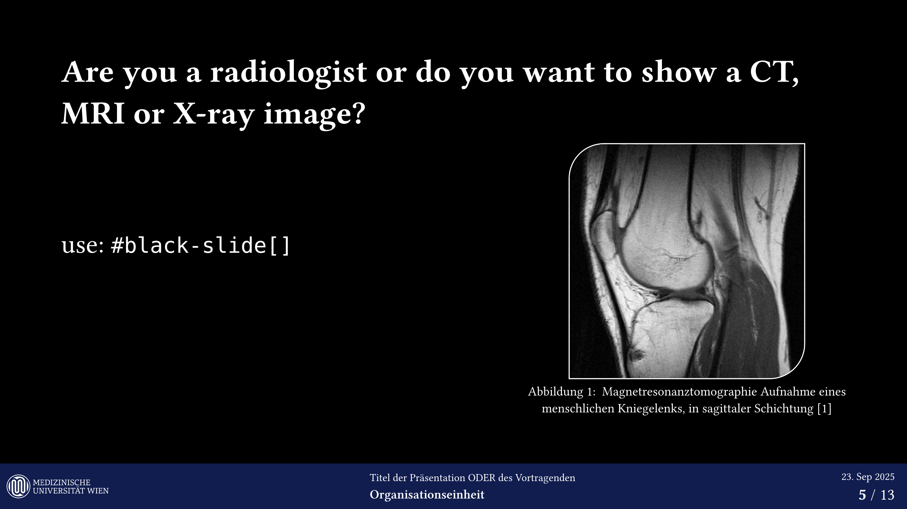

# `muw-community-templates`

## Medical University of Vienna / Medizinische Universität Wien

This repository hosts community maintained unofficial templates for the Medical University of Vienna.

Currently, it includes a presentation template built on the [`polylux`](https://typst.app/universe/package/polylux/) beamer style engine for Typst.

**https://typst.app/universe/package/muw-community-templates**

## Contents

Currently, the project only contains a template for **presentations**,
but a template for **dissertations/theses** is in the pipeline.

## Example Usage

It is recommended to use this project in the https://typst.app web app as a template. This will generate a sample project containing a presentation with the unofficial muw template, which is self-documenting.

or see:
- [src/presentation.typ](./src/presentation.typ)
- [src/template/main.typ](./src/template/main.typ)

> [!WARNING]
>
> As the correct fonts are not freely available, they are not supported in this template.
>
> see: https://typst.app/docs/reference/text/text/

refs:
- https://www.meduniwien.ac.at/web/studierende/service-center/meduni-wien-vorlagen/
- https://typst.app/
- https://github.com/typst/packages/tree/main/packages/preview/
- https://github.com/typst/packages/blob/main/docs/manifest.md

