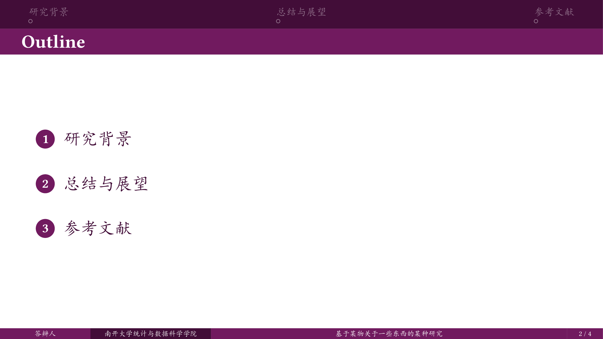
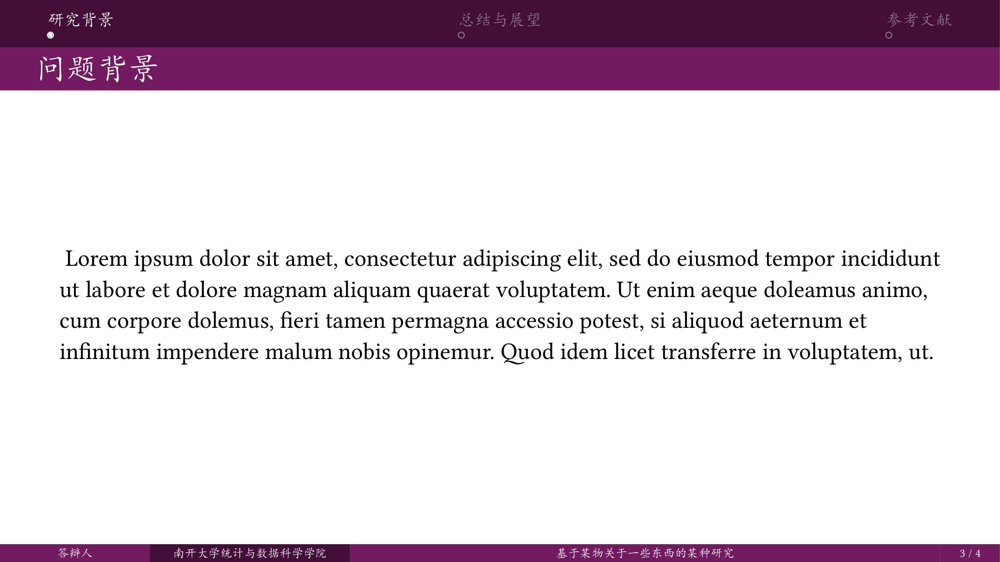
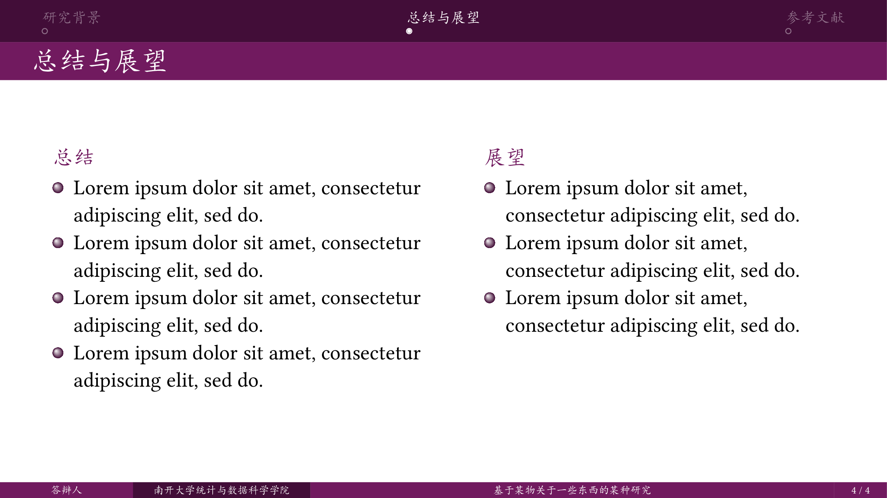
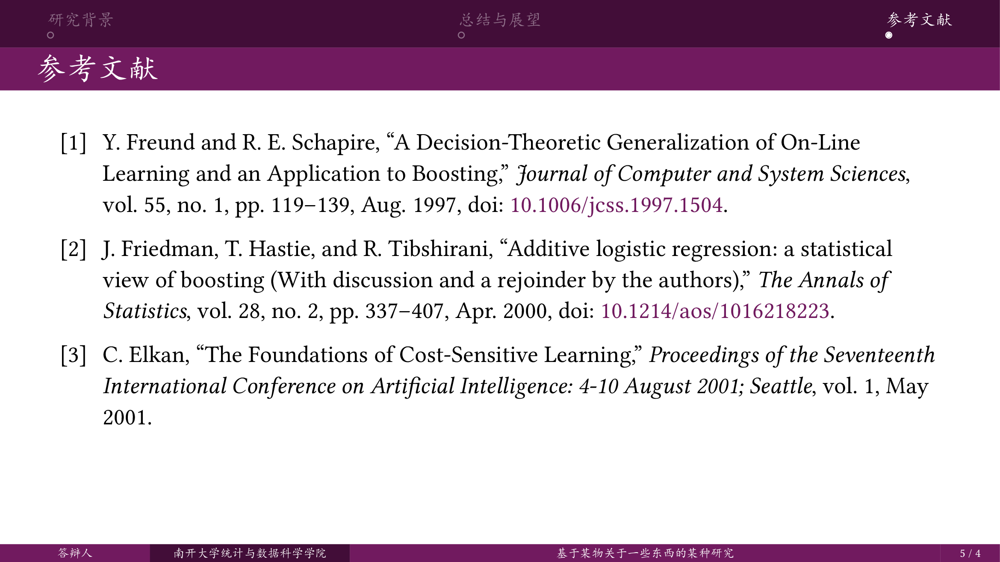

# Nankai-Touying

## 基本介绍

这是一个基于 Shuimu-Touying Theme (https://github.com/JSB-Unscarred/shuimu-touying/) 二次开发的非官方南开大学 Touying 模板。改变了颜色（小幅地😋）和标题页，以及按个人习惯修改了一些条目的显示方式。

## 效果预览







## 使用方法

### 安装字体
为了显示效果，本模板的英文使用了 Linux Libertine 字体，中文使用了 Noto Serif CJK SC 字体。如果在本地端进行编译，请先安装这两个字体。


### 方式一：使用 Typst Universe (推荐)

```typst
#import "@preview/nankai-touying:0.1.0": *
```

### 方式二：直接下载 `lib.typ`
在本项目 github 仓库(https://github.com/Jimmyzzt/nankai-touying/)下载 `lib.typ` 和 `nku-title-background_3.pdf`，放到 Typst 项目文件夹下，导入该 `.typ` 文件。

```
#import "lib.typ": *

#show: nankai-touying-theme.with(
  config-info(
    title: [代价敏感多分类提升算法的比较研究],
    // subtitle: [本科毕业答辩],
    reporter: [答辩人],
    // author: [可以填入原作者],
    supervisor: [一位 副教授],
    date: datetime.today(),
    institution: [南开大学统计与数据科学学院],
  ),
  config-common(
    datetime-format: "[year] 年 [month] 月",
    // breakable: false  // 是否允许截断
  )
)

#title-slide()
```

若如此做，你可以轻松地修改不合心意的模板细节。

### 方式三：typst init命令（我没用过）

在工作目录下新建终端，并运行以下命令：

```typst
typst init @preview/nankai-touying:0.1.0 my-slide
```
