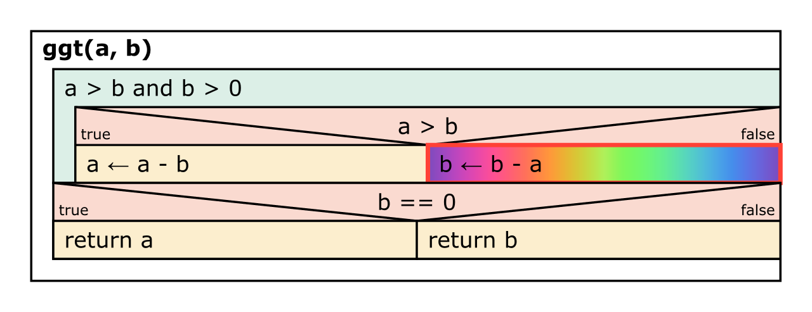

# nassi (v0.1.4)

**nassi** is a package for [Typst](https://typst.app) to draw [Nassi-Shneiderman diagrams](https://en.wikipedia.org/wiki/Nassi–Shneiderman_diagram) (Struktogramme).


## Usage

Import **nassi** in your document:

```typst
#import "@preview/nassi:0.1.4"
```

There are several options to draw diagrams. One is to parse all code-blocks with the language "nassi". Simply add a show-rule like this:

````typst
#import "@preview/nassi:0.1.4"
#show: nassi.shneiderman()

```nassi
function ggt(a, b)
  while a > 0 and b > 0
    if a > b
      a <- a - b
    else
      b <- b - a
    endif
  endwhile
  if b == 0
    return a
  else
    return b
  endif
endfunction
```
````

In this case, the diagram is created from a simple pseudocode. To have more control over the output, you can add blocks manually using the element functions provided in `nassi.elements`:

````typst
#import "@preview/nassi:0.1.4"

#nassi.diagram({
	import nassi.elements: *

	function("ggt(a, b)", {
		loop("a > b and b > 0", {
			branch("a > b", {
				assign("a", "a - b")
			}, {
				assign("b", "b - a",
					fill: gradient.linear(..color.map.rainbow),
					stroke:red + 2pt
				)
			})
		})
		branch("b == 0", { process("return a") }, { process("return b") })
	})
})
````



Since **nassi** uses **cetz** for drawing, you can add diagrams directly to a canvas. Each block gets a name within the diagram group to reference it in the drawing:

````typst
#import "@preview/cetz:0.2.2"
#import "@preview/nassi:0.1.4"

#cetz.canvas({
  import nassi.draw: diagram
  import nassi.elements: *
  import cetz.draw: *

  diagram((4,4), {
    function("ggt(a, b)", {
      loop("a > b and b > 0", {
        branch("a > b", {
          assign("a", "a - b")
        }, {
          assign("b", "b - a")
        })
      })
      branch("b == 0", { process("return a") }, { process("return b") })
    })
  })

  for i in range(8) {
    content(
      "nassi.e" + str(i+1) + ".north-west",
      stroke:red,
      fill:red.transparentize(50%),
      frame:"circle",
      padding:.05,
      anchor:"north-west",
      text(white, weight:"bold", "e"+str(i)),
    )
  }
})
````


This can be useful to annotate a diagram:


See `assets/` for usage examples.

## Changelog

### Version 0.1.4

- Added a test-last loop block.
- Added a parser for [Struktog](https://struktog.openpatch.org) JSON files.

### Version 0.1.3

- Compatibility with Typst 0.13.1.
- Bumped dependencies.

### Version 0.1.2

- Fix for deprecation warnings in Typst 0.12.

### Version 0.1.1

- Fixed labels option not working for branches in other elements.
- Added `switch` statements (thanks to @Geronymos).

### Version 0.1.0

Initial release of **nassi**.
