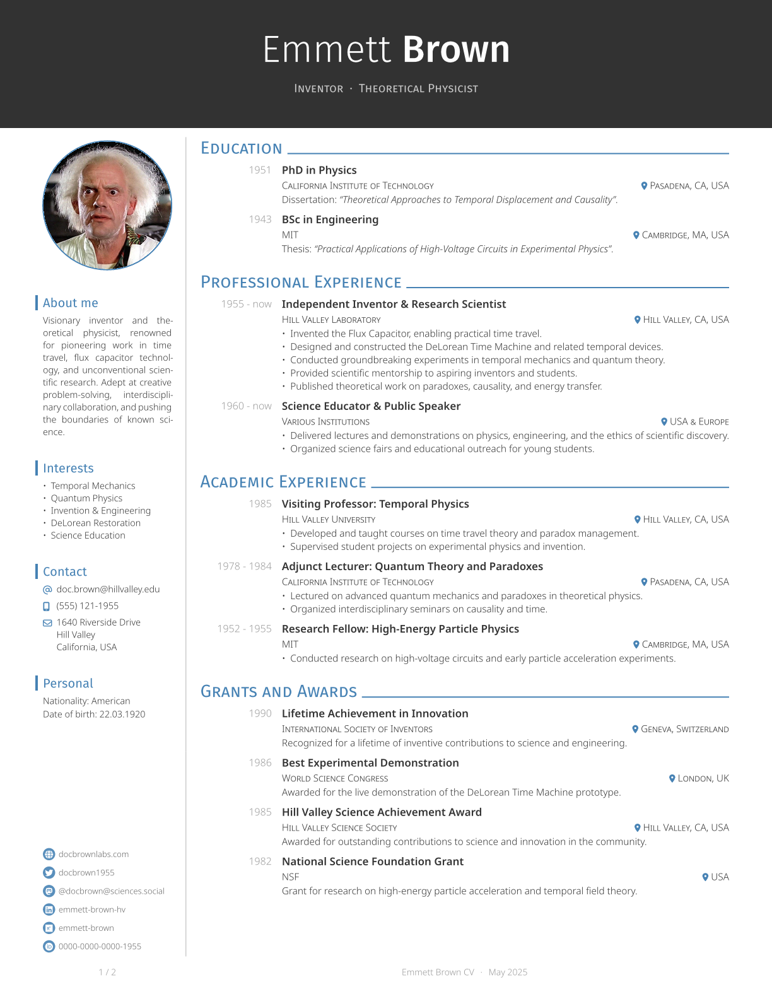
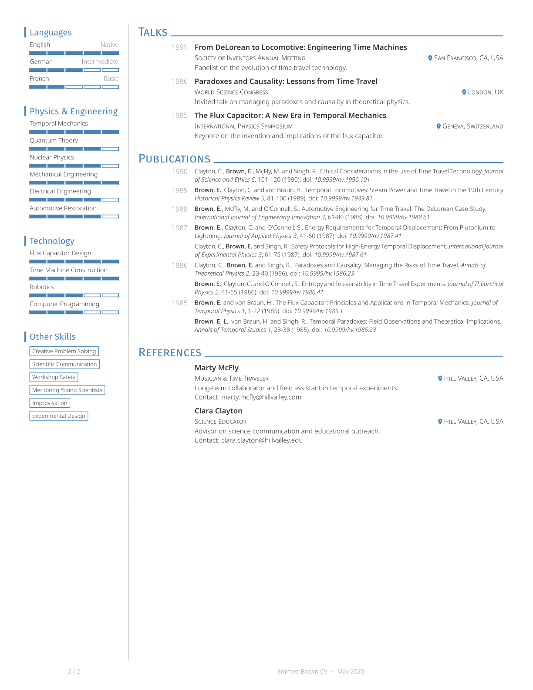

# Neat CV

A modern and elegant CV template for Typst, inspired by [Awesome CV](https://github.com/posquit0/Awesome-CV) and [simple-hipstercv](https://github.com/latex-ninja/simple-hipstercv).

## Features

- Modern, clean two-column layout with sidebar
- Customizable accent color and fonts
- Publication list generated from Hayagriva YAML, grouped by year, with author highlighting
- Level bars for languages and skills
- Social/contact info with icons and clickable links

## Requirements

### Software

- [typst](https://typst.app/) (tested with v0.13.1)

### Fonts

By default, this template uses the Fira Sans and Noto Sans fonts. You will need to install these fonts on your system to use the template as intended.
One option is to download them from Google Fonts:

- [Fira Sans](https://fonts.google.com/specimen/Fira+Sans)
- [Noto Sans](https://fonts.google.com/specimen/Noto+Sans)

On Linux, check your package manager, as most distributions provide these fonts in their repositories.

Additionally, this template uses the FontAwesome icons via the [fontawesome](https://typst.app/universe/package/fontawesome) package.
Refer to the package documentation for instructions on installing the fonts on your system.

## Usage

Basic usage example:

```typst
#import "@preview/neat-cv:0.1.0": cv, side, entry, item-with-level, contact-info

#show: cv.with(
  author: (
    firstname: "John",
    lastname: "Smith",
    email: "john.smith@example.com",
    position: ("Data Scientist"),
    github: "jsmith",
  ),
  profile-picture: image("my_profile.png"),
)

#side[
  = About Me
  Just a guy learning Typst.

  = Contact
  #contact-info()

  = Skills
  #item-with-level("Python", 4)
  #item-with-level("Bash", 3)

  #v(1fr)
  #social-links()
]

= Education

#entry(
  title: "Master of Science in Data Science",
  institution: "University of Somewhere",
  location: "Somewhere, World",
  date: "2023",
  [Thesis: "My thesis title"],
)

= Experience

#entry(
  title: "Data Scientist",
  institution: "Somewhere Inc.",
  location: "Somewhere, World",
  date: "2023 - Present",
  [
    - Worked on some cool stuff.
  ],
)
```

For a more complete example, see the `template/cv.typ` file in the repository.

## Example

|                                |                                |
| ------------------------------ | ------------------------------ |
|  |  |
